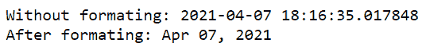
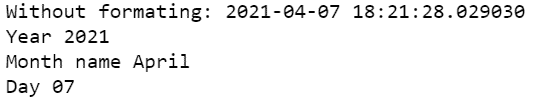
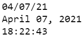

# 如何在 Python 中使用 strftime()格式化日期？

> 原文:[https://www . geeksforgeeks . org/how-to-format-date-use-strftime-in-python/](https://www.geeksforgeeks.org/how-to-format-date-using-strftime-in-python/)

在本文中，我们将看到如何在 Python 中使用[str time()](https://www.geeksforgeeks.org/python-strftime-function/)来格式化日期。 [localtime()](https://www.geeksforgeeks.org/python-time-localtime-method/) 和 [gmtime()](https://www.geeksforgeeks.org/python-time-gmtime-method/) 返回一个表示时间的元组，该元组被转换为一个字符串，该字符串由使用 python time 方法 strftime()的 format 参数指定。

**语法:**

> time.strftime（format[， sec]）
> 
> **秒:**这是以秒为单位的格式化时间。
> 
> **格式:**这是用于格式化的指令或格式代码。

<figure class="table">

| 指令或格式代码 | 返回值 | 例子 |
| --- | --- | --- |
| %Y | 世纪之交 | 2021,2022 |
| %y | 没有世纪的年份，填充值为零 | 00,01,….21,22…,99 |
| %-y | 没有世纪的一年 | 0,1…,99 |
| %m | 零填充值的月份 | 01-12 |
| %-m | 没有零填充值的月份 | 1-12 |
| %B | 完整月份名称 | 一月，二月，…，十二月 |
| %b | 月份的缩写 | 一月，二月，…，十二月 |
| %A | 完整的工作日名称 | 周日，周一，.. |
| %a | 工作日名称的缩写 | 珊，我的朋友，-什么 |
| %w | 以十进制值表示的工作日 | 0-6 |
| %d | 填充值为零的天数 | 01-31 |
| %-d | 带十进制值的天数 | 1-31 |
| %H | 小时(24 小时制)作为零填充值。 | 00-23 |
| %-H | 没有零填充值的小时(24 小时制)。 | 0,1,…,23 |
| %I | 小时(12 小时制)作为零填充值。 | 01-12 |
| %-我 | 没有零填充值的小时(12 小时制)。 | 1-12 |
| %M | 零填充的分钟 | 00-59 |
| %-M | 没有零填充值的分钟数 | 0-59 |
| %S | 具有零填充值的秒 | 00-59 |
| %-S | 没有零填充值的秒 | 0-59 |
| %f | 零填充值的微秒 | 000000 – 999999 |
| %p | 区域设置的上午或下午。 | 上午/下午 |
| %j | 一年中填充值为零的一天 | 001-366 |
| %-j | 一年中没有零填充值的日子 | 1-366 |
| %z | 以+HHMM 或-HHMM 形式表示的世界协调时偏移量。 |   |
| %Z | 时区名称。 |   |
| %C | 区域设置的适当日期和时间 | 2020 年 4 月 2 日 |
| %x | 区域设置的适当日期 | 02/04/22 |
| %X | 区域设置的适当时间 | 02:04:22 |
| %W | 一年中的周数。星期一是一周的第一天 | 00-53 |
| %U | 一年中的周数。周日是一周的第一天 | 00-53 |

</figure>

下面是一些更好理解的例子。

**例 1:**

## 蟒蛇 3

```py
from datetime import datetime

# current time and date
# datetime object
time = datetime.now()
print("Without formating:", time)

# formating date using strftime
print("After formating:", time.strftime("%b %d, %Y"))
```

**输出:**



**例 2:**

## 蟒蛇 3

```py
from datetime import datetime

# current time and date
# datetime object
time = datetime.now()
print("Without formating:", time)

# formating date using strftime
print("Year", time.strftime("%Y"))
print("Month name", time.strftime("%B"))
print("Day", time.strftime("%d"))
```

**输出:**



**例 3:**

## 蟒蛇 3

```py
from datetime import datetime

# current time and date
# datetime object
time = datetime.now()

# formating date using strftime
# format = MM/DD/YY
print(time.strftime("%m/%d/%y"))

# format = Month D, Yr
print(time.strftime("%B %d, %Y"))

# time formating
# HH:MM:SS
print(time.strftime("%H:%M:%S"))
```

**输出:**

