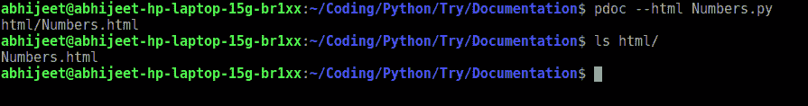
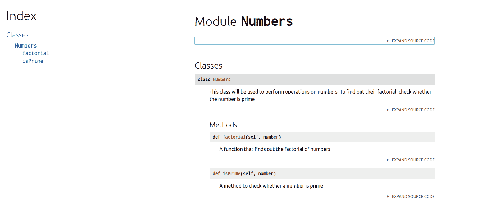

# 如何使用 Python 生成文档？

> 原文:[https://www . geeksforgeeks . org/如何使用 python 生成文档/](https://www.geeksforgeeks.org/how-to-generate-a-documentation-using-python/)

文档提高了代码的可读性。有很多工具可以帮助我们创建文档。一个这样的工具是 **pdoc** 到为 python 项目编写文档。

**安装:**在终端上运行以下 pip 命令。

```py
pip3 install pdoc3

```

现在(通过命令行)导航到保存 Python 程序的文件夹。假设我们程序的名字是 Numbers.py，它是一个简单的类，有两个函数，一个用来求这个数的阶乘，另一个用来检查这个数是否是质数。

## 蟒蛇 3

```py
class Numbers :

        """
        This class will be used to perform operations on numbers.
        To find out their factorial, check whether the number is prime
        """

        def isPrime(self, number) :

                '''
                A method to check whether a number is prime
                '''

                i = 2
                while(i <= number / 2) :
                        if number % i == 0:
                                return False
                        i += 1
                return True

        def factorial(self, number) :

                """
                A function that finds out the factorial of numbers
                """
                result = 1
                while(number >= 2) :
                        result *= number
                        number -= 1
                return result
```

在类和方法中添加文档字符串提供了一种将文档与 Python 模块、函数、类和方法相关联的便捷方式。文档字符串是文档的重要部分。

导航到保存代码(Numbers.py)的文件夹(通过命令行)后。我们必须在终端中键入以下命令:

```py
 pdoc --html Numbers.py

```



目录结构

激发上面显示的–html 命令后，将在保存 Numbers.py 的目录中创建一个 HTML 文件夹。在这个 HTML 文件夹中，将创建一个名为 Numbers.html 的文件。导航到 HTML 文件夹，打开 Numbers.html。



Numbers.html

Numbers.html 应该是这样的。我们刚刚为我们的班级编号创建了适当的文档。在 Number.html 的左栏(索引)中，可以看到类及其方法。记住我们写的文档字符串，它们可以在它们各自的类和方法下面找到。