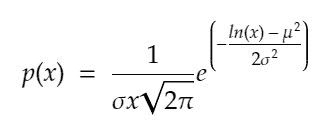
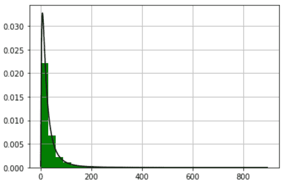
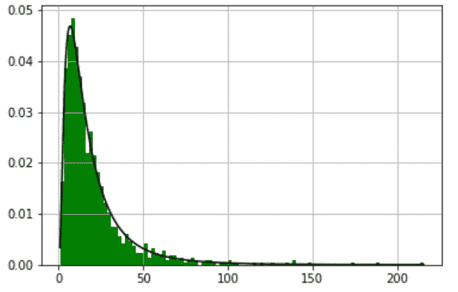

# Python 中如何从对数正态分布生成随机数？

> 原文:[https://www . geesforgeks . org/如何从 python 中的对数正态分布生成随机数/](https://www.geeksforgeeks.org/how-to-generate-random-numbers-from-a-log-normal-distribution-in-python/)

对数通常是分布的随机变量的连续概率分布在概率论中被称为对数正态(或对数正态)分布。

当且仅当对数(x)服从正态分布时，称变量 x 服从对数正态分布。PDF 的定义如下。



概率密度函数对数正态

其中μ是总体平均值，σ是变量对数正态分布的标准偏差。就像正态分布是大量独立同分布随机变量求和的表现一样，对数正态也是大量独立同分布随机变量相乘的结果。在 NumPy 库的帮助下，从对数正态分布生成随机数非常容易。

**语法:**

> numpy.random.lognormal(平均值=0.0，σ= 1.0，大小=无)
> 
> **参数:**
> 
> *   **平均值:**取基础正态分布的平均值。
> *   **西格玛:**它只取基础正态分布的标准偏差的非负值
> *   **大小:**取给定形状的整型或元组。如果传递一个值，它将返回一个整数作为结果。如果一个元组，那么它从对数正态分布返回一个 2D 值矩阵。
> 
> **返回:** 从参数化对数正态分布(nd Array 或标量)中抽取样本。

下面的例子描述了如何从对数正态分布生成随机数:

## 蟒蛇 3

```
# import modules
import numpy as np
import matplotlib.pyplot as plt

# mean and standard deviation
mu, sigma = 3., 1.  
s = np.random.lognormal(mu, sigma, 10000)

# depict illustration
count, bins, ignored = plt.hist(s, 30,
                                density=True, 
                                color='green')
x = np.linspace(min(bins),
                max(bins), 10000)

pdf = (np.exp(-(np.log(x) - mu)**2 / (2 * sigma**2))
       / (x * sigma * np.sqrt(2 * np.pi)))

# assign other attributes
plt.plot(x, pdf, color='black')
plt.grid()
plt.show()
```

**输出:**



让我们使用 python 证明 log-Normal 是随机变量的独立和相同分布的乘积。在下面的程序中，我们从正态分布中随机生成 1000 个点，然后取它们的乘积，最后绘制成对数正态分布。

## 蟒蛇 3

```
# Importing required modules
import numpy as np
import matplotlib.pyplot as plt

b = []

# Generating 1000 points from normal distribution.
for i in range(1000):
    a = 12\. + np.random.standard_normal(100)
    b.append(np.product(a))

# Making all negative values  into positives
b = np.array(b) / np.min(b)
count, bins, ignored = plt.hist(b, 100, 
                                density=True, 
                                color='green')

sigma = np.std(np.log(b))
mu = np.mean(np.log(b))

# Plotting the graph.
x = np.linspace(min(bins), max(bins), 10000)
pdf = (np.exp(-(np.log(x) - mu)**2 / (2 * sigma**2))
       / (x * sigma * np.sqrt(2 * np.pi)))

plt.plot(x, pdf,color='black')
plt.grid()
plt.show()
```

**输出:**

