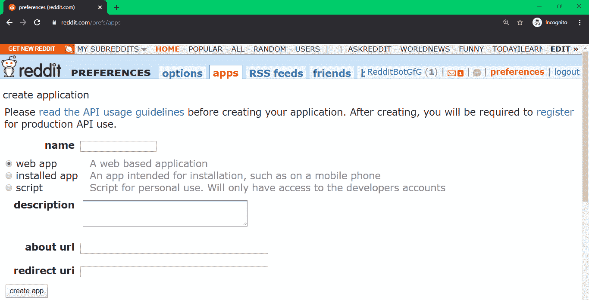
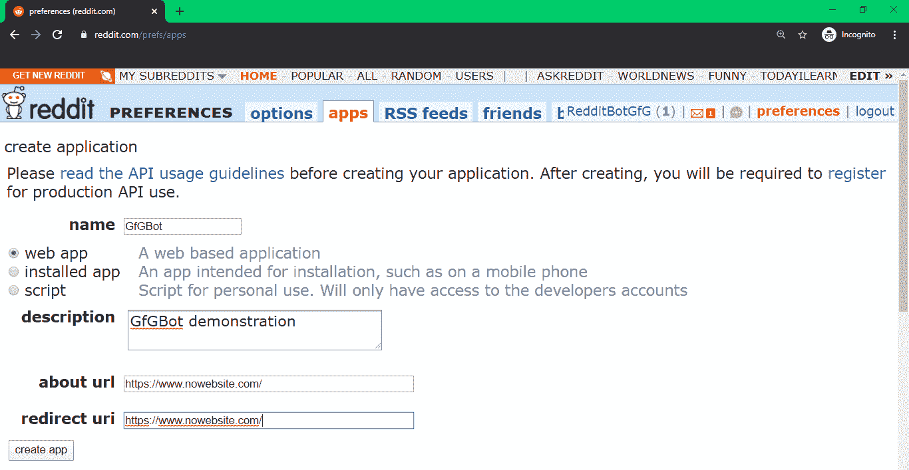
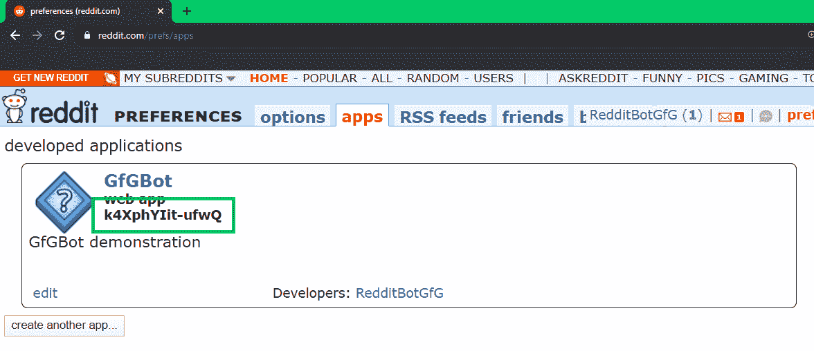
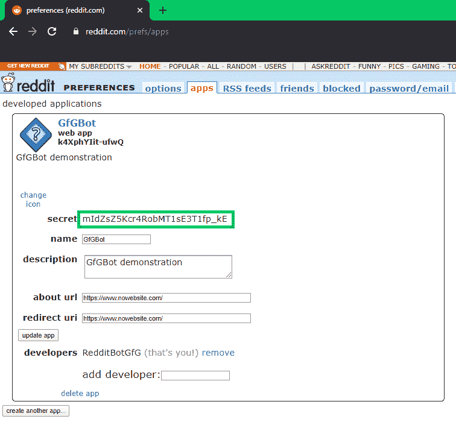

# 如何获取 Python Reddit API 注册的 client_id 和 client_secret？

> 原文:[https://www . geesforgeks . org/how-to-client _ id-and-client _ secret-for-python-Reddit-API-registration/](https://www.geeksforgeeks.org/how-to-get-client_id-and-client_secret-for-python-reddit-api-registration/)

Reddit 是一个基于人们兴趣的社区网络。这些社区中的每一个都被称为子社区。用户可以订阅多个子页面来发布、评论和互动。
Reddit 机器人是自动响应用户发帖或者每隔一定时间自动发帖的东西。这可能取决于用户发布的内容。它可以由某些关键短语触发，也取决于关于其内容的各种子循环。
为了实现一个 Reddit 机器人，我们将使用 Python Reddit API 包装器(PRAW)。它允许我们登录 Reddit API，直接与网站后端交互。关于这个库的更多信息可以在这里找到–[PRAW–Python Reddit API Wrapper](https://www.geeksforgeeks.org/python-praw-python-reddit-api-wrapper/) 。

To create an instance of PRAW we need to run the following code:

```
reddit = praw.Reddit(client_id ='my client id', 
                     client_secret ='my client secret', 
                     user_agent ='my user agent', 
                     username ='my username', 
                     password ='my password') 
```

为了获得这些字段的信息:

*   创建一个 Reddit 帐户。
*   reddit 账户的用户名将进入`username`字段。
*   reddit 账户的密码将进入`password`字段。
*   `user_agent`是帮助 Reddit 确定网络请求来源的唯一标识符。
*   作为脚本应用程序访问 Reddit 的 API 需要`client_id`和`client_secret`。我们可以通过以下方式找到它们:
    1.  登录您的 Reddit 帐户。
    2.  打开链接:[https://www.reddit.com/prefs/apps](https://www.reddit.com/prefs/apps)
    3.  以下将打开:
        
    4.  点击“创建应用程序…”。将请求以下字段:
        
    5.  给应用程序起一个合适的名字，并填写其余字段:
        
    6.  点击“创建应用”。
    7.  绿色方框中的文字为`client_id`。
        
    8.  点击“编辑”。绿色方框中的文字为`client_secret`。
        