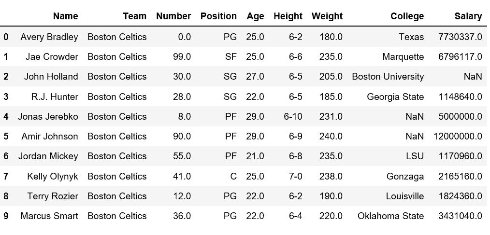

# 如何获取 DataFrame 中的列名和行名？

> 原文:[https://www . geesforgeks . org/如何获取数据框中的列和行名称/](https://www.geeksforgeeks.org/how-to-get-column-and-row-names-in-dataframe/)

在分析实际数据集时，这些数据集的大小通常非常大，我们可能需要获取行或索引名和列名，以便执行某些特定的操作。

**注:**下载以下示例中使用的 **nba** 数据集[点击此处](https://drive.google.com/file/d/1jDqWnU88gI8_BWfQARTwDYdnJT-4vnZp/view?usp=sharing)

### 获取熊猫数据框中的行名

首先，让我们用 nba.csv 创建一个简单的[数据帧](https://www.geeksforgeeks.org/python-pandas-dataframe/)

## 蟒蛇 3

```py
# Import pandas package
import pandas as pd

# making data frame
data = pd.read_csv("nba.csv")

# calling head() method 
# storing in new variable
data_top = data.head(10)

# display
data_top
```

**输出:**



现在让我们尝试从上面的数据集中获取行名。

**方法#1:** 简单地迭代索引

## 蟒蛇 3

```py
# Import pandas package
import pandas as pd

# making data frame
data = pd.read_csv("nba.csv")

# calling head() method 
# storing in new variable
data_top = data.head()

# iterating the columns
for row in data_top.index:
    print(row, end = " ")
```

**输出:**

```py
0 1 2 3 4 5 6 7 8 9 
```

**方法#2:** 使用带有数据框对象的行

## 蟒蛇 3

```py
# Import pandas package
import pandas as pd

# making data frame
data = pd.read_csv("nba.csv")

# calling head() method 
# storing in new variable
data_top = data.head()

# list(data_top) or
list(data_top.index)
```

**输出:**

```py
[0, 1, 2, 3, 4, 5, 6, 7, 8, 9]
```

**方法#3:** index.values 方法返回一个索引数组。

## 蟒蛇 3

```py
# Import pandas package
import pandas as pd

# making data frame
data = pd.read_csv("nba.csv")

# calling head() method 
# storing in new variable
data_top = data.head()

list(data_top.index.values)
```

**输出:**

```py
[0, 1, 2, 3, 4, 5, 6, 7, 8, 9]
```

**方法#4:** 使用 tolist()方法，用给定的值列出索引。

## 蟒蛇 3

```py
# Import pandas package
import pandas as pd

# making data frame
data = pd.read_csv("nba.csv")

# calling head() method 
# storing in new variable
data_top = data.head()

list(data_top.index.values.tolist())
```

**输出:**

```py
[0, 1, 2, 3, 4, 5, 6, 7, 8, 9]
```

**方法#5:** 计算数据框中的行数
由于我们使用 head()方法只加载了数据框的前 10 行，所以让我们先验证总行数。

## 蟒蛇 3

```py
# iterate the indices and print each one
for row in data.index:
    print(row, end = " ")
```