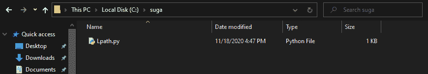

# 如何在 Python 中获取当前脚本的目录？

> 原文:[https://www . geesforgeks . org/如何获取当前 python 脚本目录/](https://www.geeksforgeeks.org/how-to-get-directory-of-current-script-in-python/)

父目录是*分层*文件系统中另一个文件/目录之上的目录。获取父目录对于执行某些与文件系统管理相关的任务至关重要。在本文中，我们将了解用于获取当前运行的 python 脚本的父目录的方法，并了解每种方法的各种用途/缺点。为了执行上述任务，我们将使用两个名为*操作系统*和*检查*的库，这两个库都是内置的，因此不需要任何安装。

出于演示目的，我们将使用位于 *C:\suga\Lpath.py* 的以下文件。文件的内容(代码)将根据引用它的上下文而改变。



在以下示例中，我们将广泛使用 *os.path* 模块中的 *dirname()* 函数。因此，我们最好事先了解一下。

> **语法:** os.path.dirname(路径)
> 
> **参数:**
> 
> **路径:**表示文件系统路径的类似路径的对象。
> 
> **返回类型:**
> 
> 此方法返回一个字符串，该字符串表示指定路径的父目录的绝对路径

**方法 1#:** 使用 __file__ 模块对象。

在这个方法中，我们将使用 __file__(用双下划线( *dunder* )包围的 file 关键字)。这个预定义的属性存在于*大多数* python 文件中。该属性用于获取当前正在执行的 python 文件的文件名。我们将通过 __file__ 获得的路径传递给 *os.path.dirname()* 函数，以便获得 python 文件的父目录。

## 蟒蛇 3

```py
import os

# Displaying the script path
print(__file__)

# Displaying the parent directory of the script
print(os.path.dirname(__file__))
```

**输出:**

```py
C:\suga\Lpath.py
C:\suga

```

**缺点:**

*   上述方法只有在 python 脚本中使用时才有效。因此，如果从交互式环境(stdin)或逐行解释器(调试)运行，它将不起作用。
*   __file__ 不会出现在静态链接的 C 模块中(最初用 C 编写但移植到 python 的库)
*   __ 文件 _ _ 不会在内置模块中定义

**方法 2#:** 使用 sys.argv[0]命令行参数

*sys.argv* 是一个包含传递给 python 程序的命令行参数的列表。在这个方法中，我们将使用 sys.argv 列表的第 0 个参数，即当前正在执行的 python 文件的路径，来获取 python 脚本的父目录。

## 蟒蛇 3

```py
import sys

print(os.path.dirname(sys.argv[0]))
```

**输出:**

```py
C:\suga

```

**缺点:**

*   只有在 python 脚本中使用 *sys.argv[0]* 时，上述方法才有效。它对原始性病不起作用，例如。从 python 命令行解释器(IDLE)运行命令。
*   上述方法是基于参数的，因此，如果 python 脚本以特定的方式运行，使得第一个参数(位于索引 0 处)不是可执行文件的文件名，则该方法将不起作用。《出埃及记》如果使用命令“ **py Lpath.py** 运行 *Lpath.py* 文件，将不会显示输出。

**方法 3#:** 使用 getsourcefile()函数

在这个方法中，我们将使用 inspect 库中的 *getsourcefile()* 方法来获取当前正在执行的 python 脚本的绝对路径。然后我们将它传递给 *os.path.dirname()* 函数来获取文件名的父目录。这种方法通常是上述方法中的*最佳和兼容的*方法，因为它跨平台、规模小(代码行更少)，并且在可变的执行环境下工作。

> **语法:** getsourcefile(对象)
> 
> **参数:**
> 
> **对象:**python 脚本中的可引用对象
> 
> **返回类型:**
> 
> 返回在其中找到对象的文件的完整路径。如果无法在源中识别对象，则返回无。

## 蟒蛇 3

```py
from inspect import getsourcefile

import os

print(os.path.dirname(getsourcefile(lambda:0)))
```

**输出:**

```py
C:\suga

```

**说明:**

首先，我们导入了 inspect 库中的 *getsourcefile()* 函数。之后我们导入了 *os* 库，用于使用在中找到的 *os.path.dirname()* 函数，该函数将用于从脚本文件名中提取父目录。我们提供了 *lambda:0* 作为 *getsourcefile()* 函数的参数，因为它需要 python 脚本中的一个引用对象，因此我们使用 lambda 创建了一个伪函数，只是为了使它能够在 python 脚本中被引用。

**注意:**如果要在逐行解释器中执行上述代码，可能需要对其进行一点修改(使用自适应函数，而不是 *dirname()* )。空闲)。但这超出了本文的范围。