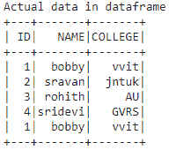
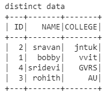
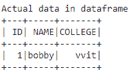
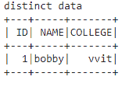

# 如何使用 PySpark 获取数据帧中不同的行？

> 原文:[https://www . geeksforgeeks . org/如何使用-pyspark/](https://www.geeksforgeeks.org/how-to-get-distinct-rows-in-dataframe-using-pyspark/) 获取数据框中的不同行

在本文中，我们将从 Python 中的 pyspark 数据框中获取不同的数据，因此我们将使用嵌套列表创建数据框并获取不同的数据。

我们将从 pyspark 列表中创建一个数据帧，绕过该列表到 pyspark 的 createDataFrame()方法，然后通过使用 distinct()函数，我们将从数据帧中获得不同的行。

> **语法:** dataframe.distinct()
> 
> 其中 dataframe 是使用 pyspark 从嵌套列表中创建的数据帧名称

**示例 1** : Python 代码，用于从列表列表创建的数据框中的大学数据中获取不同的数据。

## 蟒蛇 3

```
# importing module
import pyspark

# importing sparksession from 
# pyspark.sql module
from pyspark.sql import SparkSession

# creating sparksession and giving
# an app name
spark = SparkSession.builder.appName('sparkdf').getOrCreate()

# list  of college data
data = [["1", "bobby", "vvit"], 
        ["2", "sravan", "jntuk"],
        ["3", "rohith", "AU"],
        ["4", "sridevi", "GVRS"], 
        ["1", "bobby", "vvit"]]

# specify column names
columns = ['ID', 'NAME', 'COLLEGE']

# creating a dataframe from the 
# lists of data
dataframe = spark.createDataFrame(data, columns)

print('Actual data in dataframe')
dataframe.show()
```

**输出:**



**现在获取数据框中的不同行:**

## 蟒蛇 3

```
print('distinct data')

# display distinct data
dataframe.distinct().show()
```

**输出:**



**示例 2:** Python 程序从 1 行中查找不同的值

## 蟒蛇 3

```
# importing module
import pyspark

# importing sparksession from 
# pyspark.sql module
from pyspark.sql import SparkSession

# creating sparksession and giving
# an app name
spark = SparkSession.builder.appName('sparkdf').getOrCreate()

# list  of college data
data = [["1", "bobby", "vvit"]]

# specify column names
columns = ['ID', 'NAME', 'COLLEGE']

# creating a dataframe from the 
# list of data
dataframe = spark.createDataFrame(data, columns)

print('Actual data in dataframe')
dataframe.show()
```

**输出:**



**现在获取数据框中的不同行:**

## 蟒蛇 3

```
print('distinct data')

# display distinct data from
# the dataframe
dataframe.distinct().show()
```

**输出:**

