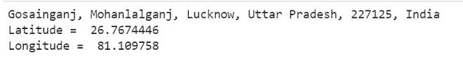
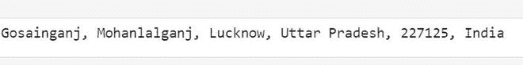

# 如何在 Python 中获取地理定位？

> 原文:[https://www . geeksforgeeks . org/如何获取 python 中的地理定位/](https://www.geeksforgeeks.org/how-to-get-geolocation-in-python/)

在本文中，我们将讨论当您输入任何位置名称并给出所有有用信息(如邮政编码、城市、州、国家等)时，如何获取地理位置。纬度和经度(具体的坐标)，反之亦然，我们提供坐标来获得位置名称。

这可以使用 python 中的 GeoPy 库来完成。这个库没有内置在 python 中，因此需要显式安装。

### 装置

在您的终端中，只需运行给定的命令:

> pip 安装地理

### **方法一:从位置名称**获取坐标

在提供位置的情况下，可以使用地理信息提取坐标，即纬度和经度。因此，可以用坐标来表示位置。

**接近**

*   导入模块
*   从 geopy 导入提名-提名是一个免费的服务或工具，或者可以被称为没有键的应用编程接口，在提供名称和地址后为您提供数据，反之亦然。
*   在调用接受 **user_agent** 参数的提名工具时，您可以给出它认为是它向其提供服务的应用程序的名称的任何名称。
*   **地理编码()**函数接受位置名称，并返回一个包含所有细节的地理数据框，因为它是一个数据框，所以我们可以通过给定的语法简单地调用它来获取地址、纬度和经度

**语法:**

> variablename.address
> 
> 变数名称. latitude
> 
> 变数名称。长度。

**示例:**

## 蟒蛇 3

```
# importing geopy library
from geopy.geocoders import Nominatim

# calling the Nominatim tool
loc = Nominatim(user_agent="GetLoc")

# entering the location name
getLoc = loc.geocode("Gosainganj Lucknow")

# printing address
print(getLoc.address)

# printing latitude and longitude
print("Latitude = ", location.latitude, "\n")
print("Longitude = ", location.longitude)
```

**输出:**



### **方法二:从经纬度**获取位置名称

在这个方法中所有的东西都和上面一样，唯一的区别是我们现在将使用 **reverse()** 方法代替使用地理编码函数，该方法接受坐标(纬度和经度)作为参数，该方法在提供坐标后给出地址。

**语法:**

> 反向(纬度、经度)

**接近**

*   导入模块
*   调用命名工具
*   传递纬度和经度以反转()
*   打印位置名称

**示例:**

## 蟒蛇 3

```
# importing modules
from geopy.geocoders import Nominatim

# calling the nominatim tool
geoLoc = Nominatim(user_agent="GetLoc")

# passing the coordinates
locname = geoLoc.reverse("26.7674446, 81.109758")

# printing the address/location name
print(locname.address)
```

**输出:**

