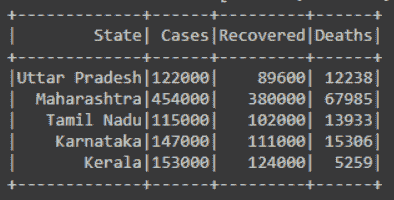
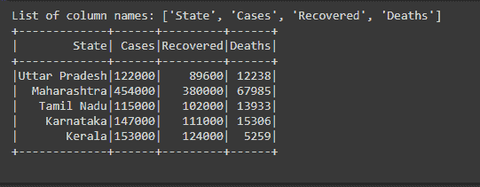
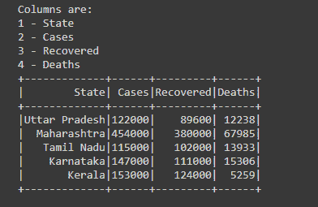
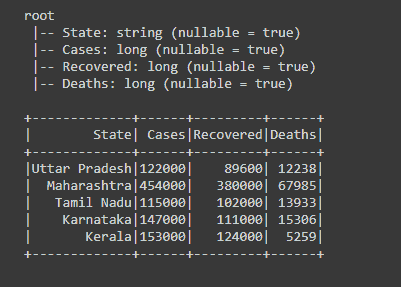

# 如何获取 PySpark 中数据框列的名称？

> 原文:[https://www . geeksforgeeks . org/如何获取 pyspark 中的 data frame-column/](https://www.geeksforgeeks.org/how-to-get-name-of-dataframe-column-in-pyspark/)

在本文中，我们将讨论如何在 PySpark 中获取 Dataframe 列的名称。

为了获得数据框中出现的列的名称，我们使用*列*函数，通过该函数，我们将获得数据框中出现的所有列名称的列表。

**语法:**

```
df.columns
```

我们还可以从结构字段列表中获取列的名称，然后从结构字段列表中提取列的名称。

**语法:**

```
df.schema.fields
```

让我们创建一个示例数据框，如下所示:

## 计算机编程语言

```
# importing necessary libraries
from pyspark.sql import SparkSession

# function to create new SparkSession
def create_session():
    spk = SparkSession.builder \
        .master("local") \
        .appName("Product_details.com") \
        .getOrCreate()
    return spk

def create_df(spark, data, schema):
    df1 = spark.createDataFrame(data, schema)
    return df1

if __name__ == "__main__":

    input_data = [("Uttar Pradesh", 122000, 89600, 12238),
                  ("Maharashtra", 454000, 380000, 67985),
                  ("Tamil Nadu", 115000, 102000, 13933),
                  ("Karnataka", 147000, 111000, 15306),
                  ("Kerala", 153000, 124000, 5259)]

    # calling function to create SparkSession
    spark = create_session()

    schema = ["State", "Cases", "Recovered", "Deaths"]

    # calling function to create dataframe
    df = create_df(spark, input_data, schema)

    # visualizing the dataframe
    df.show()
```

**输出:**



**示例 1:使用测向柱**

在本例中，我们创建了数据框，然后使用 df.columns 获取数据框中的列名列表，然后打印列名列表。

## 计算机编程语言

```
# getting the list of column names
col = df.columns

# printing
print(f'List of column names: {col}')

# visualizing the dataframe
df.show()
```

**输出:**



**示例 2:使用 df . schema . field**

在这个例子中，我们已经创建了数据框架，然后我们得到了包含列名、列数据类型和可空标志的结构字段列表。

我们已经在名为“field”的变量中存储了这个 StructFields 列表，然后迭代该字段的 for 循环，为了获得迭代的计数，我们计算了的计数，并使用 enumerate()函数从 1 开始获取计数，在 enumerate()函数中传递字段后，我们传递了 1。然后同时打印该列的计数和名称。

## 计算机编程语言

```
# getting the list of StructFields
field = df.schema.fields

# using for loop to iterate and enumerate
# for indexing or numbering
for count, col_name in enumerate(field, 1):

    # printing the column names
    print(count, "-", col_name.name)

    # visualizing the dataframe
    df.show()
```

**输出:**



**示例 3:使用 df . printchema()**

另一种查看或获取数据帧中出现的列名的方法我们可以看到数据帧的模式，这可以通过函数 printSchema()来完成。该函数用于打印数据帧的模式。从该模式中，我们可以看到所有的列名。

## 计算机编程语言

```
# printing Dataframe schema to
# get the column names
df.printSchema()

# visualizing the dataframe
df.show()
```

**输出:**

