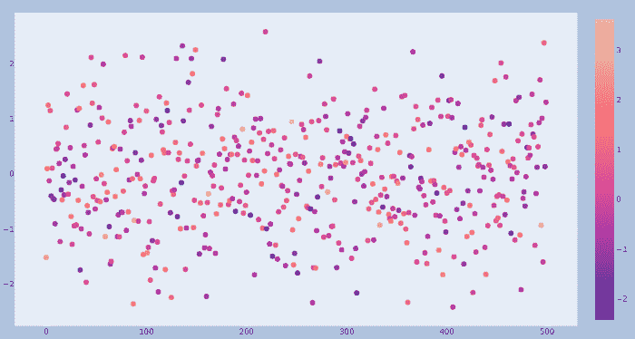
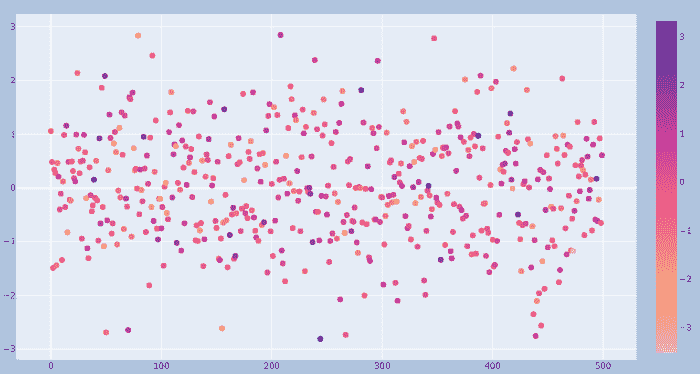

# 如何在 Plotly-Python 中获取所有色阶的名称？

> 原文:[https://www . geeksforgeeks . org/如何获取 python 中所有颜色标尺的名称/](https://www.geeksforgeeks.org/how-to-get-names-of-all-colorscales-in-plotly-python/)

在本文中，我们将学习如何在 Python 的 plotly express 中隐藏颜色条和图例。颜色条是从亮到暗或从暗到亮的渐变。它们非常适合可视化从低到高的数据集，如收入、温度或年龄。

## 逐步实施

**第一步:**

导入所有必需的包。

## 蟒蛇 3

```
# import the modules
import inspect
import plotly.express as px
from textwrap import fill
```

**第二步:**

在这里，我们将通过使用 inspect 模块迭代颜色模块来获得所有单独的色阶名称。

## 蟒蛇 3

```
# iterating over color module
colorscale_names = []
colors_modules = ['carto', 'colorbrewer', 'cmocean', 'cyclical',
                    'diverging', 'plotlyjs', 'qualitative', 'sequential']

for color_module in colors_modules:
    colorscale_names.extend([name for name, body
                            in inspect.getmembers(getattr(px.colors, color_module))
                            if isinstance(body, list)])
```

**完整代码:**

## 蟒蛇 3

```
# import the modules
import inspect
import plotly.express as px
from textwrap import fill

# iterating over color module
colorscale_names = []
colors_modules = ['carto', 'cmocean', 'cyclical',
                    'diverging', 'plotlyjs', 'qualitative', 'sequential']
for color_module in colors_modules:
    colorscale_names.extend([name for name, body
                            in inspect.getmembers(getattr(px.colors, color_module))
                            if isinstance(body, list)])

print(fill(''.join(sorted({f'{x: <{15}}' for x in colorscale_names})), 75))
```

**输出:**

**Aggrnyl** 和 Aggrnyl **_r** 的区别在于，它会显示相反的刻度，即 Aggrnyl(从亮到暗)Aggrnyl_r(从暗到亮)。为了在下面的例子中更清楚地理解它。

**注意:**由于版本控制，部分色阶名称可能无法使用。

```
Aggrnyl        Aggrnyl_r      Agsunset       Agsunset_r     Alphabet
Alphabet_r     Antique        Antique_r      Armyrose       Armyrose_r
Blackbody      Blackbody_r    Bluered        Bluered_r      Blues
Blues_r        Blugrn         Blugrn_r       Bluyl          Bluyl_r
Bold           Bold_r         BrBG           BrBG_r         Brwnyl
Brwnyl_r       BuGn           BuGn_r         BuPu           BuPu_r
Burg           Burg_r         Burgyl         Burgyl_r       Cividis
Cividis_r      D3             D3_r           Dark2          Dark24
Dark24_r       Dark2_r        Darkmint       Darkmint_r     Earth
Earth_r        Edge           Edge_r         Electric       Electric_r
Emrld          Emrld_r        Fall           Fall_r         G10
G10_r          Geyser         Geyser_r       GnBu           GnBu_r
Greens         Greens_r       Greys          Greys_r        HSV
HSV_r          Hot            Hot_r          IceFire        IceFire_r
Inferno        Inferno_r      Jet            Jet_r          Light24
Light24_r      Magenta        Magenta_r      Magma          Magma_r
Mint           Mint_r         OrRd           OrRd_r         Oranges
Oranges_r      Oryel          Oryel_r        PRGn           PRGn_r
Pastel         Pastel1        Pastel1_r      Pastel2        Pastel2_r
Pastel_r       Peach          Peach_r        Phase          Phase_r
PiYG           PiYG_r         Picnic         Picnic_r       Pinkyl
Pinkyl_r       Plasma         Plasma_r       Plotly         Plotly3
Plotly3_r      Plotly_r       Portland       Portland_r     Prism
Prism_r        PuBu           PuBuGn         PuBuGn_r       PuBu_r
PuOr           PuOr_r         PuRd           PuRd_r         Purp
Purp_r         Purples        Purples_r      Purpor         Purpor_r
Rainbow        Rainbow_r      RdBu           RdBu_r         RdGy
RdGy_r         RdPu           RdPu_r         RdYlBu         RdYlBu_r
RdYlGn         RdYlGn_r       Redor          Redor_r        Reds
Reds_r         Safe           Safe_r         Set1           Set1_r
Set2           Set2_r         Set3           Set3_r         Spectral
Spectral_r     Sunset         Sunset_r       Sunsetdark     Sunsetdark_r
T10            T10_r          Teal           Teal_r         Tealgrn
Tealgrn_r      Tealrose       Tealrose_r     Temps          Temps_r
Tropic         Tropic_r       Turbo          Turbo_r        Twilight
Twilight_r     Viridis        Viridis_r      Vivid          Vivid_r
YlGn           YlGnBu         YlGnBu_r       YlGn_r         YlOrBr
YlOrBr_r       YlOrRd         YlOrRd_r       __all__        _cols
algae          algae_r        amp            amp_r          balance
balance_r      curl           curl_r         deep           deep_r
delta          delta_r        dense          dense_r        gray
gray_r         haline         haline_r       ice            ice_r
matter         matter_r       mrybm          mrybm_r        mygbm
mygbm_r        oxy            oxy_r          phase          phase_r
scale_pairs    scale_pairs_r  scale_sequence scale_sequence_rsolar
solar_r        speed          speed_r        tempo          tempo_r
thermal        thermal_r      turbid         turbid_r
```

**例 1:**

在本例中，我们在 Plotly Express 中选择色阶作为**色阶=“Agsunset”**，这将从内置的 Plotly 库中选择 Aggrnyl 色阶。

## 蟒蛇 3

```
import plotly.graph_objects as go
import numpy as np

fig = go.Figure(data=go.Scatter(
    y=np.random.randn(500),
    mode='markers',
    marker=dict(
        size=8,
        color=np.random.randn(550),  # set color equal to a variable
        colorscale='Agsunset',  # one of plotly colorscales
        showscale=True
    )
))

fig.update_layout(
    margin=dict(l=12, r=5, t=20, b=20),
    paper_bgcolor="LightSteelBlue",
)

fig.show()
```

**输出:**



**例 2:**

在本例中，我们在 Plotly Express 中选择色标为**color scale =“Agsunset _ r”(**r 代表反转 **)** ，这将从内置的 Plotly 库中选择**反转**Aggrenyl _ r 色标。两者之间唯一的区别是它将显示相反的比例，即 Aggrnyl _ r(从暗到亮)和 Aggrenyl(从亮到暗)。

## 蟒蛇 3

```
import plotly.graph_objects as go
import numpy as np

fig = go.Figure(data=go.Scatter(
    y=np.random.randn(500),
    mode='markers',
    marker=dict(
        size=8,
        color=np.random.randn(550),  # set color equal to a variable
        colorscale='Agsunset_r',  # reverse Agsunset colorscales
        showscale=True
    )
))

fig.update_layout(
    margin=dict(l=12, r=5, t=20, b=20),
    paper_bgcolor="LightSteelBlue",
)

fig.show()
```

**输出:**

