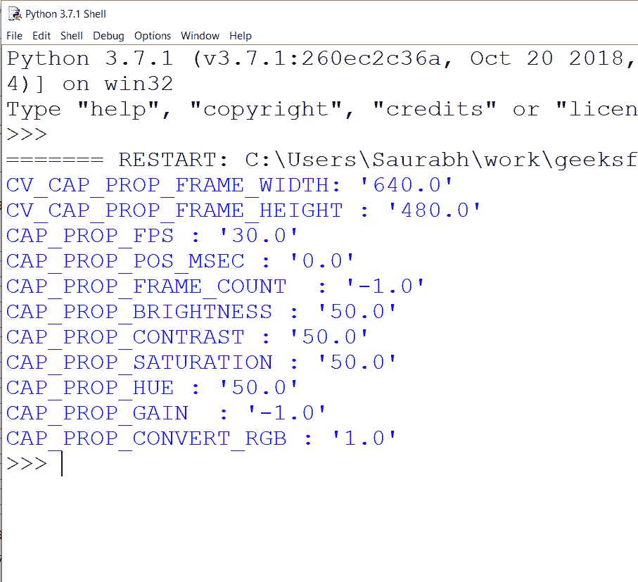

# 如何获取 Python cv2 的属性。VideoCapture 对象？

> 原文:[https://www . geesforgeks . org/how-to-properties-of-python-cv2-video capture-object/](https://www.geeksforgeeks.org/how-to-get-properties-of-python-cv2-videocapture-object/)

让我们看看如何从 cv2 中获取属性。视频捕捉对象并了解它们是如何工作的。cv2。VideoCapture 是 [openCV 库](https://www.geeksforgeeks.org/opencv-overview/)(用于计算机视觉、机器学习和图像处理)的一项功能，它允许通过网络摄像头或视频文件捕捉来处理视频。要了解更多关于此功能的信息，请参考[此链接](https://www.geeksforgeeks.org/python-opencv-capture-video-from-camera/#:~:text=It%20lets%20you%20create%20a,capture%20object%20for%20the%20camera.)。

### 装置

在我们开始之前，请确保在 Python 3.X 上安装 OpenCV 库。

```py
pip install opencv-python
```

### **cv2 的性质。视频捕捉对象**

通过了解 cv2 的特性。视频捕获对象通过对帧进行处理，最终有助于进行视频处理。

**1)宽度:**此属性用于获取视频流中帧的宽度。测量单位为像素。

> **语法:** cv2。CAP_PROP_FRAME_WIDTH

**2)高度:**此属性用于获取视频流中帧的高度。测量单位为像素。

> **语法:** cv2。CAP_PROP_FRAME_HEIGHT

**3) Fps:** FPS 代表每秒帧数。此属性用于获取视频的帧速率。

> **语法:** cv2。CAP_PROP_FPS

**4)当前位置:**这个属性用来查找视频的当前位置是什么，它的度量单位是毫秒。

> **语法:** cv2。MSEC

**5)总帧数:**此属性用于计算视频文件中的总帧数。

> **语法:** cv2。CAP_PROP_FRAME_COUNT

**6)亮度:**此属性不适用于视频文件。它只适用于照相机或网络摄像头。用来找出亮度。

> **语法:** cv2。CAP _ PROP _ 亮度

**7)对比度:**此属性仅适用于相机或网络摄像头。用于找出拍摄图像的对比度。

> **语法:** cv2。CAP_PROP_CONTRAST

**8)饱和度值:**用于获取通过摄像头拍摄的实时帧的饱和度。这对视频文件也不起作用。

> **语法:** cv2。CAP _ PROP _ 饱和度

**9)色相值:**这是为了知道图像的色相值。只适用于摄像机。

> **语法:** cv2。CAP_PROP_HUE

**10)增益:**此属性用于获取图像的增益。不适用于视频文件，如果应用于视频文件，只需返回“0”。

> **语法:** cv2。CAP_PROP_GAIN

**11)需要转换为 RGB:** 此属性返回一个布尔值，该值指示图像是否应该转换为 RGB 色彩空间。

> **语法:** cv2。CAP_PROP_CONVERT_RGB

直接在代码中使用这些属性会更清楚。下面是它的实现:

## 蟒蛇 3

```py
# importing cv2
import cv2

#For Video File
#capture=cv2.VideoCapture("sample.webm")

#For webcam
capture=cv2.VideoCapture(0)

# showing values of the properties
print("CV_CAP_PROP_FRAME_WIDTH: '{}'".format(capture.get(cv2.CAP_PROP_FRAME_WIDTH)))
print("CV_CAP_PROP_FRAME_HEIGHT : '{}'".format(capture.get(cv2.CAP_PROP_FRAME_HEIGHT)))
print("CAP_PROP_FPS : '{}'".format(capture.get(cv2.CAP_PROP_FPS)))
print("CAP_PROP_POS_MSEC : '{}'".format(capture.get(cv2.CAP_PROP_POS_MSEC)))
print("CAP_PROP_FRAME_COUNT  : '{}'".format(capture.get(cv2.CAP_PROP_FRAME_COUNT)))
print("CAP_PROP_BRIGHTNESS : '{}'".format(capture.get(cv2.CAP_PROP_BRIGHTNESS)))
print("CAP_PROP_CONTRAST : '{}'".format(capture.get(cv2.CAP_PROP_CONTRAST)))
print("CAP_PROP_SATURATION : '{}'".format(capture.get(cv2.CAP_PROP_SATURATION)))
print("CAP_PROP_HUE : '{}'".format(capture.get(cv2.CAP_PROP_HUE)))
print("CAP_PROP_GAIN  : '{}'".format(capture.get(cv2.CAP_PROP_GAIN)))
print("CAP_PROP_CONVERT_RGB : '{}'".format(capture.get(cv2.CAP_PROP_CONVERT_RGB)))

# release window
capture.release()
cv2.destroyAllWindows()
```

#### **输出如下(对于网络摄像头):**

