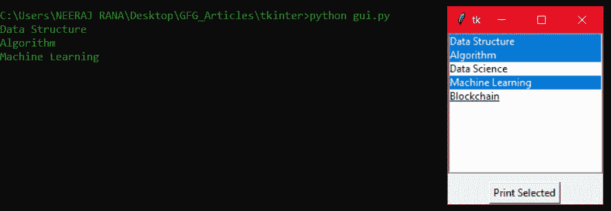

# 如何在 tkinter 中从列表框中获取选中值？

> 原文:[https://www . geesforgeks . org/如何从列表框中获取选定值-in-tkinter/](https://www.geeksforgeeks.org/how-to-get-selected-value-from-listbox-in-tkinter/)

**前提条件:**[【tkinter】](https://www.geeksforgeeks.org/python-gui-tkinter/)、

**ListBox** 是 Tkinter 为 GUI 开发提供的众多有用的小部件之一。列表框小部件用于显示项目列表，用户可以根据约束条件从中选择一个或多个项目。在本文中，我们将看到如何从 Listbox 小部件中获取选定的值。

**代码:**

## 蟒蛇 3

```py
# Python3 program to get selected
# value(s) from tkinter listbox

# Import tkinter
from tkinter import *

# Create the root window
root = Tk()
root.geometry('180x200')

# Create a listbox
listbox = Listbox(root, width=40, height=10, selectmode=MULTIPLE)

# Inserting the listbox items
listbox.insert(1, "Data Structure")
listbox.insert(2, "Algorithm")
listbox.insert(3, "Data Science")
listbox.insert(4, "Machine Learning")
listbox.insert(5, "Blockchain")

# Function for printing the
# selected listbox value(s)
def selected_item():

    # Traverse the tuple returned by
    # curselection method and print
    # corresponding value(s) in the listbox
    for i in listbox.curselection():
        print(listbox.get(i))

# Create a button widget and
# map the command parameter to
# selected_item function
btn = Button(root, text='Print Selected', command=selected_item)

# Placing the button and listbox
btn.pack(side='bottom')
listbox.pack()

root.mainloop()
```

**输出:**



带输出的图形用户界面窗口

**说明:**

listbox 上的 curselection 方法返回一个元组，该元组包含列表框中选定项的索引/行号，从 0 开始。我们创建的 selected_item 函数遍历 curselection 方法返回的元组，并使用索引打印列表框的相应项。当我们按下“打印选定”按钮时，它就会执行。在没有选择项目的情况下，curselection 方法返回一个空元组。

**注意:**可以将 listbox 小部件的 selectmode 参数更改为“SINGLE”，用于设置仅选择单个值的约束。