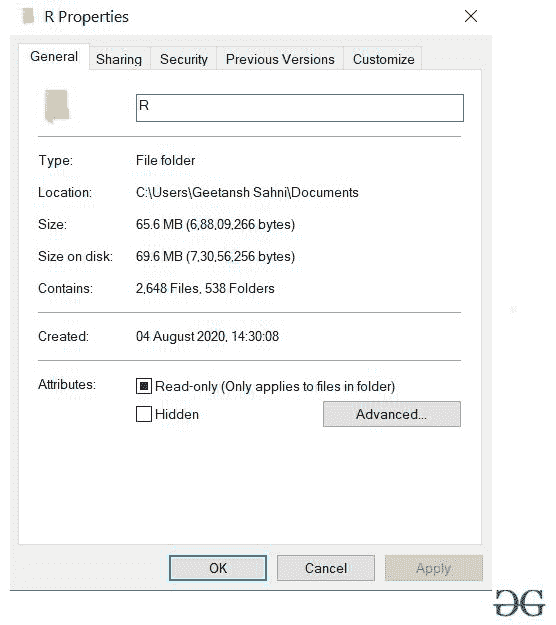
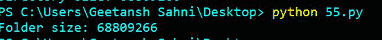

# 如何用 Python 获取文件夹的大小？

> 原文:[https://www . geesforgeks . org/如何使用 python 获取文件夹大小/](https://www.geeksforgeeks.org/how-to-get-size-of-folder-using-python/)

在本文中，我们将讨论使用 python 获取文件夹大小的各种方法。

为了得到一个目录的大小，用户必须遍历整个文件夹，添加该文件夹中每个文件的大小，并显示文件夹的总大小。

**应遵循的步骤:**

*   导入所需模块。
*   创建一个变量*大小*，并为其赋值 0。
*   分配文件夹的路径。
*   扫描文件夹，获取文件夹中每个文件的大小，并添加到*大小*中。
*   显示文件夹的总大小。

我们将使用下面的文件夹来描述每种方法:



**方法#1:** 使用[OS . walk()](https://www.geeksforgeeks.org/os-walk-python/)+[OS . path . getsize()](https://www.geeksforgeeks.org/python-os-path-size-method/)

在这种方法中，我们将使用 *os.walk()* 迭代文件夹中存在的每个文件，然后使用 *os.path.getsize()计算并添加每个扫描文件的大小。*

## 蟒蛇 3

```py
# import module
import os

# assign size
size = 0

# assign folder path
Folderpath = 'C:/Users/Geetansh Sahni/Documents/R'

# get size
for path, dirs, files in os.walk(Folderpath):
    for f in files:
        fp = os.path.join(path, f)
        size += os.path.getsize(fp)

# display size
print("Folder size: " + str(size))
```

**输出:**



**方法 2:** 使用[OS . walk()](https://www.geeksforgeeks.org/os-walk-python/)+[OS . stat()](https://www.geeksforgeeks.org/python-os-stat-method/)

在这种方法中，我们将使用 *os.walk()迭代文件夹中存在的每个文件。**OS . stat()*方法返回文件属性，现在使用 *os.stat()。st_size* 我们可以计算文件大小。因此，可以计算出文件夹的总大小。

## 蟒蛇 3

```py
# import module
import os

# assign size
size = 0

# assign folder path
Folderpath = 'C:/Users/Geetansh Sahni/Documents/R'  

# get size
for path, dirs, files in os.walk(Folderpath):
    for f in files:
        fp = os.path.join(path, f)
        size += os.stat(fp).st_size

# display size       
print("Folder size: " + str(size))
```

**输出:**


**方法 3:** 使用[OS . scandir()](https://www.geeksforgeeks.org/python-os-scandir-method/)+[OS . path . getsize()](https://www.geeksforgeeks.org/python-os-path-size-method/)

这里，我们将使用 *os.scandir()* 扫描文件夹中的每个文件，然后使用 *os.path.getsize()，*计算每个文件的大小，然后我们将总的添加大小存储在一个变量中。

## 蟒蛇 3

```py
# import module
import os

# assign size
size = 0

# assign folder path
Folderpath = 'C:/Users/Geetansh Sahni/Documents/R'   

# get size
for ele in os.scandir(Folderpath):
    size+=os.path.getsize(ele)

print(size)
```

**输出:**


**方法 4:** 使用[OS . scandir()](https://www.geeksforgeeks.org/python-os-scandir-method/)+[OS . stat()](https://www.geeksforgeeks.org/python-os-stat-method/)

这里，我们将使用 *os.scandir()扫描文件夹中的每个文件。**OS . stat()*方法返回文件属性，现在使用 *os.stat()。st_size* 我们可以计算文件大小。因此，可以计算出文件夹的总大小。

## 蟒蛇 3

```py
# import module
import os

# assign size
size = 0

# assign folder path
Folderpath = 'C:/Users/Geetansh Sahni/Documents/R'  

# get size
for ele in os.scandir(Folderpath):
    size+=os.stat(ele).st_size

print(size)
```

**输出:**

