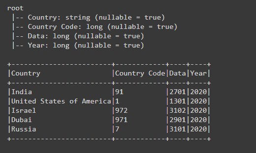

# 如何从 PySpark Dataframe 中的一列获取子串？

> 原文:[https://www . geesforgeks . org/如何从 pyspark-dataframe 中的列获取子字符串/](https://www.geeksforgeeks.org/how-to-get-substring-from-a-column-in-pyspark-dataframe/)

在本文中，我们将看到如何从 PySpark Dataframe 列中获取子字符串，以及如何创建新列并将子字符串放入新创建的列中。

我们可以使用 **substring()** 和 **substr()** 函数获取该列的子字符串。

> **语法:**子串(字符串、位置、长度)
> 
> df.col_name.substr(开始，长度)
> 
> **参数:**
> 
> *   **str–**可以是字符串，也可以是从中获取子字符串的列的名称。
> *   **start 和 pos–**通过这个参数我们可以给出子串开始的起始位置。
> *   **长度和 len–**是子串从起始位置开始的长度。

让我们创建一个数据帧。

## 蟒蛇 3

```
# importing necessary libraries
from pyspark.sql import SparkSession
from pyspark.sql.functions import col, substring

# function to create new SparkSession
def create_session():
    spk = SparkSession.builder \
        .master("local") \
        .appName("Substring.com") \
        .getOrCreate()
    return spk

def create_df(spark, data, schema):

    df1 = spark.createDataFrame(data, schema)
    return df1

if __name__ == "__main__":

    input_data = [("India", +91, 2701, 2020),
                  ("United States of America", +1, 1301, 2020),
                  ("Israel", +972, 3102, 2020),
                  ("Dubai", +971, 2901, 2020),
                  ("Russia", 7, 3101, 2020)]

    # calling function to create SparkSession
    spark = create_session()

    schema = ["Country", "Country Code",
              "Data", "Year"]

    # calling function to create dataframe
    df = create_df(spark, input_data, schema)
    df.show()
```

**输出:**



**示例 1:使用 substring()获取子字符串，并使用 withColumn()函数创建新列。**

## 计算机编程语言

```
if __name__ == "__main__":

    # creating Month column and get the
    # substring from the Data column
    # creating Date column and get the
    # substring from the Data column
    df = df.withColumn(
      "Month", substring("Data", 1, 2)).withColumn(
      "Date", substring("Data", 3, 4))

    # dropping the Data column from the
    # Dataframe
    df = df.drop("Data")

    # printing Dataframe schema to get the
    # column names
    df.printSchema()

    # visualizing the dataframe
    df.show(truncate=False)
```