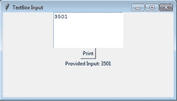

# 如何从 Tkinter 文本框获取输入？

> 原文:[https://www . geesforgeks . org/如何从 tkinter 文本框获取输入/](https://www.geeksforgeeks.org/how-to-get-the-input-from-tkinter-text-box/)

Tkinter 文本框小部件用于插入多行文本。这个小部件可以用于消息传递、显示信息和许多其他任务。重要的任务是获取插入的文本以便进一步处理。为此，我们必须对 textbox 小部件使用 [get()](https://www.geeksforgeeks.org/python-tkinter-entry-widget/) 方法。

> **语法:** get(开始，*【结束】*)
> 
> 哪里，
> 
> start 是文本框中所需文本的起始索引
> 
> end 是文本框中所需文本的结束索引
> 
> 如果未提供结束，将只检索提供的开始索引处的字符。

### 方法:

*   创建 Tkinter 窗口
*   创建文本框小部件
*   创建按钮小部件
*   创建一个函数，在点击按钮后使用 get()方法从文本框返回文本

**下面是实现:**

## 蟒蛇 3

```
import tkinter as tk

# Top level window
frame = tk.Tk()
frame.title("TextBox Input")
frame.geometry('400x200')
# Function for getting Input
# from textbox and printing it 
# at label widget

def printInput():
    inp = inputtxt.get(1.0, "end-1c")
    lbl.config(text = "Provided Input: "+inp)

# TextBox Creation
inputtxt = tk.Text(frame,
                   height = 5,
                   width = 20)

inputtxt.pack()

# Button Creation
printButton = tk.Button(frame,
                        text = "Print", 
                        command = printInput)
printButton.pack()

# Label Creation
lbl = tk.Label(frame, text = "")
lbl.pack()
frame.mainloop()
```

**输出:**



对上述代码按下打印按钮后的快照