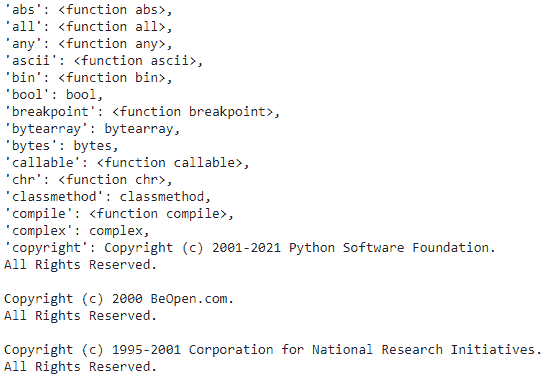
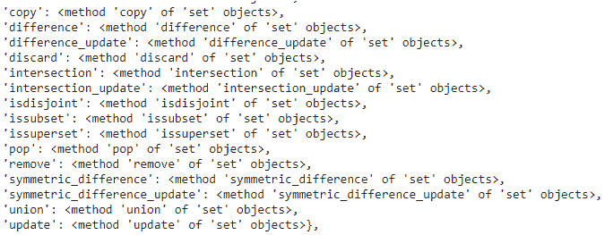

# 如何在 Python 中获得所有已初始化对象和函数定义的活列表？

> 原文:[https://www . geesforgeks . org/如何获取所有初始化对象和函数定义列表-python 中的活动/](https://www.geeksforgeeks.org/how-to-get-the-list-of-all-initialized-objects-and-function-definitions-alive-in-python/)

在本文中，我们将获得 Python 中所有已初始化对象和函数定义的列表，所以我们将获得所有已初始化对象的详细信息。GC 代表为管理内存中的对象而发出的垃圾收集器，因此从该模块中，我们使用了 **get_objects()** 方法

> **语法:** gc.get_objects()

**示例 1:** Python 程序获取初始化对象的详细信息。

在这里，我们将创建一些对象，如列表、元组、dict，然后使用 gc 获取活动的 initialize 对象。

## 蟒蛇 3

```py
# import gc module
import gc

# create list object
a = [1,2,3,4,5]
print(a)

# create a variable
b = 12
print(b)

# create tuple object
c = (1,2,3,4,5)
print(c)

# create a  dictionary object
d = {'a':1, 'b':2}
print(d)

# get all the initialized objects
gc.get_objects()
```

**输出:**



**示例 2:** 获取初始化函数列表的 Python 程序

## 蟒蛇 3

```py
# import gc module
import gc

# define a function
def geek(name):
    print(name + " - Hello Geek!")

# call the function with names as
# parameter
geek("sravan")
geek("bobby")
geek("ojaswi")
geek("rohith")
geek("gnanesh")

# get all the initialized objects
gc.get_objects()
```

**输出:**

