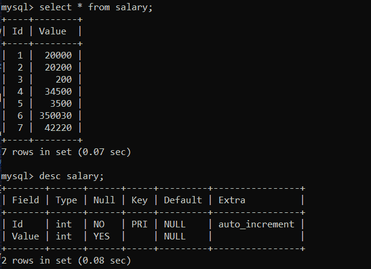

# 如何用 Python 获取 MySQL 表的一列的最小值和最大值？

> 原文:[https://www . geesforgeks . org/如何使用 python 获取 mysql 表的最小和最大列值/](https://www.geeksforgeeks.org/how-to-get-the-minimum-and-maximum-value-of-a-column-of-a-mysql-table-using-python/)

**先决条件:** [Python: MySQL 创建表](https://www.geeksforgeeks.org/python-mysql-create-table/)

在本文中，我们将看到如何使用 Python 获得 MySQL 表中一列的最小值和最大值。Python 允许广泛的数据库服务器与应用程序的集成。从 Python 访问数据库需要数据库接口。 [**MySQL 连接器**](https://www.geeksforgeeks.org/mysql-connector-python-module-in-python/) -Python 模块是 Python 中的一个 API，用于与 MySQL 数据库进行通信。

**正在使用的数据库:**



我们要用**极客**(数据库名)数据库和表格描述工资。

**进场:**

*   导入模块。
*   向数据库发出连接请求。
*   为数据库游标创建一个对象。
*   执行以下 MySQL 查询:

```py
SELECT MIN(Column_name) AS minimum FROM Table_name.
SELECT MAX(Column_name) AS minimum FROM Table_name.
```

*   并打印结果。

**例 1:** 求一列的最小值。

## 蟒蛇 3

```py
# Establish connection to MySQL database
import mysql.connector

mydb = mysql.connector.connect(
  host = "localhost",
  user = "root",
  password = "root123",
  database = "geeks"
)

# Create a cursor object
cursor = mydb.cursor()

# Execute the query 
cursor.execute("SELECT MIN(Value) AS minimum FROM salary")

result = cursor.fetchall()

for i in result:
    maximum= float(i[0])
    print(maximum)

# Close database connection
mydb.close()
```

**输出:**

```py
200.0
```

**例 2:** 获取一列的最大值。

## 蟒蛇 3

```py
# Establish connection to MySQL database
import mysql.connector

mydb = mysql.connector.connect(
  host = "localhost",
  user = "root",
  password = "root123",
  database = "geeks"
)

# Create a cursor object
cursor = mydb.cursor()

cursor.execute("SELECT MAX(Value) AS maximum FROM salary")

result = cursor.fetchall()

for i in result:
    maximum = float(i[0])
    print(maximum)

# Close database connection
mydb.close()
```

**输出:**

```py
350030.0
```