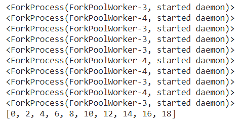
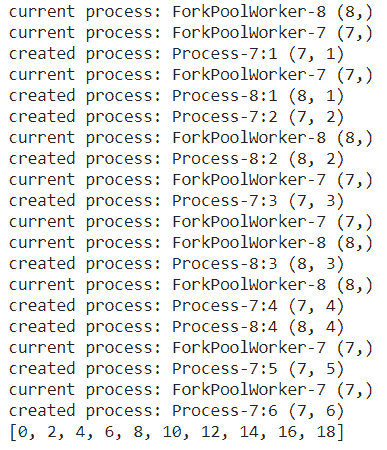

# 如何从 Python Multiprocess 获取进程 id？

> 原文:[https://www . geeksforgeeks . org/如何从 python 多进程中获取进程 id/](https://www.geeksforgeeks.org/how-to-get-the-process-id-from-python-multiprocess/)

在本文中，我们将看到如何从 Python 多进程中获取进程 id。为此，我们应该使用方法**多进程。current_process()** 来获取多进程 id。多处理指的是系统同时支持多个处理器的能力。多处理系统中的应用程序被分成独立运行的更小的例程。操作系统将这些线程分配给处理器，从而提高系统的性能。

考虑一个只有一个处理器的计算机系统。如果它同时被分配了几个进程，它将不得不中断每个任务，并短暂地切换到另一个任务，以保持所有进程的运行。
这种情况就像厨师一个人在厨房工作。他必须做几项任务，如烘烤、搅拌、揉面等。

**例 1:**

首先，我们需要用 python 导入一个多处理库。

## 蟒蛇 3

```py
# importing library
import multiprocessing

# define function
def twos_multiple(y):

    # get current process
    print(multiprocessing.current_process())

    return y * 2

pro = multiprocessing.Pool()

print(pro.map(twos_multiple, range(10)))
```

**输出:**



**例 2:**

多处理将为每个进程维护一个 [itertools.counter](https://www.geeksforgeeks.org/python-itertools-count/) 对象，该对象用于为它产生的任何子进程生成一个 _identity 元组，顶层进程产生具有单值 id 的子进程，它们产生具有双值 id 的进程，以此类推。然后，如果没有名称传递给流程构造函数，它只需使用“:”基于 _identity 自动生成名称。加入(…)。然后，池使用替换来更改进程的名称，使自动生成的 id 保持不变。

自动生成的名称是唯一的。它将返回过程对象本身，有一种可能性是过程是它自己的身份。

所有这一切的结果是，尽管两个进程可能具有相同的名称，因为您在创建它们时可能会为它们分配相同的名称，但是如果不接触名称参数，它们是唯一的。此外，理论上可以使用 _identity 作为唯一标识符；但我想他们把这个变量设为私有是有原因的！

## 蟒蛇 3

```py
import multiprocessing

def twos_multiple(x):

    proc = multiprocessing.Process()

    curr_proc = multiprocessing.current_process()

    print('current process:', curr_proc.name, curr_proc._identity)

    print('created process:', proc.name, proc._identity)

    return x * 2

pro = multiprocessing.Pool()

print(pro.map(twos_multiple, range(10)))
```

**输出:**

