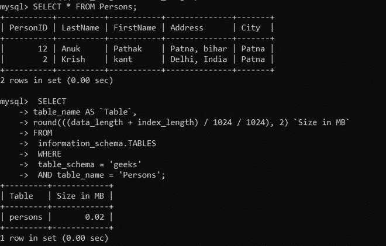
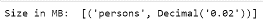
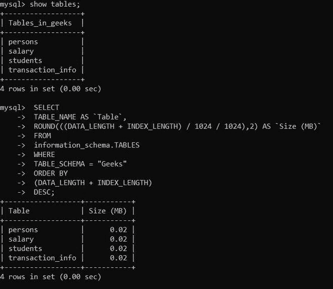
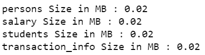

# 如何用 Python 获取 MySQL 中一个表的大小？

> 原文:[https://www . geeksforgeeks . org/如何使用 python 获取 mysql 中的表格大小/](https://www.geeksforgeeks.org/how-to-get-the-size-of-a-table-in-mysql-using-python/)

**先决条件:** [Python: MySQL 创建表](https://www.geeksforgeeks.org/python-mysql-create-table/)

在本文中，我们将看到如何使用 Python 在 MySQL 中获取表的大小。Python 允许广泛的数据库服务器与应用程序的集成。从 Python 访问数据库需要数据库接口。 [**MySQL 连接器**](https://www.geeksforgeeks.org/mysql-connector-python-module-in-python/) -Python 模块是 Python 中的一个 API，用于与 MySQL 数据库进行通信。

**进场:**

*   导入模块。
*   向数据库发出连接请求。
*   为数据库游标创建一个对象。
*   执行以下 MySQL 查询:

> SELECT table_name AS `Table `，round((data _ length+index _ length)/1024/1024)，2)` size in MB ` FROM information _ schema。TABLES WHERE Table _ schema = ' DatabaSe _ name '和 table _ name = ' Table _ name

**例 1:**

在本例中，我们将该数据库表用于以下查询；



**下面是实现:**

## 蟒蛇 3

```
# Import required module
import mysql.connector

# Establish connection
# to MySQL database
mydb = mysql.connector.connect(
    host="localhost",
    user="root",
    password="root123",
    database="geeks")

# Create cursor object
mycursor = mydb.cursor()

# Execute query
query = "SELECT  table_name AS `Table`, \
        round(((data_length + index_length) \
        / 1024 / 1024), 2) `Size in MB` \
        FROM information_schema.TABLES \
        WHERE table_schema = 'Geeks' AND \
        table_name = 'Persons';"

mycursor.execute(query)

# Display size of each table
myresult = mycursor.fetchall()

for item in myresult:
    print(item[0], "Size in MB: ", item[-1])
```

**输出:**



**例 2:**

在本例中，我们将获取数据库中所有的表大小。



**下面是实现:**

## 蟒蛇 3

```
# Import required module
import mysql.connector

# Establish connection
# to MySQL database
mydb = mysql.connector.connect(
    host="localhost",
    user="root",
    password="root123",
    database="geeks")

# Create cursor object
mycursor = mydb.cursor()

# Execute query
query = "SELECT  TABLE_NAME AS `Table`, \
         ROUND(((DATA_LENGTH + INDEX_LENGTH) \
         / 1024 / 1024),2) AS `Size (MB)` \
         FROM information_schema.TABLES WHERE \
         TABLE_SCHEMA = 'Geeks' ORDER BY \
         (DATA_LENGTH + INDEX_LENGTH) DESC;"

mycursor.execute(query)

# Display size of each table
myresult = mycursor.fetchall()

for item in myresult:
    print(item[0], "Size in MB: ", item[-1])
```

**输出:**

