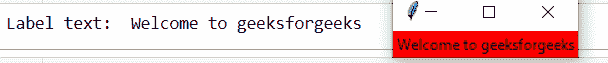

# 如何获取 Tkinter 标签文本？

> 原文:[https://www . geeksforgeeks . org/如何获取-tkinter-label-text/](https://www.geeksforgeeks.org/how-to-get-the-tkinter-label-text/)

**先决条件:** [Python 图形用户界面–Tkit](https://www.geeksforgeeks.org/python-gui-tkinter/)

Python 为开发图形用户界面提供了多种选择。在所有的 GUI 方法中， *tkinter* 是最常用的方法。它是 Python 附带的 Tk 图形用户界面工具包的标准 Python 接口。Python 与 *tkinter* 是创建图形用户界面应用程序最快最简单的方法。使用 tkinter 创建图形用户界面是一项简单的任务。

在本文中，我们将编写一个 Python 脚本来获取 *tkinter* 标签文本。下面是讨论的各种方法:

**方法#1:** 采用 *cget()* 方法。

**进场:**

*   正在导入模块。
*   创建主窗口(容器)。
*   向主窗口添加标签小部件。
*   应用 *cget()* 方法，获取标签文本。

**实施:**

## 蟒蛇 3

```py
# import modules
import tkinter as tk

# object of tkinter
# and background set for light grey
master = tk.Tk()
master.configure(bg='light grey')

# create label
l = tk.Label(master,
             text="Welcome to geeksforgeeks",
             bg="red")

# apply cget()
print("Label text: ", l.cget("text"))

l.pack()
master.mainloop()
```

**输出:**



**方法 2:** 使用字典标签对象。

**进场:**

*   正在导入模块。
*   创建主窗口(容器)。
*   向主窗口添加标签小部件。
*   使用字典标签对象并获取标签文本。

## 蟒蛇 3

```py
# import modules 
import tkinter as tk

# object of tkinter 
# and background set for light grey 
master = tk.Tk() 
master.configure(bg = 'light grey')   

# create label
l = tk.Label(master, 
             text = "Welcome to geeksforgeeks", 
             bg = "red")

# using dictionary label object
print("Label text: ", l["text"])

l.pack()
tk.mainloop()
```

**输出:**

