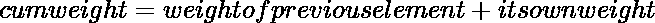

# 如何在 Python 中得到加权随机选择？

> 原文:[https://www . geesforgeks . org/如何获得加权随机选择 python/](https://www.geeksforgeeks.org/how-to-get-weighted-random-choice-in-python/)

加权随机选择意味着根据元素的概率从列表或数组中选择随机元素。我们可以给每个元素分配一个概率，并根据这个概率选择元素。通过这种方式，我们可以从列表中选择一个或多个元素，这可以通过两种方式实现。

1.  随机选择()
2.  By numpy.random.choice()

## **使用随机选择()方法**

[**选择()**](https://www.geeksforgeeks.org/random-choices-method-in-python/) 方法从列表中返回多个随机元素并替换。您可以使用权重参数或累计权重参数来衡量每个结果的可能性。

> ***语法:**随机选择(序列，权重=无，cum _ weights =无，k=1)*
> 
> ***参数:***
> *1。**序列**是一个强制参数，可以是列表、元组或字符串。*
> *2。**权重**是一个可选参数，用于衡量每个值的可能性。*
> *3。 **cum_weights** 是一个可选参数，用于衡量每个值的可能性，但在此情况下，可能性是累积的*
> *4。 **k** 是一个可选参数，用于定义返回列表的长度。*

**例 1:**

## 蟒蛇 3

```py
import random

sampleList = [100, 200, 300, 400, 500]

randomList = random.choices(
  sampleList, weights=(10, 20, 30, 40, 50), k=5)

print(randomList)
```

**输出:**

```py
[200, 300, 300, 300, 400]

```

您也可以使用 cum_weight 参数。它代表交换重量。默认情况下，如果我们将使用上述方法并发送权重，该函数会将权重更改为交换权重。所以为了让程序快速使用 cum_weight。累计重量通过以下公式计算:



```py
let the relative weight of 5 elements are [5,10,20,30,35]

than there cum_weight will be [5,15,35,65,100]
```

**示例:**

## 蟒蛇 3

```py
import random

sampleList = [100, 200, 300, 400, 500]
randomList = random.choices(
  sampleList, cum_weights=(5, 15, 35, 65, 100), k=5)

print(randomList)
```

**输出:**

```py
[500, 500, 400, 300, 400]
```

## **使用 numpy.random.choice()方法**

如果你使用的是 3.6 版本以上的 Python，那么你必须使用 NumPy 库来实现加权随机数。借助 **choice()** 方法，可以得到一维数组的随机样本，并返回 numpy 数组的随机样本。

> **语法:** numpy.random.choice(list，k，p=None)
> 
> **列表:**是你选择随机数的原始列表。
> 
> **k:** 是返回列表的大小。即您想要选择的元素数量。
> 
> **p:** 是各元素的概率。

**注:**所有元素的概率总和应等于 1。

**示例:**

## 计算机编程语言

```py
from numpy.random import choice

sampleList = [100, 200, 300, 400, 500]
randomNumberList = choice(
  sampleList, 5, p=[0.05, 0.1, 0.15, 0.20, 0.5])

print(randomNumberList)
```

**输出:**

```py
[200 400 400 200 400]
```