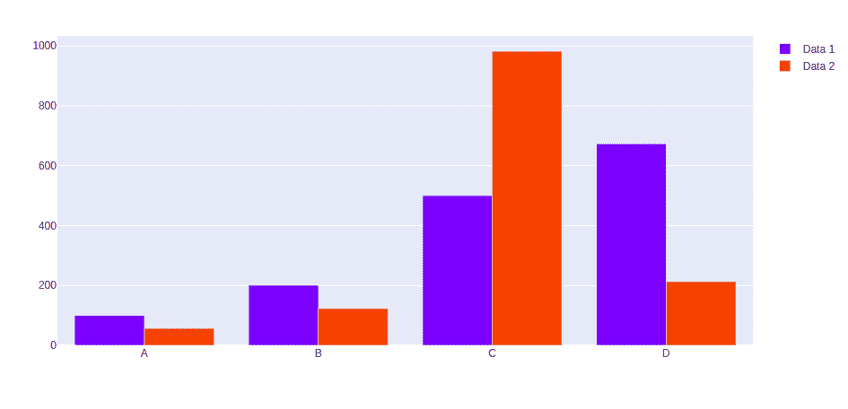
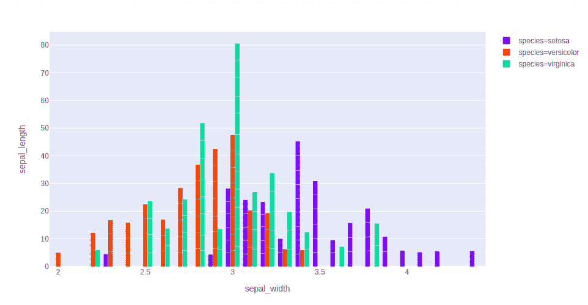
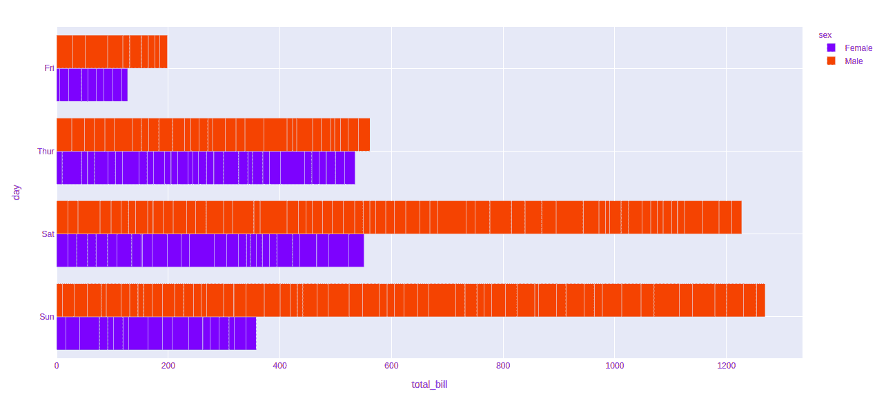

# 如何用 Python-Plotly 对条形图进行分组？

> 原文:[https://www . geesforgeks . org/如何分组-python 中的条形图-plotly/](https://www.geeksforgeeks.org/how-to-group-bar-charts-in-python-plotly/)

[**Plotly**](https://www.geeksforgeeks.org/getting-started-with-plotly-python/) 是一个 Python 库，用来设计图形，尤其是交互图形。它可以绘制各种图形和图表，如直方图、条形图、箱线图、展开图等。它主要用于数据分析以及财务分析。plotly 是一个交互式可视化库。

## 分组条形图

分组条形图可用于显示多组数据项，这些数据项与单一颜色进行比较，单一颜色用于指示所有数据集中的特定系列。

**方法 1:** 使用 graph_objects 类

**示例:**

## 蟒蛇 3

```
import plotly.graph_objects as px
import numpy

# creating random data through randomint 
# function of numpy.random 
np.random.seed(42)

random_x= np.random.randint(1,101,100) 
random_y= np.random.randint(1,101,100)

x = ['A', 'B', 'C', 'D']

plot = px.Figure(data=[go.Bar(
    name = 'Data 1',
    x = x,
    y = [100, 200, 500, 673]
   ),
                       go.Bar(
    name = 'Data 2',
    x = x,
    y = [56, 123, 982, 213]
   )
])

plot.show()
```

**输出:**



**方法二:**使用快递类

**示例 1:** 虹膜数据集

## 蟒蛇 3

```
import plotly.express as px

df = px.data.iris()

fig = px.bar(df, x="sepal_width", y="sepal_length",
             color="species", hover_data=['petal_width'],
             barmode = 'group')

fig.show()
```

**输出:**



**示例 2:** Tips 数据集

## 蟒蛇 3

```
import plotly.express as px

df = px.data.tips()

fig = px.bar(df, x="tota_bill", y="day", 
             color="sex", barmode = 'group')

fig.show()
```

**输出:**

