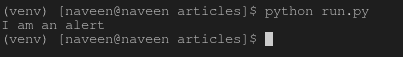

# 如何处理硒蟒中的预警提示？

> 原文:[https://www . geesforgeks . org/如何处理-提醒-硒中提示-python/](https://www.geeksforgeeks.org/how-to-handle-alert-prompts-in-selenium-python/)

Selenium 的 Python 模块是为使用 Python 执行自动化测试而构建的。警报是在浏览器中显示弹出窗口的一种方式，用于接受数据或显示数据。Selenium 提供了处理各种警报的方法。`class selenium.webdriver.common.alert.Alert(driver)`处理 Selenium Python 中的所有警报。它包含消除、接受、输入和从警告提示中获取文本的方法。警报中的两个主要任务是接受警报或取消警报。
硒提供了两种相同的方法–

```
Alert(driver).accept()
Alert(driver).dismiss()
```

## 警报方法

在 Selenium 中处理警报的主要方法包括–

*   **接受()**–接受可用的警报。
*   **取消()**–取消可用的警报。
*   **发送密钥(密钥发送)**–向警报发送密钥。
*   **文本**–获取警报的文本。

## 如何使用 Selenium Python 对报警提示进行操作？

为了说明警报，让我们编写手动 javascript alert 并检查相同的各种方法。我们创建了一个示例链接—https://ide.geeksforgeeks.org/tryit.php/WXYeMD9tD4

**Program –**

```
# import webdriver
from selenium import webdriver

# import Alert 
from selenium.webdriver.common.alert import Alert

# create webdriver object
driver = webdriver.Firefox()

# get ide.geeksforgeeks.org
driver.get("https://ide.geeksforgeeks.org / tryit.php / WXYeMD9tD4")

# create alert object
alert = Alert(driver)

# get alert text
print(alert.text)

# accept the alert
alert.accept()
```

**输出–**


**终端输出–**
