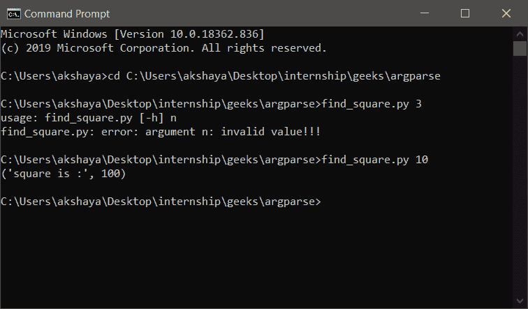
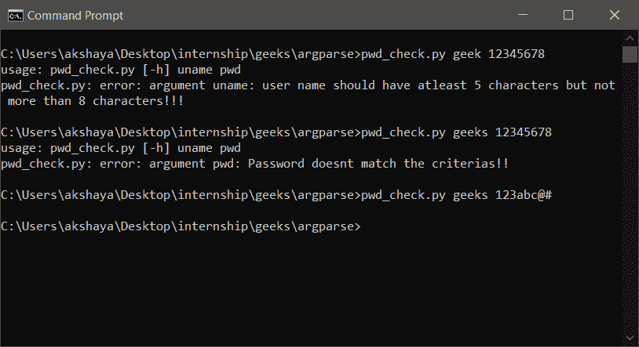

# Python 中如何用 argparse 处理无效参数？

> 原文:[https://www . geeksforgeeks . org/如何使用 python 中的-argparse 处理无效参数/](https://www.geeksforgeeks.org/how-to-handle-invalid-arguments-with-argparse-in-python/)

[Argparse 模块](https://www.geeksforgeeks.org/command-line-option-and-argument-parsing-using-argparse-in-python/)提供了改善命令行界面的设施。与这个模块相关联的方法使得为命令行界面程序编写代码以及更好的交互变得容易。当传递不适当的参数时，此模块会自动生成帮助消息并引发错误。它甚至允许定制在参数无效的情况下显示的消息。

## 处理无效参数的方法

**1。自定义功能和“类型”参数**

argparse 模块有一个名为 **add_arguments()** 的函数，其中给出了参数应该转换成的类型。用户定义的函数可以作为该参数的值传递，而不是使用可用的值。这在许多情况下是有用的，因为我们可以定义自己的标准，使参数在转换后有效。例如，让我们举一个简单的例子。我们必须输入一个 5 到 15 之间的数字，如果超过了这个数字，那么在转换之后就会产生一个错误。否则，将显示数字的平方。看看下面保存为 **find_square.py** 的 python 代码

## 计算机编程语言

```py
import argparse

# function to convert the input and 
# check the range
def checker(a):
    num = int(a)

    if num < 5 or num > 15:
        raise argparse.ArgumentTypeError('invalid value!!!')
    return num

parser = argparse.ArgumentParser(
    description='Processing integers in range 5 to 15')

# passing the function for 'type' parameter
parser.add_argument('n', type=checker)

res = parser.parse_args()
print("square is :", res.n*res.n)
```

**输出:**



find_square.py 输出

如果传递的参数不在给定的范围内，例如第一次给定的参数上面的图像' **3** '，错误信息**无效值！！！**显示。下一次通过的参数是 **10** ，在指定范围内，打印 10 的平方。

现在，看另一个例子，你不想输入转换输入，但指定一些标准，使它可能是一个有效的输入。下面给出的程序接受两个参数–**uname，pwd(用户名，密码)**。这里设置用户名的标准是，它应该至少有 5 个字符，但不超过 8 个。密码必须至少有 1 个数字、2 个字母和 1 个特殊字符。解析器设置为以这种方式处理，程序存储为 **pwd_check.py** 。

## 计算机编程语言

```py
import argparse

# function to check user name
def checker(a):
    if len(a) > 8 or len(a) < 5:
        raise argparse.ArgumentTypeError(
            'user name should have atleast 5 characters \
            but not more than 8 characters!!!')
    return

# function to check password
def checker_pwd(b):

    d = 0  # initial count of digits
    a = 0  # initial count of alphabets
    ss = 0  # initial count of special characters

    for i in range(0, len(b)):
      # increment alphabet count
        if (b[i] >= 'a' and b[i] <= 'z') or (b[i] >= 'A' and b[i] <= 'Z'):
            a = a+1

      # increment digit count
        elif (b[i] >= '0' and b[i] <= '9'):
            d = d+1

       # increment special characters count
        else:
            ss = ss+1

    # check criteria
    if d < 1 or a < 2 or ss < 1 or len(b) > 6:
        raise argparse.ArgumentTypeError(
            'Password doesnt match the criterias!!')
    return

parser = argparse.ArgumentParser()
parser.add_argument('uname', type=checker)
parser.add_argument('pwd', type=checker_pwd)
parser.parse_args()
```

**输出:**



pwd_check.py 输出

*   **第一次运行:**论据是**极客 12345678** 。用户名应该至少有 5 个字符。
*   **第二次运行:**争论的是**极客 12345678** 。不满足密码的标准。
*   **第三次运行:**论据是**极客 123 BC @ #**。这些通过了所有的约束，因此系统退出

**2。使用 ArgumentError()**

该函数采用两个参数，即参数和要显示的消息。为此，应该设置一个引用参数的变量。请看下面的例子。程序从用户那里获取两个值，第一个应该是奇数，第二个应该是偶数。保存为**奇数 _ 偶数. py** 。

## 计算机编程语言

```py
import argparse

parser = argparse.ArgumentParser()

# a variable to hold odd numbers
ref_arg1 = parser.add_argument('odd', type=int)

# a variable to hold even number
ref_arg2 = parser.add_argument('even', type=int)

args = parser.parse_args()

# raising error in cas of
if args.odd % 2 == 0:
    raise argparse.ArgumentError(ref_arg1, "Argument 1 Can't \
    be even number!!")

if args.even % 2 != 0:
    raise argparse.ArgumentError(ref_arg1, "Argument 2 Can't be\
    odd number!!")
```

**输出:**


奇偶. py 输出