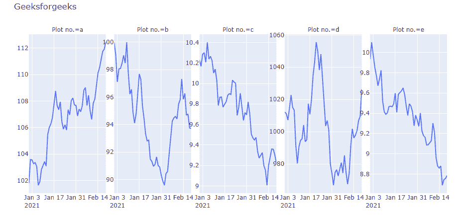
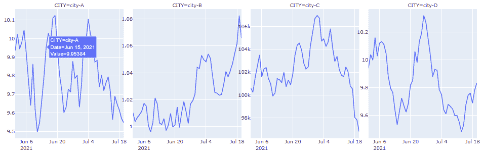

# 如何在 Python 中隐藏带刻面的 plotly express 图中的轴标题？

> 原文:[https://www . geeksforgeeks . org/如何隐藏轴-标题-绘图-表达-python 中带有刻面的图形/](https://www.geeksforgeeks.org/how-to-hide-axis-titles-in-plotly-express-figure-with-facets-in-python/)

在本文中，我们将学习如何在 Python 中隐藏带有小平面的图形中的轴标题。

我们可以通过循环迭代[将轴标题设置为空白来隐藏轴。我们只隐藏了 X 轴和 Y 轴的轴，所以我们必须在每次迭代中比较这个条件](https://www.geeksforgeeks.org/python-for-loops/)

**语法:**

```py
for axis in fig.layout:
   if type(fig.layout[axis]) == go.layout.YAxis:
       fig.layout[axis].title.text = ''  
   if type(fig.layout[axis]) == go.layout.XAxis:
       fig.layout[axis].title.text = ''
```

**例 1:**

日期与价值数据

## 蟒蛇 3

```py
import pandas as pd
import numpy as np
import plotly.express as px
import string
import plotly.graph_objects as go

# create a dataframe
cols = ['a', 'b', 'c', 'd', 'e']
n = 50

df = pd.DataFrame({'Date': pd.date_range('2021-1-1', periods=n)})

# create data with vastly different ranges
for col in cols:
    start = np.random.choice([1, 10, 100, 1000, 100000])
    s = np.random.normal(loc=0, scale=0.01*start, size=n)
    df[col] = start + s.cumsum()

# melt data columns from wide to long
dfm = df.melt("Date")

# make the plot
fig = px.line(
    data_frame=dfm,
    x='Date',
    y='value',
    facet_col='variable',
    facet_col_wrap=6,

    height=500,
    width=1000,
    title='Geeksforgeeks',
    labels={
        'Date': 'Date',
        'value': 'Value',
        'variable': 'Plot no.'
    }
)

# hide subplot y-axis titles and x-axis titles
for axis in fig.layout:
    if type(fig.layout[axis]) == go.layout.YAxis:
        fig.layout[axis].title.text = ''
    if type(fig.layout[axis]) == go.layout.XAxis:
        fig.layout[axis].title.text = ''

# ensure that each chart has its own y rage and tick labels
fig.update_yaxes(matches=None, showticklabels=True, visible=True)

fig.show()
```

**输出:**



**例 2:**

温度与城市数据

## 蟒蛇 3

```py
import pandas as pd
import numpy as np
import plotly.express as px
import string
import plotly.graph_objects as go

# create a dataframe
cols = ['city-A', 'city-B', 'city-C', 'city-D']
n = 50

df = pd.DataFrame({'Date': pd.date_range('2021-6-1', periods=n)})

# create data with vastly different ranges
for col in cols:
    start = np.random.choice([1, 10, 100, 1000, 100000])
    s = np.random.normal(loc=0, scale=0.01*start, size=n)
    df[col] = start + s.cumsum()

# melt data columns from wide to long
dfm = df.melt("Date")

# make the plot
fig = px.line(
    data_frame=dfm,
    x='Date',
    y='value',
    facet_col='variable',
    facet_col_wrap=6,

    height=500,
    width=1300,
    title='Geeksforgeeks',
    labels={
        'Date': 'Date',
        'value': 'Value',
        'variable': 'CITY'
    }
)

# hide subplot y-axis titles and x-axis titles
for axis in fig.layout:
    if type(fig.layout[axis]) == go.layout.YAxis:
        fig.layout[axis].title.text = ''
    if type(fig.layout[axis]) == go.layout.XAxis:
        fig.layout[axis].title.text = ''

# ensure that each chart has its own y rage and tick labels
fig.update_yaxes(matches=None, showticklabels=True, visible=True)

fig.show()
```

**输出**:

