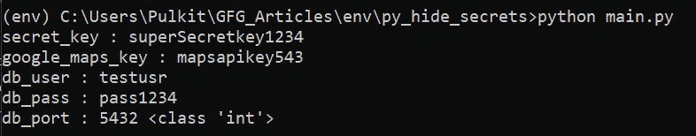
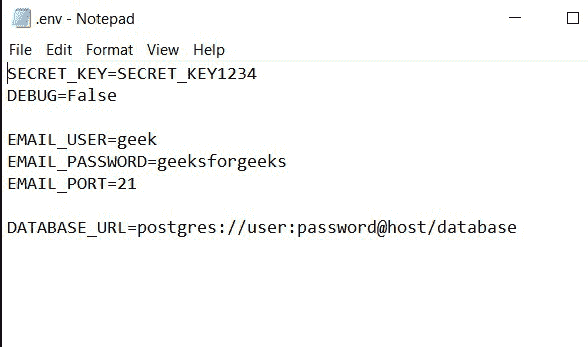
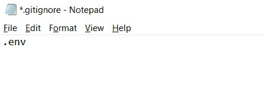
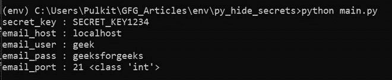

# 如何使用 Python 隐藏敏感凭证

> 原文:[https://www . geeksforgeeks . org/如何使用 python 隐藏敏感凭据/](https://www.geeksforgeeks.org/how-to-hide-sensitive-credentials-using-python/)

您是否遇到过这样的情况:您正在处理一个 python 项目，需要与他人共享您的代码，或者您将代码托管在一个公共存储库中，但不想共享敏感凭据，以免被随机用户利用？

例如，您正在 Django 制作一个网络应用程序，其中有一个“SECRET_KEY”的概念，这是一个随机生成的唯一密钥，用于数据的加密签名。顾名思义，它不应该公开分享，因为它破坏了姜戈的许多安全保护。或者你正在使用云存储，比如 AWS S3，你将需要在代码中存储访问令牌，并且还需要防止未经授权的用户滥用凭据，我们如何做到这两者？对于这种情况，我们需要防止将“密钥”(本质上是保存我们凭证的变量)硬编码到我们的代码中，并且随后不在我们的公共存储库中公开它。

## 方法 1:从另一个 Python 文件导入

最简单和最基本的方法之一是将凭证保存在另一个 python 文件 say secrets.py 中，并将其导入到所需的文件中。我们需要。[*git ignore*T3【秘宝】文件。现在我们可以用两种方式来存储凭证，第一种是使用 python 变量来存储值，第二种更好的方式是使用字典。字典是首选的，因为如果我们试图访问一个不存在的变量，它将引发一个错误，但在字典的情况下，我们可以返回一个默认值。](https://www.geeksforgeeks.org/what-is-git-ignore-and-how-to-use-it/)

**我们已经将以下凭证保存在 secrets.py 的字典中:**

## 蟒蛇 3

```py
# secrets.py
secrets = {
    'SECRET_KEY': "superSecretkey1234",
    'DATABASE_USER': "testusr",
    'DATABASE_PASSWORD': 'pass1234',
    'DATABASE_PORT': 5432

}
```

**现在导入所需文件中的凭证，main.py.**

## 蟒蛇 3

```py
# main.py
from secrets import secrets

secret_key = secrets.get('SECRET_KEY')

# gives default value if the credential is absent
google_maps_key = secrets.get('gmaps_key', 
                              'mapsapikey543')

db_user = secrets.get('DATABASE_USER', 'root')
db_pass = secrets.get('DATABASE_PASSWORD', 'pass')
db_port = secrets.get('DATABASE_PORT', 3306)

print('secret_key :', secret_key)
print('google_maps_key :', google_maps_key)
print('db_user :', db_user)
print('db_pass :', db_pass)

# no need to type cast numbers and booleans
print('db_port :', db_port, type(db_port))
```

**输出:**



这是可行的，我们不需要担心布尔值和整数值的数据类型转换(您将理解为什么这在后面的方法中很重要)，但这不是推荐的方法，因为文件名和字典名可能因不同的项目而异，因此它不会形成标准的解决方案。更重要的是，这种方法仅限于 python，因为在更现实的场景中，我们可以使用多种语言，这些语言也需要访问相同的凭据，并且以一种语言才能访问的方式存储它们并不理想。更好的方法是使用环境变量。

## 方法 2:使用环境变量

我们可以将凭据存储为环境变量。环境变量本质上是使用操作系统的功能设置的键值对，并且可以被任何编程语言使用，因为它们链接到环境或操作系统。由于我们将凭据设置为环境变量，因此我们不会在代码中公开它们，因此如果其他人有权访问我们的代码，则不会在他们的环境中设置凭据。此外，我们可以为生产和本地环境设置不同的值，比如在开发过程中使用不同的邮件服务，并且我们不需要担心更改代码。

很多主机提供商像 Heroku，netlify 等。提供一种设置环境变量的简单方法。在 python 中，我们可以使用 [os.environ](https://www.geeksforgeeks.org/python-os-environ-object/) 访问环境变量，它的工作方式非常类似于普通的 python 字典。os.environ 返回字符串值，我们需要手动类型转换每个值。假设我们已经将上面提到的相同凭证设置为环境变量。

## 蟒蛇 3

```py
# main.py
import os

def convert(val):
      if type(val) != str:
          return val
    if val.isnumeric():
        return int(val)
    elif val == 'True':
        return True
    elif val == 'False':
        return False
    else:
        return val

secret_key = convert(os.environ.get('SECRET_KEY'))

# gives default value if the credential is absent
google_maps_key = convert(os.environ.get('gmaps_key', 
                                         'mapsapikey543'))
db_user = convert(os.environ.get('DATABASE_USER', 'root'))
db_pass = convert(os.environ.get('DATABASE_PASSWORD', 'pass'))
db_port = convert(os.environ.get('DATABASE_PORT', '3306'))

print('secret_key :', secret_key)
print('google_maps_key :', google_maps_key)
print('db_user :', db_user)
print('db_pass :', db_pass)
print('db_port :', db_port, type(db_port))
```

**输出:**


此外，在开发过程中本地设置的环境变量**仅在一个会话**中是持久的，因此我们需要在每次运行项目之前手动设置它们。为了简化这个过程，我们有一个很棒的软件包叫做 **python 解耦**。该包有助于从环境或外部加载凭据。env or。ini 文件。

**我们将凭证存储在. env 或 settings.ini 文件中，并*****git ignore*****它们。python-解耦按照以下顺序搜索选项:**

1.  环境变量。
2.  ini 或。env 文件。
3.  调用期间传递的默认值。

如果已经设置了环境变量，它会返回相同的值，否则会尝试从文件中读取，如果没有找到，它会返回默认值。因此，它可以在生产时从环境中读取，在开发时从文件中读取。

**遵循下面简单的 3 步流程:**

**步骤 1:** 安装 python-使用 pip 解耦。

```py
pip install python-decouple
```

**第二步:**单独保存你的凭证。

首先，我们需要将我们的凭证从代码存储库中“分离”到一个单独的文件中。如果你使用的是版本控制系统，比如 git，确保将这个文件添加到*中。gitignore* 。该文件应采用以下形式之一，并应保存在存储库的根目录下:

*   *设置. ini*
*   *。env*-注意文件没有名字

这些是保存项目配置的常用文件格式。这些文件遵循以下语法:

> KEY=YOUR_KEY ->不带任何引号。

按照惯例，我们将键名存储在所有大写字母中。

**我们在这里使用。保存了以下凭据的 env 格式:**



**现在，我们将。** ***吉通*** **本档。去了解更多。*****git ignore*****读作** [**本**](https://www.geeksforgeeks.org/what-is-git-ignore-and-how-to-use-it/) **:**



**步骤 3:** 安全加载您的凭据。

我们可以通过将“cast”参数指定为相应的类型来转换值。此外，如果我们没有指定默认值，并且配置对象找不到给定的键，它将引发“未定义的值错误”。

## 蟒蛇 3

```py
# main.py

# 1\. Import the config object from decouple.
from decouple import config

# 2\. Retrieve the credentials in your code.

# default data-type of returned value is str.
SECRET_KEY = config('SECRET_KEY') 

# you can cast the values on the fly.
DEBUG = config('DEBUG', cast=bool) 

# provide defaulft value if key is not found.
EMAIL_HOST = config('EMAIL_HOST', 
                    default='localhost') 
EMAIL_USER = config('EMAIL_USER',
                    default='gfg')

# if key not found and no default is given,
# it will raise UndefinedValueError.
EMAIL_PASSWORD = config('EMAIL_PASSWORD') 
EMAIL_PORT = config('EMAIL_PORT',
                    default=25, cast=int)

print('secret_key :', SECRET_KEY)
print('email_host :', EMAIL_HOST)
print('email_user :', EMAIL_USER)
print('email_pass :', EMAIL_PASSWORD)
print('email_port :', EMAIL_PORT, type(EMAIL_PORT))
```

**输出:**

