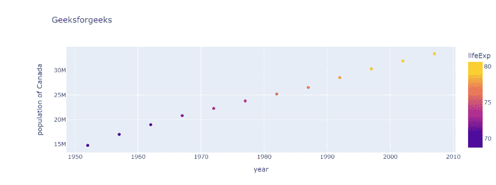
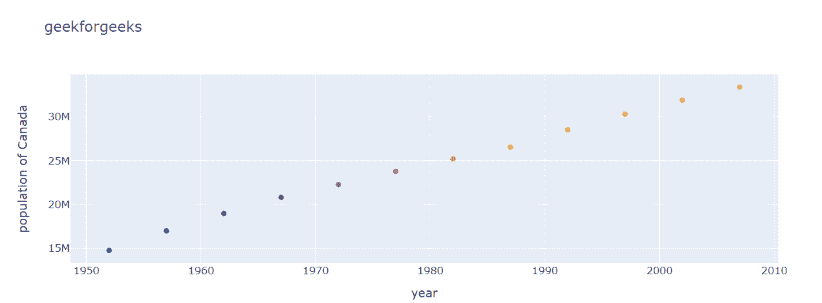
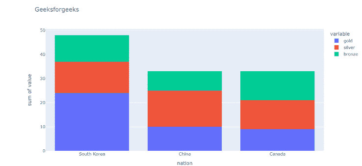
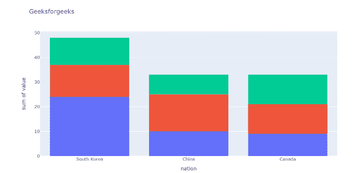
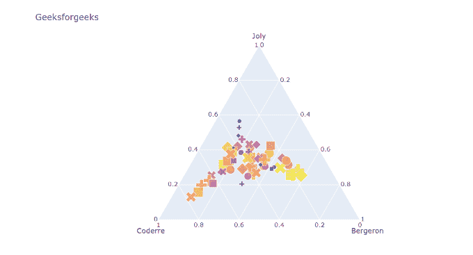

# 如何隐藏 Plotly Express 中的彩条和图例？

> 原文:[https://www . geeksforgeeks . org/如何隐藏绘图仪中的颜色条和图例/express/](https://www.geeksforgeeks.org/how-to-hide-the-colorbar-and-legend-in-plotly-express/)

在本文中，我们将学习如何在 plotly express 中隐藏颜色条和图例。

这里我们将讨论隐藏颜色条和图例的两种不同方法，使用不同的示例使其更加清晰。

**例 1:**

在这个例子中，我们借助于方法**在 Plotly Express 中隐藏颜色条**。

> **语法:**对于颜色条:
> 
> *   图. update _ color axes(show scale = False)
> *   图更新(布局 _ 颜色轴 _ 显示比例=假)

## 蟒蛇 3

```
# importing packages
import plotly.express as px

# using the gapminder dataset
data = px.data.gapminder()
data_canada = data[data.country == 'Canada']

# plotting the bar chart
fig = px.scatter(data_canada, x='year', y='pop',
             hover_data=['lifeExp', 'gdpPercap'], color='lifeExp',
             labels={'pop':'population of Canada'}, height=400, title="Geeksforgeeks")

# hiding color-bar 
fig.update_coloraxes(showscale=False)

fig.show()
```

**输出:**



躲起来之前



隐藏后

**例 2:**

在这个例子中，我们借助于方法**在 Plotly Express 中隐藏图例**。

> **语法:**图例:
> 
> *   图. update_traces(showlegend=False)
> *   图 3 .更新(布局 _ 显示图例=假)

## 蟒蛇 3

```
#importing packages
import plotly.express as px

# using medals_wide dataset
wide_df = px.data.medals_wide()

# plotting the bar chart
fig = px.histogram(wide_df, x="nation", y=["gold", "silver", "bronze"], title="Geeksforgeeks")

# hiding legend 
fig.update_traces(showlegend=False)

fig.show()
```

**输出:**



躲起来之前



隐藏后

**例 3:**

在本例中，我们借助方法**图更新(layout_showlegend=False)** 和**图更新(layout _ color axis _ show scale = False)**，在 Plotly Express 中同时隐藏图例和色标。

## 蟒蛇 3

```
# imports
import plotly.express as px

# using elections dataset
df = px.data.election()

# figure setup
fig = px.scatter_ternary(df, a="Joly", b="Coderre", c="Bergeron", hover_name="district", 
    color="total", size="total", size_max=15, symbol ='Coderre',
    color_discrete_map = {"Joly": "blue", "Bergeron": "green", "Coderre":"red"}, title="Geeksforgeeks"
    )

# move colorbar
fig.update_layout(coloraxis_colorbar=dict(yanchor="top", y=1, x=0,
                                          ticks="outside",
                                          ticksuffix=" bills"))
# hiding legend
fig.update(layout_showlegend=False)

# hiding color-bar
fig.update(layout_coloraxis_showscale=False)

fig.show()
```

**输出:**


躲起来之前



隐藏后