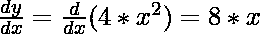
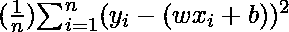
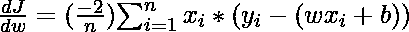
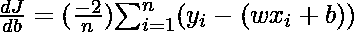
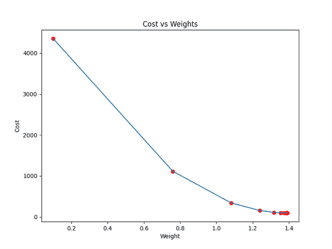
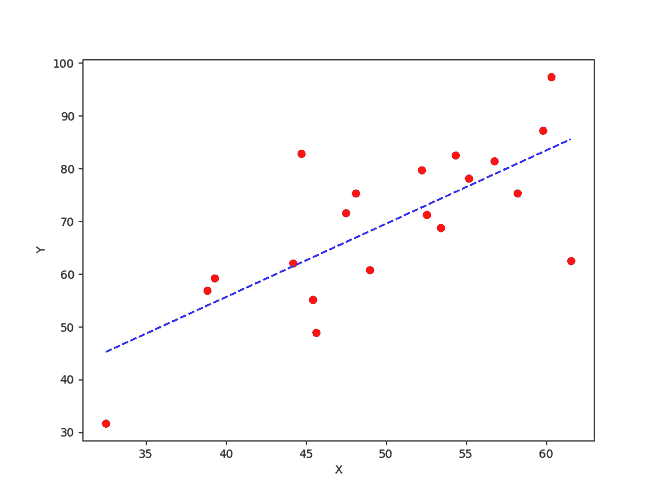

# 如何在 Python 中实现梯度下降来寻找局部最小值？

> 原文:[https://www . geesforgeks . org/如何实现 python 中的梯度下降以找到局部最小值/](https://www.geeksforgeeks.org/how-to-implement-a-gradient-descent-in-python-to-find-a-local-minimum/)

[**【梯度下降】**](https://www.geeksforgeeks.org/gradient-descent-algorithm-and-its-variants/) 是一种迭代算法，用于通过寻找最优参数来最小化函数。梯度下降可以应用于任何维度函数，即一维、二维、三维。在本文中，我们将致力于寻找抛物函数(二维)的全局最小值，并将在 python 中实现梯度下降，以找到线性回归方程(一维)的最佳参数。在进入实现部分之前，让我们确定实现梯度下降算法所需的参数集。为了实现梯度下降算法，我们需要一个需要最小化的成本函数、迭代次数、在每次迭代中确定步长并向最小值移动的学习率、在每次迭代中更新参数的权重&偏差的部分导数以及一个预测函数。

到目前为止，我们已经看到了梯度下降所需的参数。现在让我们用梯度下降算法映射参数，并通过一个例子来更好地理解梯度下降。让我们考虑一个抛物方程 y=4x <sup>2</sup> 。通过查看方程，我们可以确定抛物线函数在 x=0 时最小，即 x = 0，y=0。因此 x=0 是抛物线函数 y=4x <sup>2</sup> 的局部最小值。现在让我们看看梯度下降的算法，以及我们如何通过应用梯度下降来获得局部最小值:

## **梯度下降算法**

应在当前点与函数梯度的负值(远离梯度)成比例地进行步进，以找到局部最小值。梯度上升是通过采取与梯度的正值成比例的步骤(向梯度移动)来接近函数的局部最大值的过程。

```
repeat until convergence
{
    w = w - (learning_rate * (dJ/dw))
    b = b - (learning_rate * (dJ/db))
}
```

**步骤 1:** 初始化所有必要的参数，并导出抛物线方程 4x <sup>2</sup> 的梯度函数。x <sup>2</sup> 的导数是 2x，所以抛物方程 4x <sup>2</sup> 的导数将是 8x。

> x<sub>0</sub>= 3(x 的随机初始化)
> 
> learning_rate = 0.01(在向局部最小值移动时确定步长)

梯度= (计算梯度函数)

**步骤 2:** 让我们执行 3 次梯度下降的迭代:

对于每次迭代，继续根据梯度下降公式更新 x 的值。

```
Iteration 1:
    x1 = x0 - (learning_rate * gradient)
    x1 = 3 - (0.01 * (8 * 3))
    x1 = 3 - 0.24
    x1 = 2.76

Iteration 2:
    x2 = x1 - (learning_rate * gradient)
    x2 = 2.76 - (0.01 * (8 * 2.76))
    x2 = 2.76 - 0.2208
    x2 = 2.5392

Iteration 3:
    x3 = x2 - (learning_rate * gradient)
    x3 = 2.5392 - (0.01 * (8 * 2.5392))
    x3 = 2.5392 - 0.203136
    x3 = 2.3360
```

从上面三次梯度下降的迭代中，我们可以注意到 x 的值是逐迭代递减的，并且会通过运行梯度下降进行更多的迭代而慢慢收敛到 0(局部极小值)。现在你可能会有一个问题，对于多少迭代，我们应该运行梯度下降？

我们可以设置停止阈值，即当 x 的先前值和当前值之间的差值小于停止阈值时，我们停止迭代。当涉及到机器学习算法和深度学习算法的梯度下降的实现时，我们尝试使用梯度下降来最小化算法中的代价函数。现在我们已经清楚了梯度下降的内部工作，让我们看看梯度下降的 python 实现，其中我们将最小化线性回归算法的成本函数，并找到最佳拟合线。在我们的例子中，参数如下:

## **预测功能**

线性回归算法的预测函数是由 y=wx+b 给出的线性方程。

```
prediction_function (y) = (w * x) + b
Here, x is the independent variable
      y is the dependent variable
      w is the weight associcated with input variable
      b is the bias
```

## **成本函数**

成本函数用于根据预测计算损失。在线性回归中，我们使用均方误差来计算损失。[均方误差](https://www.geeksforgeeks.org/python-mean-squared-error/)是实际值和预测值之间的平方差之和。

成本函数(J) = 

这里，n 是样本数

## **偏导数(梯度)**

使用成本函数计算权重和偏差的部分导数。我们得到:





## **参数更新**

通过减去学习速率及其各自梯度的乘积来更新权重和偏差。

```
w = w - (learning_rate * (dJ/dw))
b = b - (learning_rate * (dJ/db))
```

**梯度下降的 Python 实现**

在实现部分，我们将编写两个函数，一个是以实际输出和预测输出为输入并返回损失的成本函数，第二个是以自变量、目标变量为输入并使用梯度下降算法找到最佳拟合线的实际梯度下降函数。迭代次数、学习速率和停止阈值是梯度下降算法的调整参数，可以由用户进行调整。在主函数中，我们将初始化线性相关的随机数据，并对数据应用梯度下降算法来找到最佳拟合线。通过使用梯度下降算法找到的最佳权重和偏差随后用于在主函数中绘制最佳拟合线。迭代指定必须完成参数更新的次数，停止阈值是两次连续迭代之间损失的最小变化，以停止梯度下降算法。

## 蟒蛇 3

```
# Importing Libraries
import numpy as np
import matplotlib.pyplot as plt

def mean_squared_error(y_true, y_predicted):

    # Calculating the loss or cost
    cost = np.sum((y_true-y_predicted)**2) / len(y_true)
    return cost

# Gradient Descent Function
# Here iterations, learning_rate, stopping_threshold
# are hyperparameters that can be tuned
def gradient_descent(x, y, iterations = 1000, learning_rate = 0.0001, 
                     stopping_threshold = 1e-6):

    # Initializing weight, bias, learning rate and iterations
    current_weight = 0.1
    current_bias = 0.01
    iterations = iterations
    learning_rate = learning_rate
    n = float(len(x))

    costs = []
    weights = []
    previous_cost = None

    # Estimation of optimal parameters 
    for i in range(iterations):

        # Making predictions
        y_predicted = (current_weight * x) + current_bias

        # Calculationg the current cost
        current_cost = mean_squared_error(y, y_predicted)

        # If the change in cost is less than or equal to 
        # stopping_threshold we stop the gradient descent
        if previous_cost and abs(previous_cost-current_cost)<=stopping_threshold:
            break

        previous_cost = current_cost

        costs.append(current_cost)
        weights.append(current_weight)

        # Calculating the gradients
        weight_derivative = -(2/n) * sum(x * (y-y_predicted))
        bias_derivative = -(2/n) * sum(y-y_predicted)

        # Updating weights and bias
        current_weight = current_weight - (learning_rate * weight_derivative)
        current_bias = current_bias - (learning_rate * bias_derivative)

        # Printing the parameters for each 1000th iteration
        print(f"Iteration {i+1}: Cost {current_cost}, Weight \
        {current_weight}, Bias {current_bias}")

    # Visualizing the weights and cost at for all iterations
    plt.figure(figsize = (8,6))
    plt.plot(weights, costs)
    plt.scatter(weights, costs, marker='o', color='red')
    plt.title("Cost vs Weights")
    plt.ylabel("Cost")
    plt.xlabel("Weight")
    plt.show()

    return current_weight, current_bias

def main():

    # Data
    X = np.array([32.50234527, 53.42680403, 61.53035803, 47.47563963, 59.81320787,
           55.14218841, 52.21179669, 39.29956669, 48.10504169, 52.55001444,
           45.41973014, 54.35163488, 44.1640495 , 58.16847072, 56.72720806,
           48.95588857, 44.68719623, 60.29732685, 45.61864377, 38.81681754])
    Y = np.array([31.70700585, 68.77759598, 62.5623823 , 71.54663223, 87.23092513,
           78.21151827, 79.64197305, 59.17148932, 75.3312423 , 71.30087989,
           55.16567715, 82.47884676, 62.00892325, 75.39287043, 81.43619216,
           60.72360244, 82.89250373, 97.37989686, 48.84715332, 56.87721319])

    # Estimating weight and bias using gradient descent
    estimated_weight, eatimated_bias = gradient_descent(X, Y, iterations=2000)
    print(f"Estimated Weight: {estimated_weight}\nEstimated Bias: {eatimated_bias}")

    # Making predictions using estimated parameters
    Y_pred = estimated_weight*X + eatimated_bias

    # Plotting the regression line
    plt.figure(figsize = (8,6))
    plt.scatter(X, Y, marker='o', color='red')
    plt.plot([min(X), max(X)], [min(Y_pred), max(Y_pred)], color='blue',markerfacecolor='red',
             markersize=10,linestyle='dashed')
    plt.xlabel("X")
    plt.ylabel("Y")
    plt.show()

if __name__=="__main__":
    main()
```

**输出:**

> 迭代 1:成本 4352.088931274409，权重 0.759329114256.21117，偏差 0.0210000001
> 
> 迭代 2:成本 1114.8561474350017，权重 1.081602958623.24，偏差 0.0816001
> 
> 迭代 3:成本 341.42912086804455，权重 1.239127408494.5083，偏差 0.0322892
> 
> 迭代 4:成本 156.6449529090443，权重 1.316123928174.6984，偏差 0.0312004
> 
> 迭代 5:成本 112.49704004742098，权重 1.3537591652024.805，偏差 0.0374785
> 
> 迭代 6:成本 101.9493925395456，重量 1.372154983397.8113，偏差 0.032805
> 
> 迭代 7:成本 99.4293893333546，权重 1.381146757515.4601，偏差 0.0000001 . 000001
> 
> 迭代 8:成本 98.82731958262897，重量 1.3855419247507244，偏差 0.0319811
> 
> 迭代 9:成本 98.68347500997261，重量 1.387690314465
> 
> 迭代 10:成本 98.64910780902792，权重 1.388740507983.562，偏差 0.0399995
> 
> 迭代 11:成本 98.64089651459352，权重 1.389253895811.451，偏差 0.035985
> 
> 迭代 12:成本 98.63893428729509，权重 1.3895049123567
> 
> 迭代 13:成本 98.63846506273883，权重 1.38962768081378.57，偏差 0.03222000005
> 
> 迭代 14:成本 98.63835254057648，重量 1.38968776283053，偏差 0.028985
> 
> 迭代 15:成本 98.63832524036214，权重 1.389717204313.9192，偏差 0.039916 . 1999915
> 
> 迭代 16:成本 98.63831830104695，权重 1.389731668997.059，偏差 0.000001 . 000001
> 
> 迭代 17:成本 98.63831622628217，权重 1.389738813163.012，偏差 0.000001 . 000001
> 
> 预计重量:1.38973813885
> 
> 估计偏差:0.0350946167414



接近局部最小值的代价函数



使用梯度下降获得的最佳拟合线