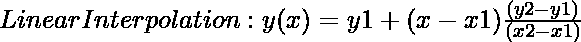
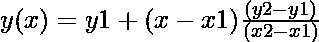

# 如何在 Python 中实现线性插值？

> 原文:[https://www . geesforgeks . org/如何在 python 中实现线性插值/](https://www.geeksforgeeks.org/how-to-implement-linear-interpolation-in-python/)

当两个相邻点的值已知时，线性插值是确定任何中间点的函数值的技术。线性插值基本上是对落入两个已知值内的未知值的估计。线性插值用于各种学科，如统计学、经济学、价格决定等。为了信息的连续性，它被用来填补统计数据中的空白。

通过使用下面的公式，我们可以对给定的数据点进行线性插值



这里 **(x1，y1)** 是第一个数据点的坐标。而 **(x2，y2** )是第二个数据点的坐标，其中 **x** 是我们进行插值的点， **y** 是插值的值。

**例题:**

让我们举个例子来更好地理解。我们有以下数据值，其中 x 表示数字，y 是 x 平方根的函数，我们的任务是求 **5.5 (x)** 的平方根。

<figure class="table">

| 

**x**

 | one | Two | three | four | five | six |
| 

**y(f(x)=【x】t1]**

 | one | 1.4142 | 1.7320 | Two | 2.2360 | 2.4494 |

</figure>

我们可以在这里使用线性插值方法。

1.从 x，即(5，2.2360)和(6，2.4494)中找出两个相邻的(x1，y1)、(x2，y2)。

> 其中 x1 = 5，x2= 6，y1 = 2.2360，y2 = 2.4494，我们在点 x = 5.5 处插值。

2.使用公式 y(x)= y1+(x–x1)\ frac {(y2–y1)} {(x2–x1)}

3.将这些值放入上述等式后。

```

y = 2.3427
```

在 x = 5.5 时，Y 的值将为 **2.3427。**因此，通过使用线性插值，我们可以很容易地确定两个区间之间的函数值。

**方法 1:**

**使用公式** 

**示例:**假设我们有一个城市人口和年份的数据集。

<figure class="table">

| 

十(年)

 | Two thousand and sixteen | Two thousand and seventeen | Two thousand and eighteen | Two thousand and nineteen | Two thousand and twenty-one |
| 

y(人口)

 | Ten thousand and one | one two three four five | Seventy-four thousand eight hundred and fifty-one | Twelve thousand one hundred and twenty-four | Five thousand seven hundred |

</figure>

这里，X 是年份，Y 是任何城市的人口。我们的任务是在 **2020 年找到这个城市的人口。**

> 我们选择我们的(x1，y1)，(x2，y2)为 x1=2019，y1=12124，x2=2021，y2=5700，x = 2020，y =？

这里(x1，y1)和(x2，y2)是两个相邻的点，x 是我们要预测 y 总体值的年份。

## 蟒蛇 3

```
# Python3 code
# Implementing Linear interpolation
# Creating Function to calculate the
# linear interpolation

def interpolation(d, x):
    output = d[0][1] + (x - d[0][0]) * ((d[1][1] - d[0][1])/(d[1][0] - d[0][0]))

    return output

# Driver Code
data=[[2019, 12124],[2021, 5700]]

year_x=2020

# Finding the interpolation
print("Population on year {} is".format(year_x),
             interpolation(data, year_x))
```

**Output**

```
Population on year 2020 is 8912.0
```

**方法 2:**

**使用 scipy . INTERPOL . interp 1d**

同样，我们可以使用名为 **interpolate.interp1d.** 的 scipy 库函数实现线性插值

> **语法**:scipy . interpolate . interp 1d(x，y，kind='linear '，axis=- 1，copy=True，bounds_error=None，fill_value=nan，假定 _sorted=False)

<figure class="table">

| 

不，先生。

 | 

**参数**

 | 

**描述**

 |
| --- | --- | --- |
| 1. | x | 实数的一维数组。 |
| 2. | y | 实数的二维数组。 |
| 3. | 种类 | 也就是说，你想要的插值类型可以是“线性”、“最近的”、“最近的上一个”、“零”、“slinear”、“二次”、“三次”、“上一个”或“下一个”。“零”、“线性”、“二次”和“三次”，默认为**线性**。 |
| 4. | 轴 | 指定我们插值的 y 轴。 |
| 5. | 复制 | 它保存布尔值。如果为真，该类生成 x 和 y 的内部副本。 |
| 6. | 界限错误 | 它保存布尔值如果为真，当试图对 x 范围之外的值进行插值时，会引发值错误 |

</figure>

**示例:**

> 让我们有一个随机数据集:
> 
> X = [1，2，3，4，5]，Y = [11，2.2，3.5，-88，1]，我们想求点 2.5 处 Y 的值。

## 蟒蛇 3

```
# Implementation of Linear Interpolation using Python3 code
# Importing library
from scipy.interpolate import interp1d

X = [1,2,3,4,5] # random x values
Y = [11,2.2,3.5,-88,1] # random y values

# test value
interpolate_x = 2.5

# Finding the interpolation
y_interp = interp1d(X, Y)
print("Value of Y at x = {} is".format(interpolate_x),
      y_interp(interpolate_x))
```

**输出**

```
Value of y at x = 2.5 is 2.85
```