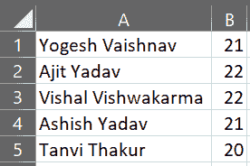
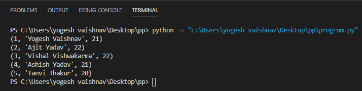
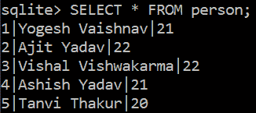

# 如何使用 Python 将 CSV 文件导入 SQLite 数据库表？

> 原文:[https://www . geesforgeks . org/how-import-a-CSV-file-in-a-SQLite-database-table-use-python/](https://www.geeksforgeeks.org/how-to-import-a-csv-file-into-a-sqlite-database-table-using-python/)

在本文中，我们将讨论如何使用 Python 将 CSV 文件内容导入到 SQLite 数据库表中。

### 方法:

*   首先，我们导入 *csv* 模块(处理 csv 文件)和 *sqlite3* 模块(填充数据库表)。
*   然后我们使用 sqlite3.connect()方法连接到我们的*极客*数据库。
*   此时，我们创建一个*光标*对象来处理数据库表上的查询。
*   我们首先创建我们的*人*表，并创建一个 csv 文件，其中的内容将被插入到我们的表中。
*   我们使用 *open()* 函数打开上面创建的 csv 文件。
*   我们通过 csv.reader()方法将 csv 文件的所有内容提取到我们的 *contents* 变量中。
*   然后我们通过*executemy()方法*将 csv 文件的逐行内容插入到我们的数据库中，该方法将替换(？,?)与 csv 文件的下两个逗号分隔的数据，并将其作为记录插入到*人*表中。
*   最后，我们用 SELECT 语句验证 csv 文件的数据已经成功插入到我们的表中，并提交更改和关闭数据库连接。

### 下面是实现。

为了实现的目的，我们将在我们的*极客数据库*中创建一个*人*表。我们将把 *person_records.csv* 的内容插入到我们的 *person* 表中。下面是我们将要使用的 CSV 文件:



以下是基于上述方法的完整程序:

## 蟒蛇 3

```
# Import required modules
import csv
import sqlite3

# Connecting to the geeks database
connection = sqlite3.connect('g4g.db')

# Creating a cursor object to execute
# SQL queries on a database table
cursor = connection.cursor()

# Table Definition
create_table = '''CREATE TABLE person(
                id INTEGER PRIMARY KEY AUTOINCREMENT,
                name TEXT NOT NULL,
                age INTEGER NOT NULL);
                '''

# Creating the table into our
# database
cursor.execute(create_table)

# Opening the person-records.csv file
file = open('person-records.csv')

# Reading the contents of the
# person-records.csv file
contents = csv.reader(file)

# SQL query to insert data into the
# person table
insert_records = "INSERT INTO person (name, age) VALUES(?, ?)"

# Importing the contents of the file
# into our person table
cursor.executemany(insert_records, contents)

# SQL query to retrieve all data from
# the person table To verify that the
# data of the csv file has been successfully
# inserted into the table
select_all = "SELECT * FROM person"
rows = cursor.execute(select_all).fetchall()

# Output to the console screen
for r in rows:
    print(r)

# Committing the changes
connection.commit()

# closing the database connection
connection.close()
```

**输出:**



**SQLite:**

