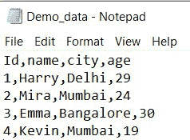

# 如何在 PostgreSQL

中使用 CSV 文件导入导出数据

> 原文:[https://www . geesforgeks . org/如何使用-csv-files-in-postgresql 导入和导出数据/](https://www.geeksforgeeks.org/how-to-import-and-export-data-using-csv-files-in-postgresql/)

在本文中，我们将看到如何在 PostgreSQL 中使用 CSV 文件导入和导出数据，CSV 文件中的数据可以使用 PostgreSQL 轻松导入和导出。

要创建 CSV 文件，请打开任何文本编辑器(记事本、vim、atom)。在第一行写下列名。将逗号分隔的行值添加到下一行的相应列中。如下所示，将文件保存为 Demo_data.csv。



**现在使用 psycopg2 创建一个新表，我们将从 CSV 文件导入数据:**

## 蟒蛇 3

```
import psycopg2

# connection establishment
conn = psycopg2.connect(
    database="postgres",
    user='postgres',
    password='password',
    host='localhost',
    port='5432'
)

conn.autocommit = True

# Creating a cursor object
cursor = conn.cursor()

# query to create a table
sql = ''' CREATE TABLE demo
(
    id INT,
    name VARCHAR(50),
    city VARCHAR(50),
    age INT
); '''

# executing above query
cursor.execute(sql)
print("Table has been created successfully!!")

# Closing the connection
conn.close()
```

**输出:**

```
Table has been created successfully!!
```

## **使用 CSV 文件导入数据**

我们使用带有 FROM 关键字的 COPY 命令将 CSV 文件的内容导入到一个新表中。

> **语法:** COPY <表名>FROM ' location+file _ name ' DELIMITER '，' CSV HEADER
> 
> **其中:**
> 
> *   –我们要导入数据的表的名称。
>     
>     
>     
>     
> *   location+file _ name '–我们从中导入数据的 CSV 文件的完整路径(确保您对该文件具有“读取”权限)。
> *   分隔符'，'–指定分隔符，即逗号(，)
> *   CSV–指定我们从中导入数据的文件的格式。
> *   HEADER–指定我们的中有一个标题行。导入时，我们应该忽略第一行。

**示例:**

## 蟒蛇 3

```
import psycopg2

# connection establishment
conn = psycopg2.connect(
    database="postgres",
    user='postgres',
    password='password',
    host='localhost',
    port='5432'
)

conn.autocommit = True

# Creating a cursor object
cursor = conn.cursor()

# query to import data from given csv
sql = '''COPY demo FROM 
        'C:\\Users\\DELL\\Downloads\\Demo_data.csv' 
        DELIMITER ',' CSV HEADER'''

# executing above query
cursor.execute(sql)

# Display the table
cursor.execute('SELECT * FROM demo')
print(cursor.fetchall())

# Closing the connection
conn.close()
```