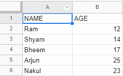
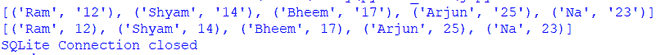

# 如何使用 Python 在 SQLite 数据库中导入 CSV 文件？

> 原文:[https://www . geesforgeks . org/how-import-CSV-file-in-SQLite-database-use-python/](https://www.geeksforgeeks.org/how-to-import-csv-file-in-sqlite-database-using-python/)

在本文中，我们将学习如何从 CSV 文件导入数据，并使用 Python 将其存储在 SQLite 数据库的表中。你可以从[这里](https://media.geeksforgeeks.org/wp-content/cdn-uploads/20210507143402/student_info.csv)下载 CSV 文件，里面有几个学生的名字和年龄的样本数据。



CSV 文件的内容

**进场:**

*   导入必要的模块
*   从 CSV 文件中读取数据 DictReader()
*   与数据库建立连接。

```
sqliteConnection = sqlite3.connect('sql.db')
cursor = sqliteConnection.cursor()
```

*   创建学生表，并使用 execute()方法执行查询。
*   向表中插入数据

```
cursor.executemany("insert into student (name, age) VALUES (?, ?);", student_info)
```

*   从表中读取数据
*   关闭数据库。

**下面是实现:**

## 蟒蛇 3

```
import csv
import sqlite3

try:

    # Import csv and extract data
    with open('student_info.csv', 'r') as fin:
        dr = csv.DictReader(fin)
        student_info = [(i['NAME'], i['AGE']) for i in dr]
        print(student_info)

    # Connect to SQLite
    sqliteConnection = sqlite3.connect('sql.db')
    cursor = sqliteConnection.cursor()

    # Create student table
    cursor.execute('create table student(name varchar2(10), age int);')

    # Insert data into table
    cursor.executemany(
        "insert into student (name, age) VALUES (?, ?);", student_info)

    # Show student table
    cursor.execute('select * from student;')

    # View result
    result = cursor.fetchall()
    print(result)

    # Commit work and close connection
    sqliteConnection.commit()
    cursor.close()

except sqlite3.Error as error:
    print('Error occured - ', error)

finally:
    if sqliteConnection:
        sqliteConnection.close()
        print('SQLite Connection closed')
```

**输出:**

