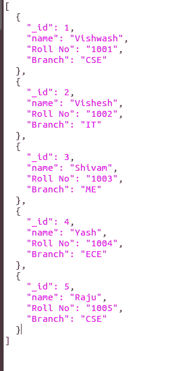
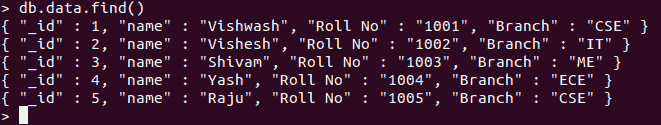

# 如何用 Python 在 MongoDB 中导入 JSON 文件？

> 原文:[https://www . geesforgeks . org/how-import-JSON-file-in-MongoDB-using-python/](https://www.geeksforgeeks.org/how-to-import-json-file-in-mongodb-using-python/)

**先决条件:** [MongoDB 和 Python](https://www.geeksforgeeks.org/mongodb-and-python/)[使用 Python 中的 JSON 数据](https://www.geeksforgeeks.org/working-with-json-data-in-python/)

[MongoDB](https://www.geeksforgeeks.org/mongodb-and-python/) 是一个跨平台的面向文档和非关系(即 NoSQL)的数据库程序。它是一个开源文档数据库，以键值对的形式存储数据。

**[【JSON】](https://www.geeksforgeeks.org/working-with-json-data-in-python/)**代表 JavaScript 对象符号。它是一种开放的标准文件格式，并且是带扩展名的数据交换格式”。json”，它使用人类可读的文本来存储和传输由属性值对和数组数据类型组成的数据对象。

## 在 MongoDB 中导入 JSON 文件

要在 MongoDB 中导入 JSON 文件，我们必须首先加载或打开 JSON 文件，然后我们可以轻松地将该文件插入数据库或集合中。要加载一个 JSON 文件，我们必须首先在代码中导入`json`，然后我们才能打开 JSON 文件。当我们的文件被加载或打开时，我们可以很容易地将其插入到集合中，并对该文件进行操作。让我们看看例子，以便更好地理解。

**示例:**

**使用的样品 JSON:**



```py
import json
from pymongo import MongoClient 

# Making Connection
myclient = MongoClient("mongodb://localhost:27017/") 

# database 
db = myclient["GFG"]

# Created or Switched to collection 
# names: GeeksForGeeks
Collection = db["data"]

# Loading or Opening the json file
with open('data.json') as file:
    file_data = json.load(file)

# Inserting the loaded data in the Collection
# if JSON contains data more than one entry
# insert_many is used else inser_one is used
if isinstance(file_data, list):
    Collection.insert_many(file_data)  
else:
    Collection.insert_one(file_data)
```

**输出:**

