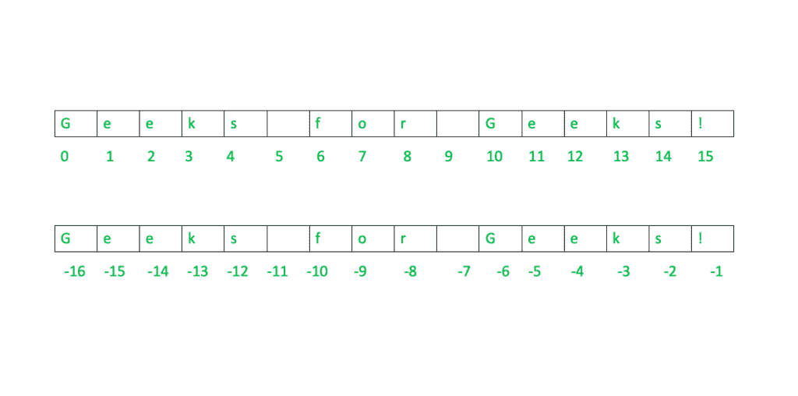

# 如何在 Python 中对字符串进行索引和切片？

> 原文:[https://www . geesforgeks . org/如何在 python 中对字符串进行索引和切片/](https://www.geeksforgeeks.org/how-to-index-and-slice-strings-in-python/)

Python 字符串数据类型是由一个或多个单独的字符组成的序列，这些字符可以由字母、数字、空白字符或符号组成。由于字符串是一个序列，因此可以通过索引和切片，以与其他基于序列的数据类型相同的方式访问它。

## 索引

索引是指根据可重复项在可重复项中的位置来引用可重复项的元素。字符串的每个字符对应一个索引号，每个字符都可以使用它们的索引号来访问。

我们可以通过两种方式访问字符串中的字符:

1.  通过正索引号访问字符
2.  通过负索引号访问字符

**1。通过正索引号访问字符:**
在这种类型的索引中，我们在方括号中传递一个正索引(我们想访问它)。索引号从索引号 0(表示字符串的第一个字符)开始。



Python 中的索引

**Example 1 (Positive Indexing) :**

```py
# declaring the string
str = "Geeks for Geeks !"

# accessing the character of str at 0th index
print(str[0])

# accessing the character of str at 6th index
print(str[6])

# accessing the character of str at 10th index
print(str[10])
```

**输出:**

```py
G
f
G

```

**2。通过负索引号访问字符:**
在这种类型的索引中，我们将负索引(我们想要访问的索引)放在方括号中。这里的索引号从索引号-1 开始(表示字符串的最后一个字符)。
**示例 2(负索引):**

```py
# declaring the string
str = "Geeks for Geeks !"

# accessing the character of str at last index
print(str[-1])

# accessing the character of str at 5th index from the last
print(str[-5])

# accessing the character of str at 10th index from the last
print(str[-10])
```

**输出:**

```py
!
e
f
```

## 限幅

Python 中的切片是一个允许访问序列部分的特性。在对字符串进行切片时，我们创建一个子字符串，它本质上是一个存在于另一个字符串中的字符串。当我们需要字符串的一部分而不是完整的字符串时，我们使用切片。
**语法:**

```py
string[start : end : step]
start : We provide the starting index.
end : We provide the end index(this is not included in substring).
step : It is an optional argument that determines the increment between each index for slicing.

```

**例 1 :**

```py
# declaring the string
str ="Geeks for Geeks !"

# slicing using indexing sequence 
print(str[: 3]) 
print(str[1 : 5 : 2]) 
print(str[-1 : -12 : -2])
```

**输出:**

```py
Gee
ek
!ke o
```

**例 2 :**

```py
# declaring the string
str ="Geeks for Geeks !"

print("Original String :-")
print(str)

# reversing the string using slicing
print("Reverse String :-") 
print(str[: : -1]) 
```

**输出:**

```py
Original String :-
Geeks for Geeks!
Reverse String :-
!skeeG rof skeeG
```