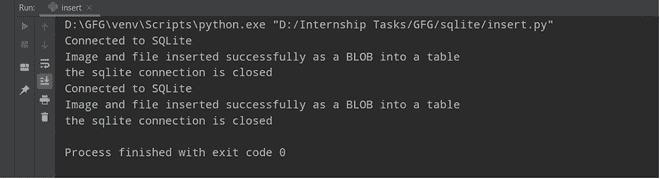
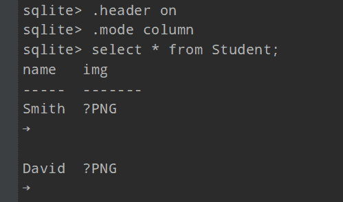

# 如何用 Python 在 SQLite 中插入图像？

> 原文:[https://www . geesforgeks . org/如何使用 python 在 sqlite 中插入图像/](https://www.geeksforgeeks.org/how-to-insert-image-in-sqlite-using-python/)

在本文中，我们将讨论如何使用 Python 中的 **sqlite3** 模块在 SQLite 中插入图像。

### 实施:

1.使用 Python 代码设置与 SQLite 数据库的连接。

```py
sqliteConnection = sqlite3.connect('SQLite_Retrieving_data.db')
cursor = sqliteConnection.cursor()
```

2.我们需要定义一个**插入查询**，用于将 **BLOB 数据**插入到表中。

```py
sqlite_insert_blob_query = """ INSERT INTO Student
                                 (name, img) VALUES (?, ?)"""
```

3.通过调用此 **convertToBinaryData()** 函数，将人类可读文件转换为二进制数据，并将其存储为 **empPhoto** 变量，

```py
empPhoto = convertToBinaryData(photo)
```

4.一旦文件转换成二进制格式，现在让我们将数据转换成元组格式，

```py
data_tuple = (name, empPhoto)
```

5.使用**光标. execute()** 在 Python 中执行**选择查询**。

```py
cursor = sqliteConnection.cursor()
cursor.execute(sqlite_insert_blob_query, data_tuple)
```

6.使用**SQliteConnection . commit()**保存我们所做的更改。

```py
sqliteConnection.commit()
```

7.创建一个函数，将人类可读数据转换为二进制格式，并将其存储到数据库中。

```py
def convertToBinaryData(filename):

  # Convert binary format to images or files data
  with open(filename, 'rb') as file:
      blobData = file.read()
  return blobData
```

8.关闭**光标**连接和 **MySQL 数据库**。

```py
if sqliteConnection:
    sqliteConnection.close()
    print("the sqlite connection is closed")
```

下面是实现。

## 蟒蛇 3

```py
import sqlite3

# Function for Convert Binary Data 
# to Human Readable Format
def convertToBinaryData(filename):

    # Convert binary format to images 
    # or files data
    with open(filename, 'rb') as file:
        blobData = file.read()
    return blobData

def insertBLOB(name, photo):
    try:

        # Using connect method for establishing
        # a connection
        sqliteConnection = sqlite3.connect('SQLite_Retrieving_data.db')
        cursor = sqliteConnection.cursor()
        print("Connected to SQLite")

        # insert query
        sqlite_insert_blob_query = """ INSERT INTO Student
                                  (name, img) VALUES (?, ?)"""

        # Converting human readable file into 
        # binary data
        empPhoto = convertToBinaryData(photo)

        # Convert data into tuple format
        data_tuple = (name, empPhoto)

        # using cursor object executing our query
        cursor.execute(sqlite_insert_blob_query, data_tuple)
        sqliteConnection.commit()
        print("Image and file inserted successfully as a BLOB into a table")
        cursor.close()

    except sqlite3.Error as error:
        print("Failed to insert blob data into sqlite table", error)

    finally:
        if sqliteConnection:
            sqliteConnection.close()
            print("the sqlite connection is closed")

insertBLOB("Smith", "D:\Internship Tasks\GFG\images\One.png")
insertBLOB("David", "D:\Internship Tasks\GFG\images\person.png")
```

**输出:**



上述 Python 程序的输出

让我们使用 **SELECT** 查询和适当的格式命令来检查数据库中的输出，



数据库内部输出