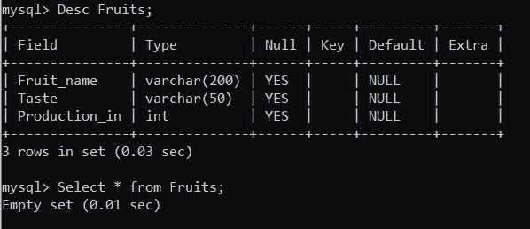
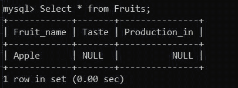
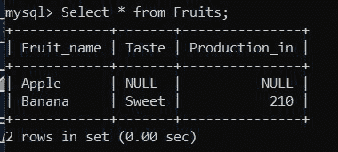

# 如何使用 Python 向 MySQL 服务器表中插入值？

> 原文:[https://www . geeksforgeeks . org/如何使用 python 将值插入 MySQL-server-table/](https://www.geeksforgeeks.org/how-to-insert-values-into-mysql-server-table-using-python/)

**先决条件:** [Python: MySQL 创建表](https://www.geeksforgeeks.org/python-mysql-create-table/)

在本文中，我们将看到如何使用 Python 在 MySQL 中获取表的大小。Python 允许广泛的数据库服务器与应用程序的集成。从 Python 访问数据库需要数据库接口。 [**MySQL 连接器**](https://www.geeksforgeeks.org/mysql-connector-python-module-in-python/) -Python 模块是 Python 中的一个 API，用于与 MySQL 数据库进行通信

**进场:**

*   建立一个服务于本地或全球的数据库。
*   安装 Python 连接器以便与数据库通信。
*   使用连接器建立数据库连接。
*   需要一个表来插入数据，如果没有表，创建一个表。
*   使用连接器返回的游标对象修改表[ CRUD 操作]中的数据。
*   如果已经完成，请关闭数据库连接。

我们将使用这张表:



**示例 1:** 将一行添加到具有静态值的表中:

> **语法:**“插入到表名(列名)值(ValueSofRow)；”

**下面是实现:**

## 蟒蛇 3

```
import mysql.connector

db = mysql.connector.connect(
    host="localhost",
    user="root",
    passwd="root",
    database="testdb"
)
# getting the cursor by cursor() method
mycursor = db.cursor()

insertQuery = "INSERT INTO Fruits (Fruit_name) VALUES ('Apple');"

mycursor.execute(insertQuery)

print("No of Record Inserted :", mycursor.rowcount)

# we can use the id to refer to that row later.
print("Inserted Id :", mycursor.lastrowid)

# To ensure the Data Insertion, commit database.
db.commit() 

# close the Connection
db.close()
```

**输出:**

```
No of Record Inserted : 1
Inserted Id : 1
```

**插入后我们的表在 SQL 中的样子:**



**示例 2:** 将多行添加到具有静态值的表中:

> **语法:**“插入到表名(列名)中”
> 
> values(value soff 1)、(value soff 2)、…。(valuesoff rown)；“”

**下面是实现:**

## 蟒蛇 3

```
import mysql.connector

db = mysql.connector.connect(
    host="localhost",
    user="root",
    passwd="root",
    database="testdb"
)

#getting the cursor by cursor() method
mycursor = db.cursor()

insertQuery = '''INSERT INTO 
            Fruits (Fruit_name, Taste, Production_in ) 
            VALUES ('Banana','Sweet',210);'''

mycursor.execute(insertQuery)

print("No of Record Inserted :", mycursor.rowcount)

# To ensure the data insertion, Always commit to the database.
db.commit()

# close the Connection
db.close()
```

**输出:**

```
No of Record Inserted : 2
```

**插入后我们的表在 SQL 中的样子:**

