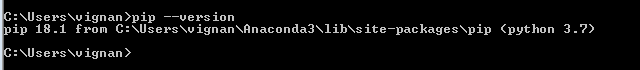
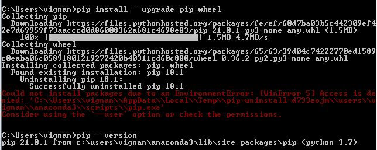

# 如何安装 Python 模块？

> 原文:[https://www . geesforgeks . org/如何安装 python 模块/](https://www.geeksforgeeks.org/how-to-install-a-python-module/)

一个模块帮助你逻辑地安排你的 Python 代码。当代码被组织成模块时，更容易理解和使用。您可以绑定和引用一个模块，它是一个具有任意命名属性的 Python 对象。

模块只是一个包含 Python 代码的文件。函数、组和变量都可以在一个模块中描述。可运行代码也可以在模块中使用。一个模块可以由多个应用程序导入，因此多个程序可以使用一个代码来更快、更可靠地完成它们的功能。

### 在 Windows 上安装 Python 模块

检查 pip 是否已安装:要检查 pip 是否已安装，请使用命令提示符在 windows 中运行以下命令:

```
pip --version 
```

**输出:**



**注意:**如果没有安装 pip 那就参考文章 [**如何在 Windows 上安装 PIP？**](https://www.geeksforgeeks.org/how-to-install-pip-on-windows/)

输出版本应等于或大于 19 版本，如果不是，请使用以下命令更新 pip:

```
pip install --upgrade pip wheel
```

**输出:**



要安装 pip 包，请使用以下命令安装所需的包:

```
pip install <packagename> 
```

要从其他资源安装软件包，请使用以下命令:

```
pip install -e git+<https://github.com/myrepo.git#egg=packagename>
```

要升级已安装的软件包，请使用以下命令:

```
pip install --upgrade <packagename>
```

要卸载已安装的软件包，请使用以下命令:

```
pip uninstall <packagename>
```

### 在 Unix/macOS 上安装 Python 模块

确保您已经安装了 pip。在您的终端中键入以下命令，验证 pip 是否已安装。

```
python3 -m pip --version
```

**注意:**如果 pip 未安装，请参考文章

*   [**如何在 Linux 中安装 PIP？**T3】](https://www.geeksforgeeks.org/how-to-install-pip-in-linux/)
*   [**如何在 macOS 中安装 pip？**T3】](https://www.geeksforgeeks.org/how-to-install-pip-in-macos/)

要更新已安装的 pip 和安装工具副本，请使用以下命令:

```
python -m pip install --upgrade pip setuptools wheel
```

键入以下命令，使用 pip 安装模块。

```
python3 -m pip install "ProjectName"
```

要安装特定版本的模块，请使用以下命令:

```
python3 -m pip install "ProjectName==2.2"
```

要在任意两个数字之间安装模块版本:

```
python3 -m pip install "ProjectName>=2,<3"
```

要安装特定兼容版本的全长:

```
python3 -m pip install "ProjectName~=2.2.3"
```

要升级项目版本，请使用以下命令:

```
python3 -m pip install --upgrade ProjectName
```

要安装文本文档中所需的模块，请执行以下操作:

```
python3 -m pip install -r requirements.txt
```

要安装本地系统中存在的目录，请使用以下命令:

```
python3 -m pip install --no-index --find-links=file:///local/dir/ ProjectName
python3 -m pip install --no-index --find-links=/local/dir/ ProjectName
python3 -m pip install --no-index --find-links=relative/dir/ProjectName
```

### **Python 包手动安装**

大多数 Python 包现在都是为使用 pip 而设计的。如果您有一个不兼容的工具包，您将不得不手动安装它。

通过下载工具包，然后将其解压缩到本地目录来安装它。如果套件有自己的一套安装说明，请遵守这些说明，如果套件不存在，请使用以下命令手动安装套件:

```
python <FILE_NAME>.py install
```