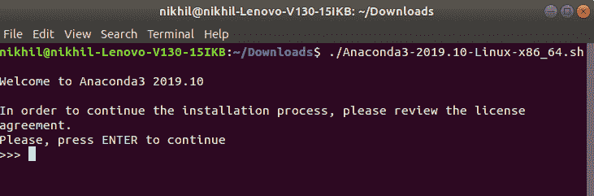
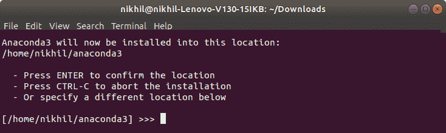
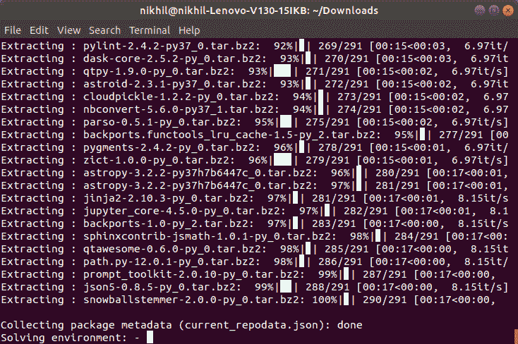
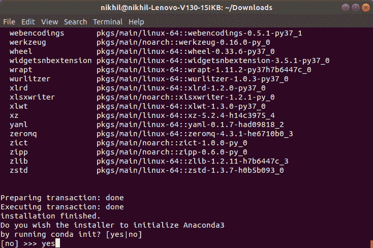
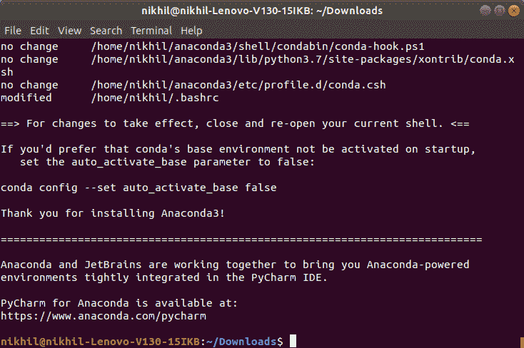
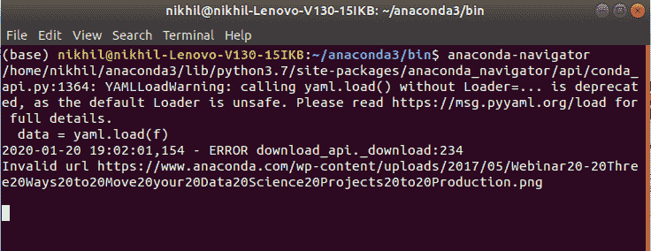

# 如何在 Linux 上安装 Anaconda？

> 原文:[https://www . geeksforgeeks . org/如何在 linux 上安装 anaconda/](https://www.geeksforgeeks.org/how-to-install-anaconda-on-linux/)

Anaconda 是一个开源软件，包含 Jupyter、spyder 等，用于大型数据处理、数据分析、重型科学计算。Anaconda 为 R 和 [python 编程语言](https://www.geeksforgeeks.org/python-language-introduction/)工作。python 使用 spyder(Anaconda 的子应用程序)。python 的 Opencv 将在 spyder 中工作。软件包版本由名为 conda 的软件包管理系统管理。

要开始使用 Anaconda，必须先安装它。按照以下说明在您的系统上下载并安装 Anaconda:

### 下载并安装 Anaconda:

前往[anaconda.com](https://www.anaconda.com/distribution/#windows)安装最新版本的 Anaconda。确保下载“Python 3.7 版本”以获得合适的体系结构。
T3】

**从安装过程开始:**

*   **入门:**
    
*   **通过许可协议:**
    
*   **选择安装地点:**
    
*   **提取文件和包:**
    
*   **初始化蟒蛇安装:**
    
*   **完成安装:**
    

### 与蟒蛇一起工作:

安装过程完成后，Anaconda 可用于执行多个操作。要开始使用 Anaconda，请使用以下命令启动 Anaconda 导航器:

```
anaconda-navigator
```


