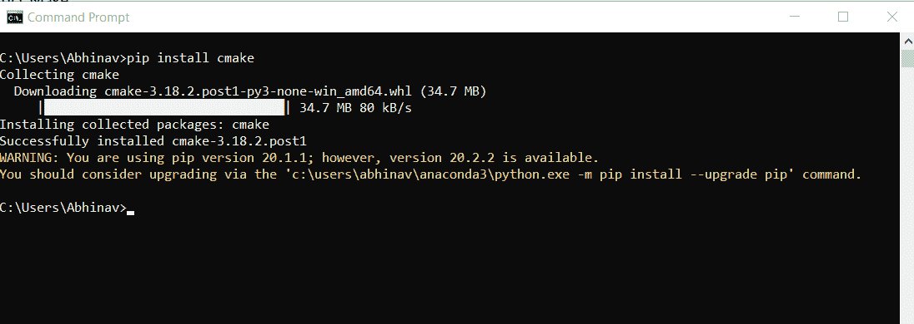
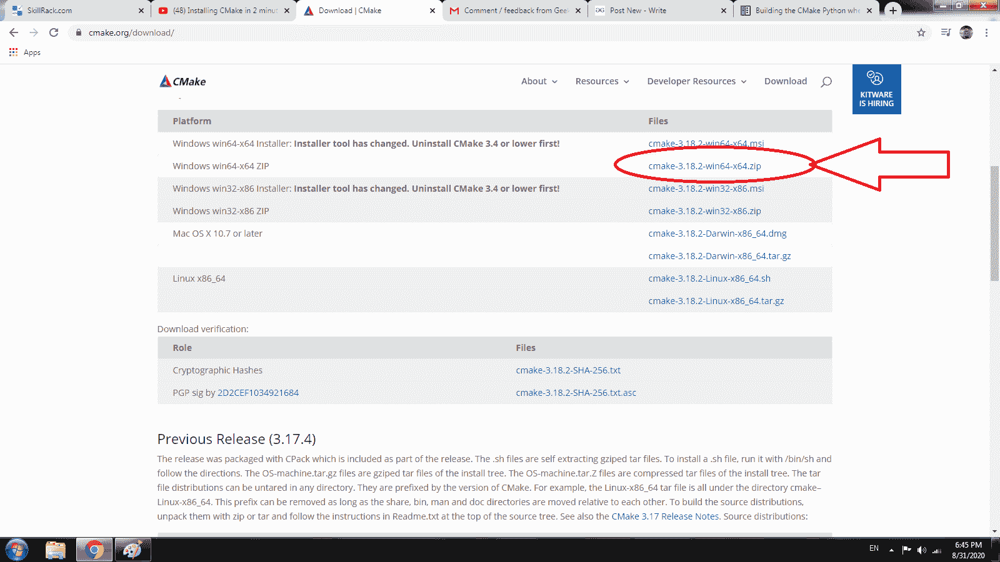
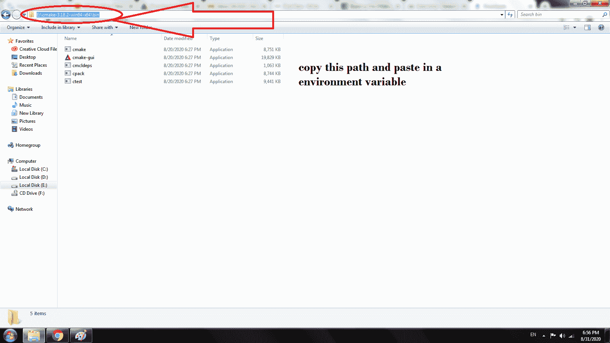
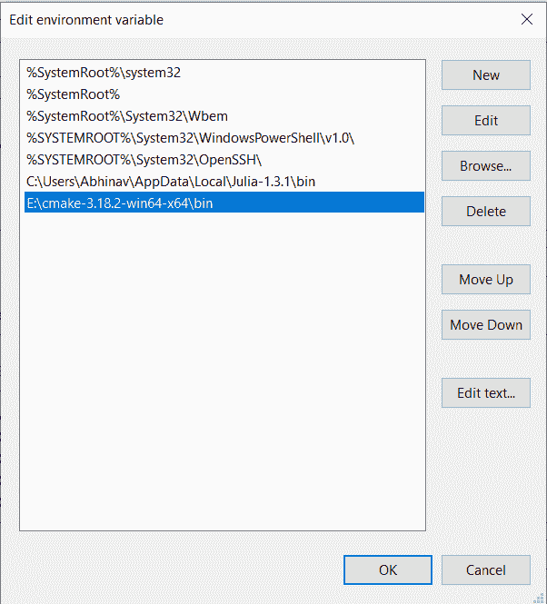

# 如何用 Python 安装 Windows 的 CMake？

> 原文:[https://www . geesforgeks . org/how-install-cmake-for-windows-in-python/](https://www.geeksforgeeks.org/how-to-install-cmake-for-windows-in-python/)

CMake 是一个跨平台的自由开源软件工具，用于使用独立于编译器的方法来管理软件的构建过程。它支持依赖于多个库的目录层次和应用程序。

#### 安装 CMake

使用 python 提供的 pip 包管理工具，可以轻松安装 Python 中的 CMake。只需在安装过程中使用以下命令:

> pip 安装 cmake

#### 设置环境变量

**第一步:**打开[https://cmake.org/](https://cmake.org/)点击下载

**第二步:**下载 CMake 的 Zip 文件。

**第三步:**提取文件，复制 bin 文件路径。

**第 4 步:** 转到 **控制面板- >系统和安全- >系统**
在 **高级系统设置** 选项下点击 **环境变量** 如下所示:

 

**第 6 步:** 现在，我们必须更改系统变量下的 **【路径】** 变量，使其也包含到 CMake 环境的路径。选择 **【路径】** 变量，点击 **编辑** 按钮，如下图:

**第七步:** 我们会看到一个不同路径的列表，点击 **新建** 按钮、然后添加安装 CMake 的路径然后点击确定。

