# 如何在 Linux 中安装 Jupyter 笔记本？

> 原文:[https://www . geesforgeks . org/how-install-jupyter-notebook in-Linux/](https://www.geeksforgeeks.org/how-to-install-jupyter-notebook-in-linux/)

Jupyter Notebook 是一个开源网络应用程序，允许您创建和共享包含实时代码、公式、可视化和叙事文本的文档。用途包括数据清理和转换、数值模拟、统计建模、数据可视化、机器学习等等。

Jupyter 支持 40 多种不同的编程语言， [Python](https://www.geeksforgeeks.org/python-language-introduction/) 就是其中之一。Python 是安装 Jupyter 笔记本本身的要求(Python 3.3 或更高版本，或 Python 2.7)。

Jupyter 笔记本可以通过以下两种方式安装:

*   **使用 Anaconda:**
    使用 Anaconda 发行版安装 Python 和 Jupyter，该发行版包括 Python、Jupyter Notebook 和其他用于科学计算和数据科学的常用软件包。安装 Anaconda，要经过[如何在 Linux 上安装 Anaconda？](https://www.geeksforgeeks.org/how-to-install-anaconda-on-linux/)并按照提供的说明操作。
*   **使用 PIP:**
    使用 **PIP 包管理器**安装 Jupyter，用于安装和管理用 Python 编写的软件包/库。要安装 pip，请通过[如何在 Linux 中安装 PIP？](https://www.geeksforgeeks.org/how-to-install-pip-in-linux/)并遵循提供的说明。

### 使用 Anaconda 安装 Jupyter 笔记本:

Anaconda 是一个开源软件，包含 Jupyter、spyder 等，用于大型数据处理、数据分析、重型科学计算。Anaconda 为 R 和 python 编程语言工作。python 使用 spyder(Anaconda 的子应用程序)。python 的 Opencv 将在 spyder 中工作。软件包版本由名为 conda 的软件包管理系统管理。

要使用 Anaconda 安装 Jupyter，只需按照以下说明操作:

*   **发射巨蟒领航员:**
    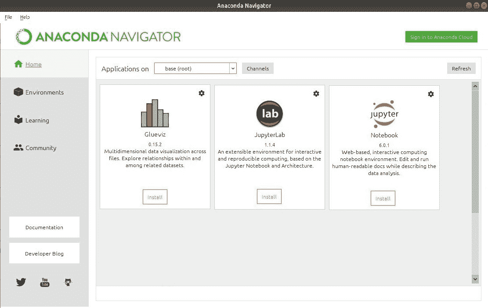
*   **点击安装 Jupyter 笔记本按钮:**
    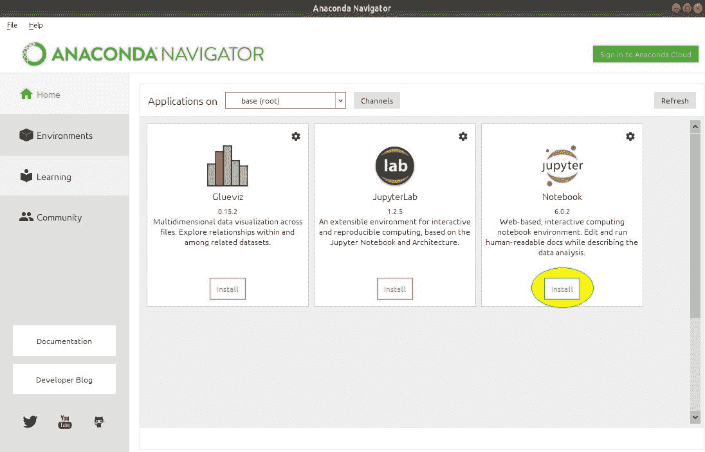
*   **开始安装:**
    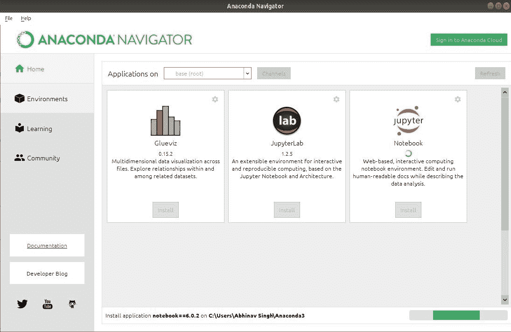
*   **装载包裹:**
    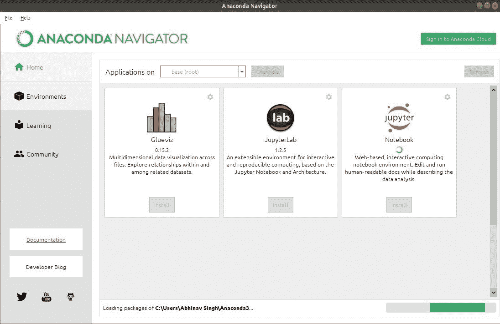
*   **安装完毕:**
    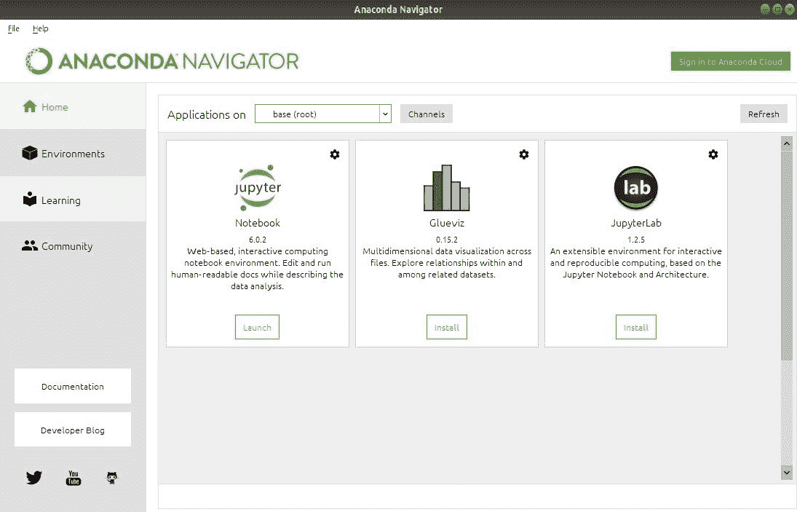

**发射 Jupyter:**
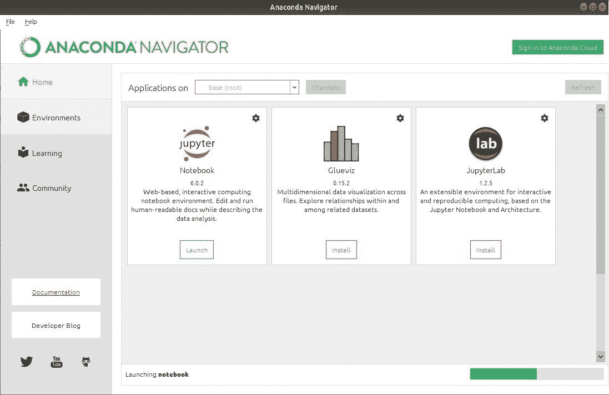
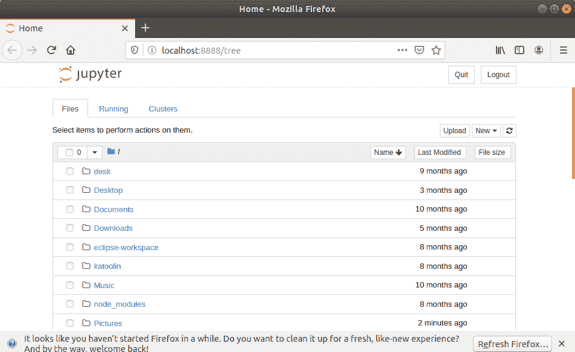

### 使用 pip 安装 Jupyter 笔记本:

**PIP** 是一个包管理系统，用于安装和管理用 Python 编写的软件包/库。这些文件存储在一个被称为 Python 包索引(PyPI)的大型“在线存储库中”。
pip 使用 PyPI 作为包及其依赖项的默认来源。

要使用 pip 安装 Jupyter，我们需要首先检查 pip 是否在我们的系统中更新。使用以下命令更新 pip:

```
python3 -m pip install --upgrade pip
```

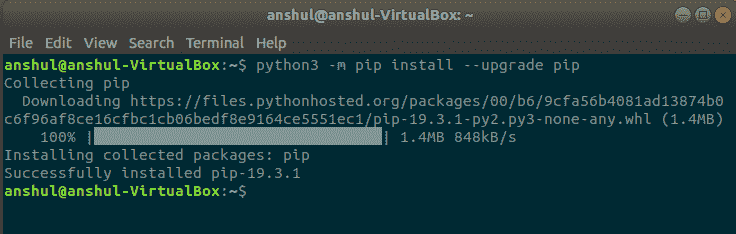

更新 pip 版本后，按照下面提供的说明安装 Jupyter:

*   **命令安装 Jupyter:**

    ```
    pip3 install Jupyter

    ```

*   **开始安装:**
    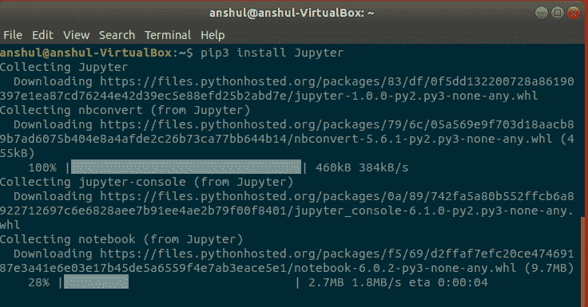
*   **收集文件和数据:**
    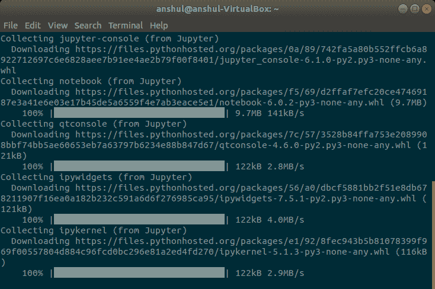
*   **下载套餐:**
    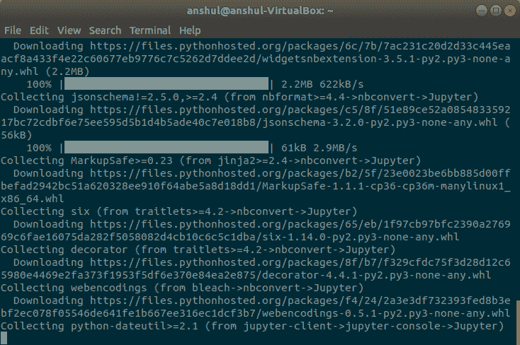
*   **运行安装:**
    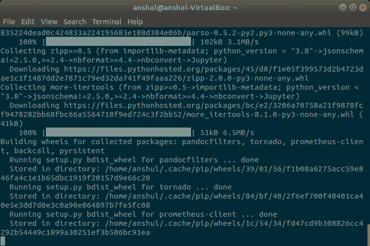
*   **安装完毕:**
    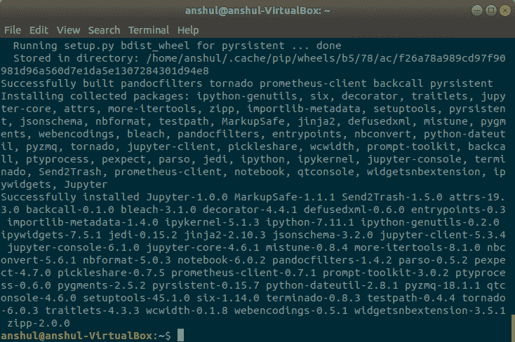

**启动 Jupyter:**
使用以下命令使用命令行启动 Jupyter:

```
jupyter notebook
```

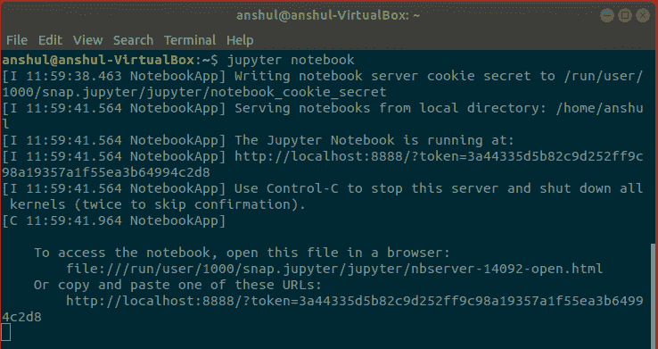
