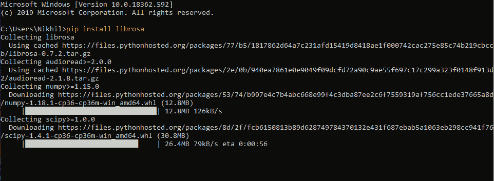
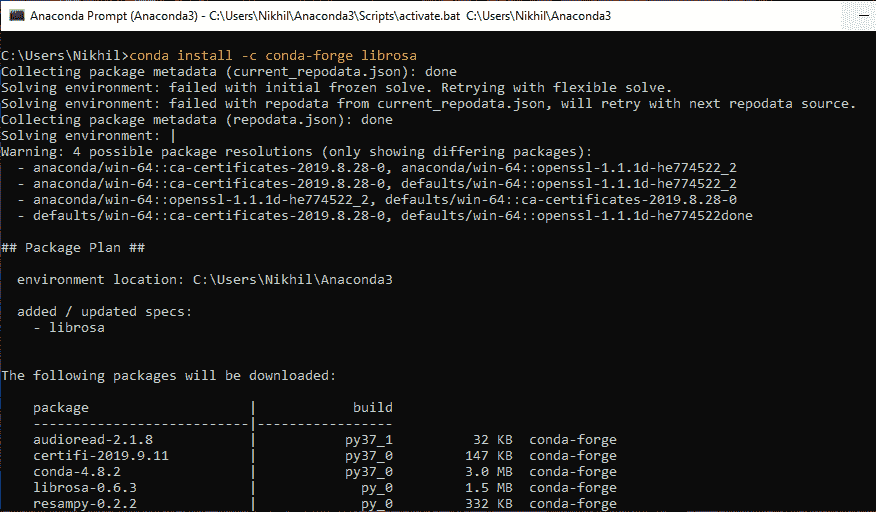
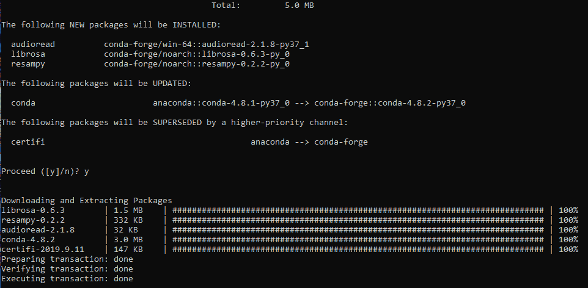

# 如何用 Python 安装 Librosa 库？

> 原文:[https://www . geesforgeks . org/how-install-librosa-library-in-python/](https://www.geeksforgeeks.org/how-to-install-librosa-library-in-python/)

Librosa 是一个用于音乐和音频分析的 Python 包。Librosa 基本上是在我们处理音频数据时使用的，比如音乐生成(使用 LSTM 的)，自动语音识别。

它为创建音乐信息检索系统提供了必要的构件。Librosa 有助于可视化音频信号，并使用不同的信号处理技术提取其中的特征。

#### 装置

*   **Using PyPI(Python Package Index)**

    打开系统上的命令提示符，并编写其中任何一个命令。

    ```py
    pip install librosa 
    sudo pip install librosa
    pip install -u librosa
    ```

    

*   **Conda Install**

    如果使用 conda/Anaconda 环境，可以从 conda-forge 通道安装 librosa。打开 Anaconda 提示符并写道:

    ```py
    conda install -c conda-forge librosa
    ```

    
    

    **注意:**如果在 conda 中使用 Python 3.5 环境，可能会遇到 numba 依赖的问题。这可以通过在安装 librosa 之前从 numba conda 通道安装来避免:

    ```py
    conda install -c numba numba
    ```