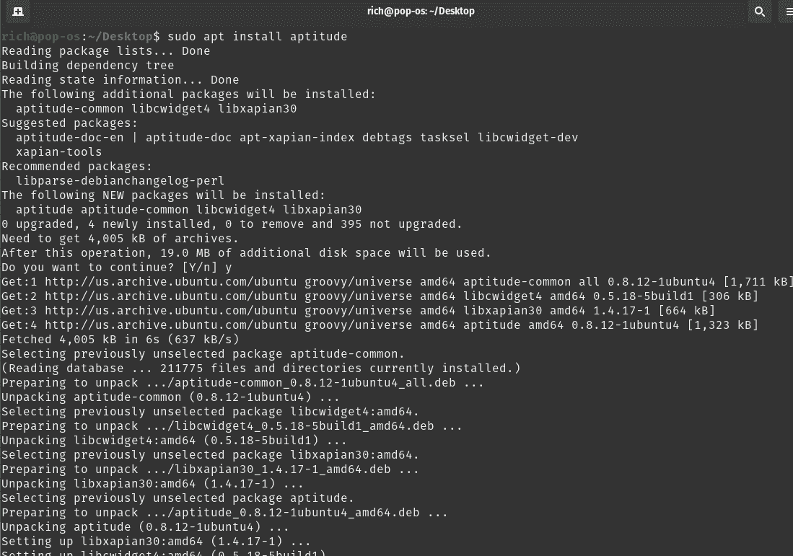
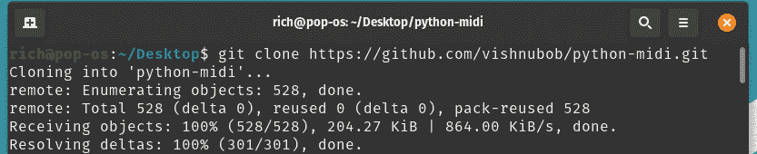
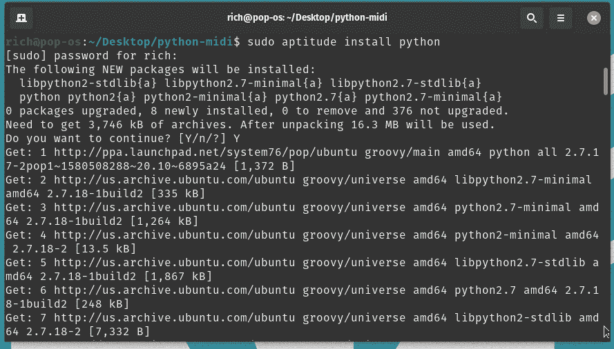
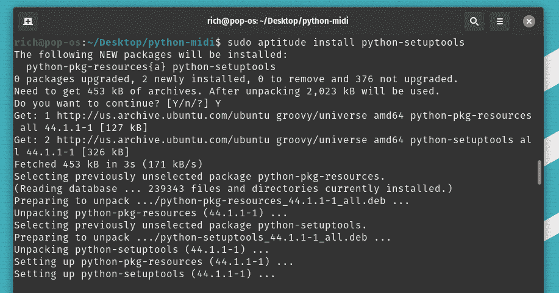
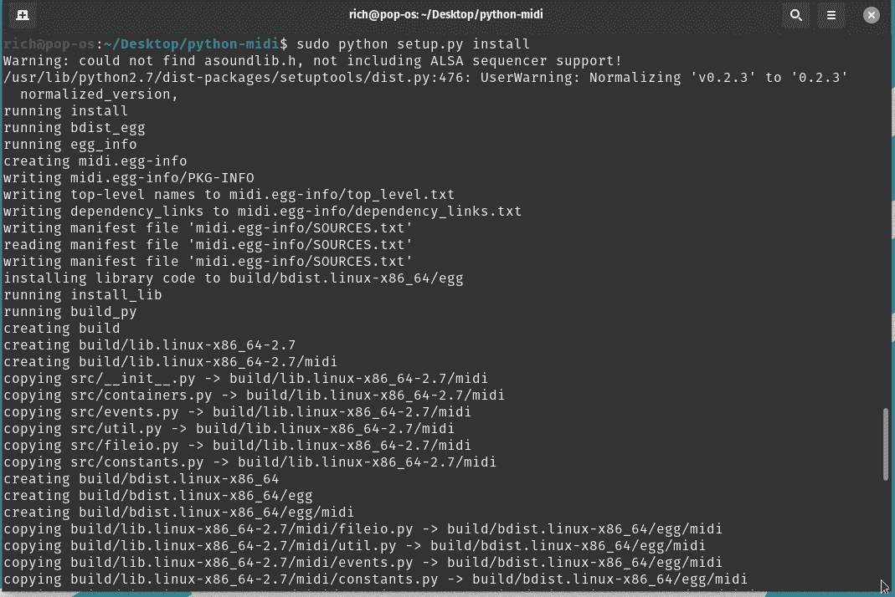
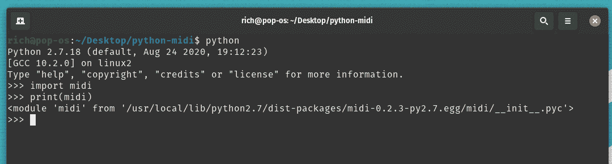

# 如何在 Linux 上安装 Python 的 midi，midi _ maniulation？

> 原文:[https://www . geeksforgeeks . org/如何安装-midi-midi _ maniation-for-python-on-Linux/](https://www.geeksforgeeks.org/how-to-install-midi-midi_maniulation-for-python-on-linux/)

在本文中，我们将看到如何在 Linux 上安装 midi Python。MIDI 是**乐器数字接口**的首字母缩写。MIDI 是连接发出和控制声音的设备的一种方式。这种 midi 操作有一个 python 框架。使用这个 python 框架，我们可以从磁盘读取 MIDI 文件，构建新的 MIDI 流，处理、过滤预先存在的流，并将我们的更改写回磁盘。在本文中，我们将学习如何在我们的 Linux 机器上安装 python 的 midi。

## 在 Linux 上安装 midi

**步骤 1:** 通过运行以下命令安装智能包管理器:

```py
sudo apt install aptitude -y
```



运行上面的命令将导致在您的 Linux 机器上安装智能包管理器。

**步骤 2:** 要安装 midi，前往 midi GitHub 存储库，并将其克隆到桌面上。

```py
git clone https://github.com/vishnubob/python-midi.git
```



**步骤 3:** 通过运行以下命令到你的 Linux 终端，下载依赖项来构建 **d** 这个包。

*   安装 python

```py
sudo aptitude install python
```



安装 python

*   安装安装工具来构建包。

```py
sudo aptitude install python-setuptools
```



安装 setuptools

**步骤 3:** 通过运行 setup.py 文件安装 midi。

```py
cd python-midi
sudo python setup.py install
```



midi 已安装

**步骤 4:** 要验证安装，请在您的终端中运行以下命令:

```py
python
import midi
print(midi)
```



midi 已安装

这将打印 midi 的安装位置，从而确认将安装到您的系统上。