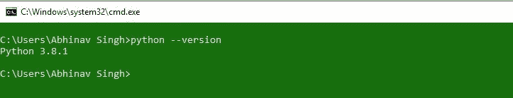
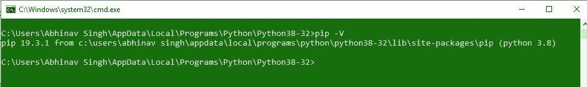
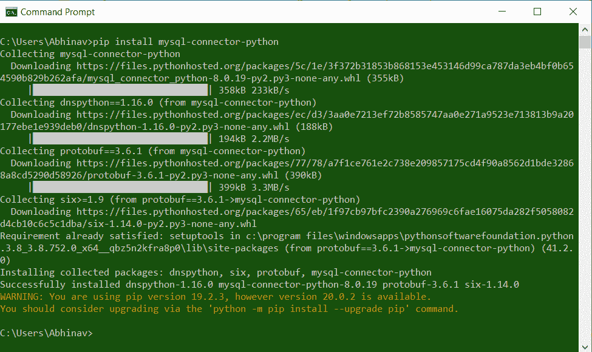
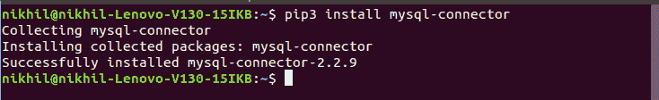

# 如何用 Python 安装 MySQL 连接器包？

> 原文:[https://www . geesforgeks . org/how-install-MySQL-connector-package-in-python/](https://www.geeksforgeeks.org/how-to-install-mysql-connector-package-in-python/)

**先决条件:** [Python 语言简介](https://www.geeksforgeeks.org/python-language-introduction/)

MySQL 是一种关系数据库管理系统(RDBMS)，而结构化查询语言(SQL)是使用命令处理 RDBMS 的语言，即创建、插入、更新和删除数据库中的数据。
当我们不得不使用 MySQL 和其他编程语言时，就要用到连接器。mysql 连接器的工作是提供对所需语言的 MySQL 驱动程序的访问。因此，它在编程语言和 MySQL 服务器之间生成了一个连接。

#### 安装:

要安装 Python-mysql 连接器模块，必须在系统上预装 **Python** 和 **PIP** 。要检查您的系统是否已经包含 Python，请按照以下说明操作:

打开命令行(在运行对话框中搜索 cmd(<link rel="stylesheet" href="https://maxcdn.bootstrapcdn.com/font-awesome/4.6.1/css/font-awesome.min.css">***+R**)。
现在运行以下命令:*

```py
*python --version*
```

*如果已经安装了 Python，它将生成一条消息，其中包含可用的 Python 版本。
*

*如果 Python 不存在，请通过[Windows](https://www.geeksforgeeks.org/how-to-install-python-on-windows/)[Linux](https://www.geeksforgeeks.org/how-to-install-python-on-linux/)如何安装 Python？并遵循提供的说明。

**PIP** 是一个包管理系统，用于安装和管理用 Python 编写的软件包/库。这些文件存储在一个被称为 Python 包索引(PyPI)的大型“在线存储库中”。
要检查您的系统上是否已经安装了画中画，只需转到命令行并执行以下命令:*

```py
*pip -V*
```

**

*如果 PIP 不存在，请通过 [Windows](https://www.geeksforgeeks.org/how-to-install-pip-on-windows/) 和 [Linux](https://www.geeksforgeeks.org/how-to-install-pip-in-linux/) 如何安装 PIP？*

#### *Windows 操作系统*

***`mysql-connector`** 方法可以通过使用以下命令安装在 Windows 上:*

```py
*pip install mysql-connector-python*
```

**

#### *Linux 操作系统*

***`mysql-connector`** 方法可以使用以下命令安装在 Linux 上:*

```py
*pip3 install mysql-connector*
```

**