# 如何在 Windows 上安装 Oracle 数据库 11g？

> 原文:[https://www . geesforgeks . org/如何安装-Oracle-database-11g-on-windows/](https://www.geeksforgeeks.org/how-to-install-oracle-database-11g-on-windows/)

**甲骨文数据库**(通称甲骨文*关系数据库管理系统*)是由甲骨文公司生产和销售的数据库管理系统。
Oracle 数据库最基本和最常见的用法是存储预定义类型的数据。它支持*结构化查询语言* (SQL)来管理和操作它所拥有的数据。它是最可靠和使用率最高的关系数据库引擎之一。

Oracle 数据库有很多版本，像 Oracle 数据库 10g、Oracle 数据库 11g、Oracle 数据库 12c、Oracle 数据库 19c 等。其中*甲骨文 19c* 为最新版本。在本文中，我们将学习如何在 Windows 上安装 11g 版本。

Downloading the Installation Files

**第一步:**前往[oracle.com](https://www.oracle.com/index.html)点击**选项**菜单。

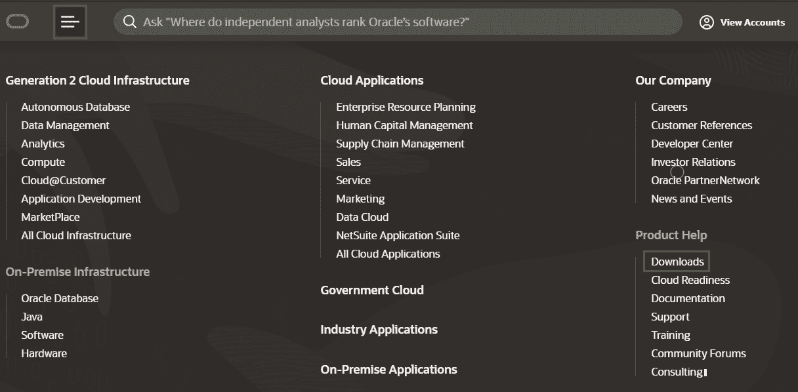

**第二步:**点击**下载**按钮，向下滚动至**数据库**部分。

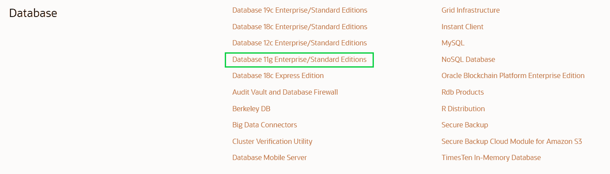

**第三步:**点击**数据库 11g 企业版/标准版**，之后会发现不同操作系统的不同版本的 Oracle。根据您的操作系统下载文件。

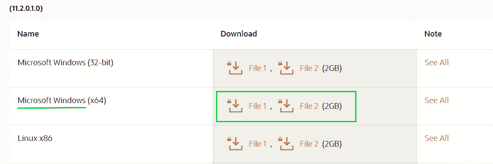

**第四步:**点击**下载**按钮后，页面将导向*登录*界面，您需要在**甲骨文账户**中*登录*。如果你没有，那么你必须*注册*，因为没有它你将无法下载文件。

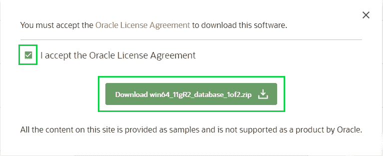

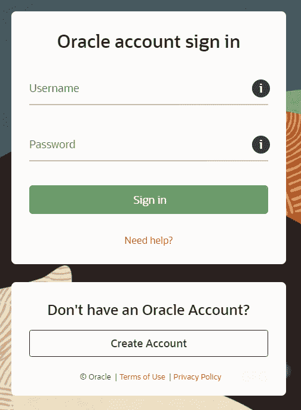

**第 5 步:**对两个文件重复相同的步骤并下载它们。

文件下载成功后，你会在**下载**文件夹中找到这两个文件，它们都将处于*压缩形式*，所以你需要**提取**它们。

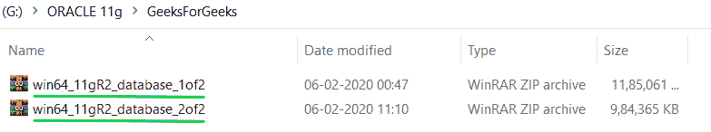

Extraction of Downloaded Files

**第 1 步:**在同一个目录下，使用 WinRAR 或您选择的任何其他提取工具提取这两个文件。

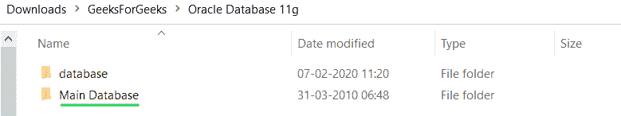

**步骤 2:** 转到文件夹**数据库- >阶段- >组件**复制此文件夹的所有内容

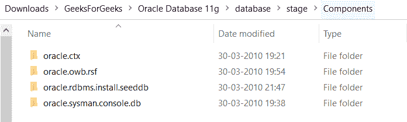

**步骤 3:** 转到**主数据库- >阶段**将复制的内容粘贴到**组件**文件夹中

Installation of Oracle Database

**第一步:**转到**主数据库**文件夹，在那里可以找到**设置**。右键单击**setup.exe**文件，选择**以管理员身份运行**。

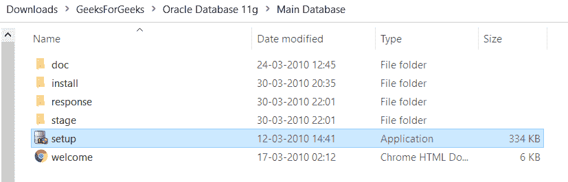

**第二步:**点击**是**继续。这将启动**甲骨文通用安装程序**。

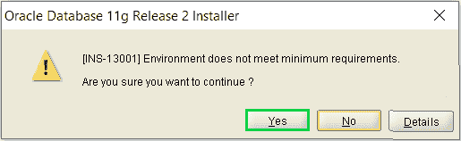

**第三步:**提供您的*电子邮件地址*以接收来自甲骨文的所有通知和新闻提醒。

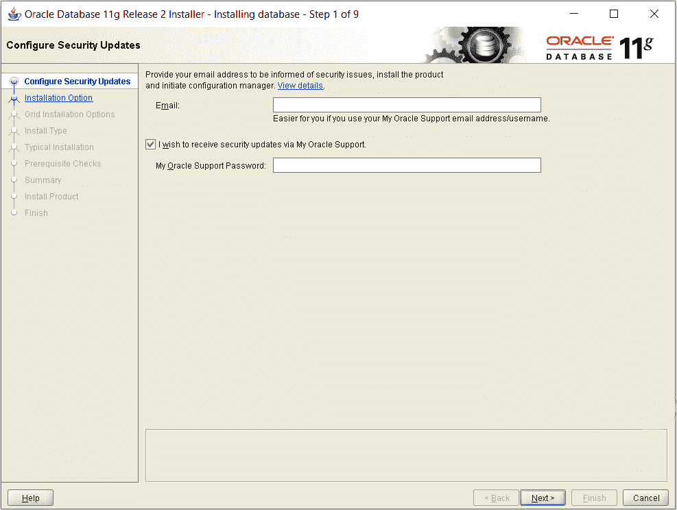

如果您不想从甲骨文收到任何警报，只需将这些字段留空，然后单击下一步继续。

**第四步:**根据需要选择三种不同的*安装选项*中的任意一种。

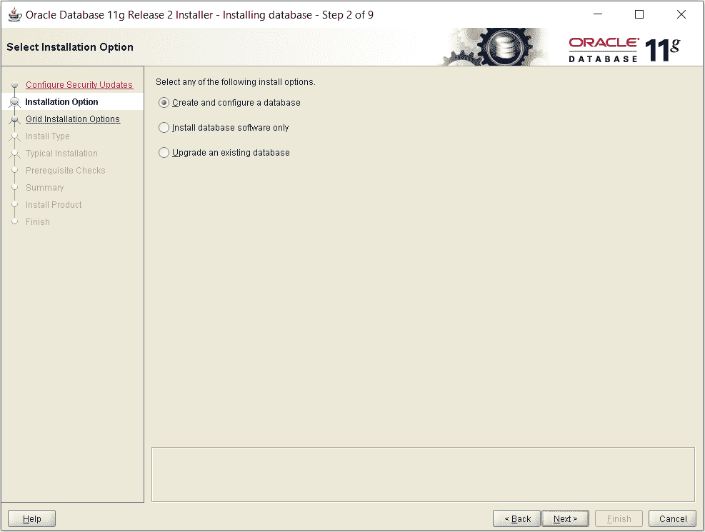

*   **选项 1**–如果您想安装 Oracle 服务器软件，并且还想创建数据库。
*   **选项 2**–如果您只想安装甲骨文服务器。
*   **选项 3**–如果您想升级现有数据库。

**第五步:**根据需要在**服务器类**和**桌面类**中选择，点击**下一步**。

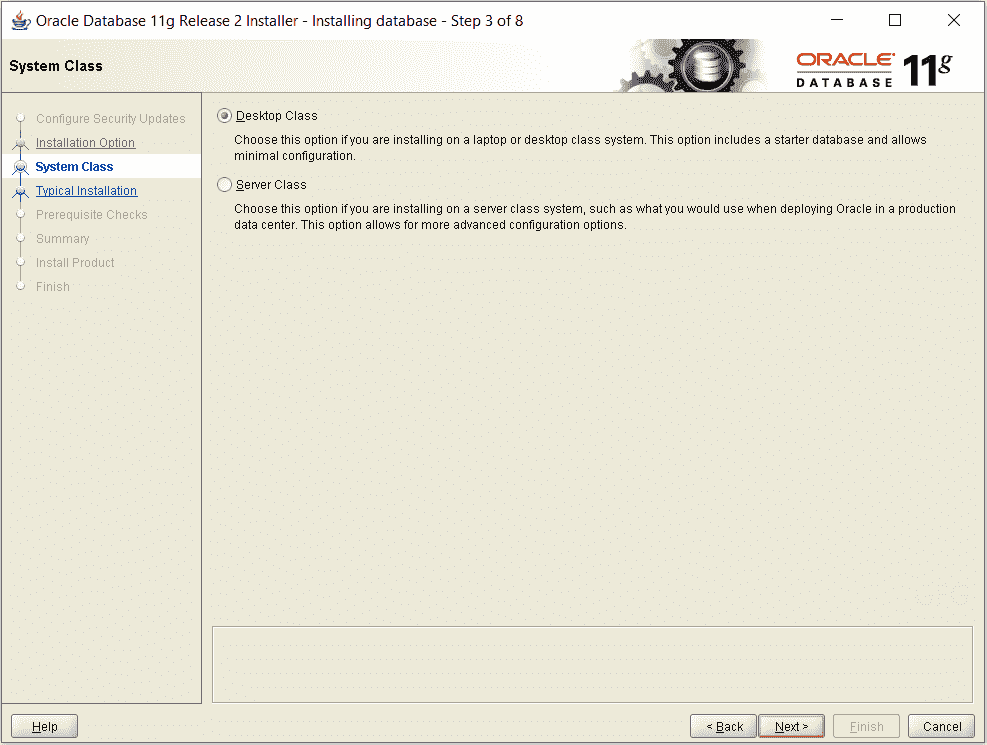

> **注意:**忽略与管理员密码相关的警告。

**第 6 步:**配置基本设置，为数据库创建密码。配置完成后，点击**下一步**继续。

**第 7 步:**在这里， *Oracle 通用安装程序* (OUI)将检查硬件兼容性等先决条件。
如果有**错误**，那么 **OUI** 会在这里显示，并推荐修改。

**第八步:**点击**完成**开始**安装**过程。此安装可能需要一些时间，具体取决于您的硬件。

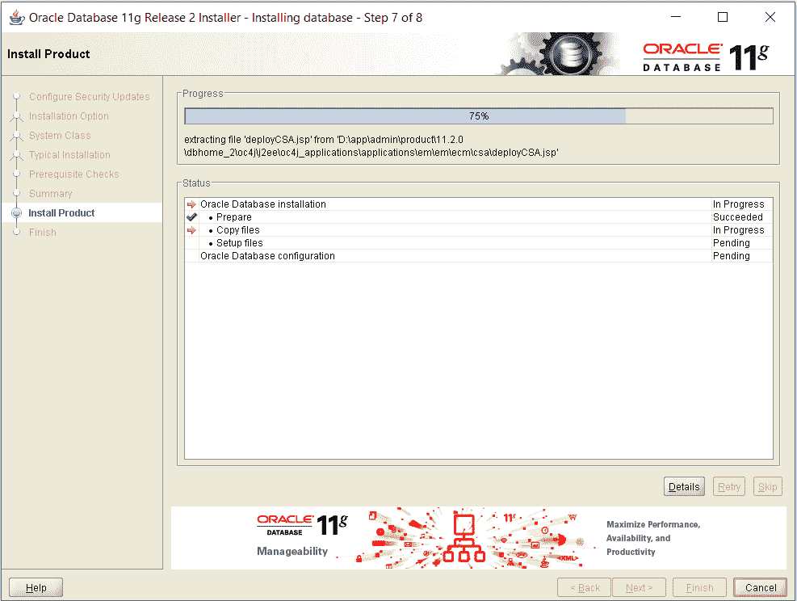

**第九步:**点击**确定**完成安装。

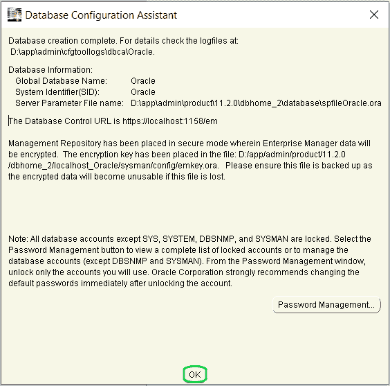

**第 10 步:**复制提供的本地主机链接打开你的**企业管理器**。

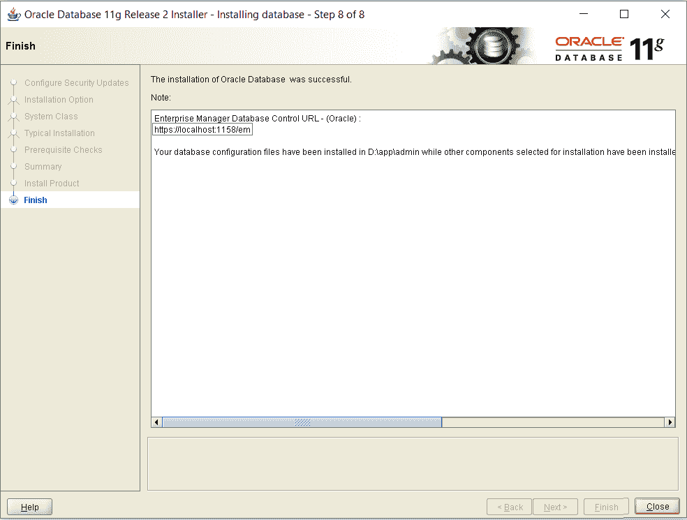

点击**关闭**按钮，完成**安装过程**。

Getting Started with Oracle Enterprise Manager

启动 Oracle 企业管理器有两种方式:

*   One way to launch Enterprise Manager is using the **Link** provided in last step of *Installation Process*. 

    **注意:**万一以后把这个链接放错了，按照下一步反过来启动。

*   转至**开始菜单**并
    *   搜索**甲骨文**文件夹
    *   点击**数据库控制–甲骨文**(您的全球数据库名称)
    *   这将带您进入**甲骨文企业管理器**的登录屏幕。

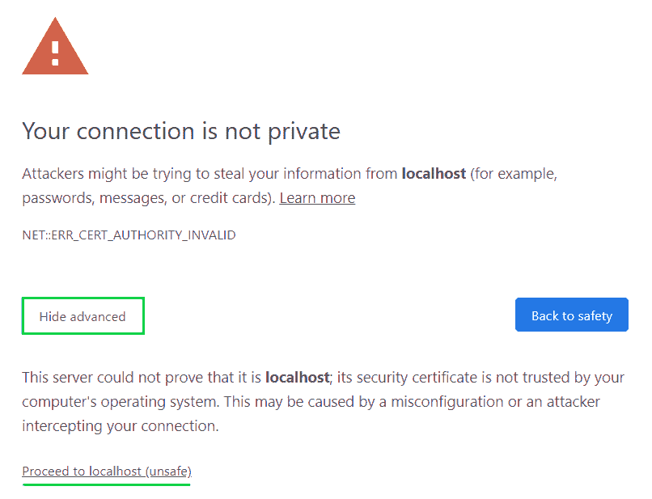

*   如果出现上述错误，只需点击**高级- >进入本地主机**

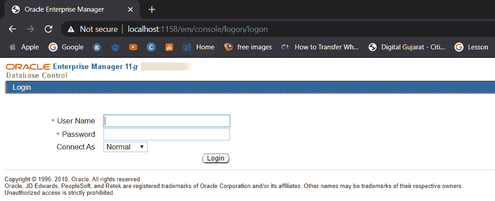

使用您的**凭证**登录，并开始在您的窗口上使用**甲骨文数据库 11g** 。