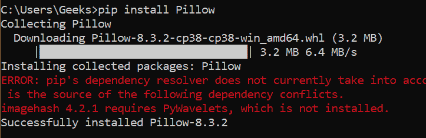
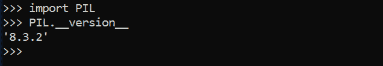
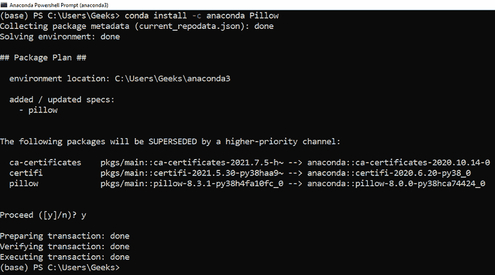
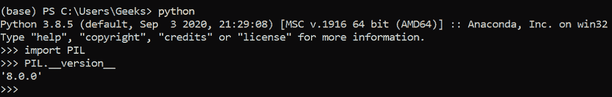

# 如何在 Windows 上安装 PIL？

> 原文:[https://www . geesforgeks . org/how-install-pil-on-windows/](https://www.geeksforgeeks.org/how-to-install-pil-on-windows/)

在本文中，我们将探讨在 Windows 机器上安装 [PIL 软件包](https://www.geeksforgeeks.org/python-pillow-a-fork-of-pil/)的各种方法。

### 先决条件:

*   [蟒蛇](https://www.geeksforgeeks.org/how-to-download-and-install-python-latest-version-on-windows/)
*   [PIP](https://www.geeksforgeeks.org/how-to-install-pip-on-windows/) 或 [Ananconda](https://www.geeksforgeeks.org/how-to-install-conda-in-windows/) (取决于您的喜好)

### 对于画中画用户:

打开命令提示符，使用以下命令安装 PIL 软件包:

```py
pip install Pillow
```

安装完成后，将显示以下消息:



要验证安装，请在您选择的 Python IDE 中运行以下代码:

## 蟒蛇 3

```py
import PIL

IL.__version__
```

**输出:**



### 对于康达用户:

Conda 用户可以打开 Anaconda 电源外壳，并使用以下命令安装 PIL:

```py
conda install -c anaconda Pillow
```

安装完成后，将显示以下消息:



要验证安装，请在您选择的 Python IDE 中运行以下代码:

## 蟒蛇 3

```py
import PIL
IL.__version__
```

**输出:**

