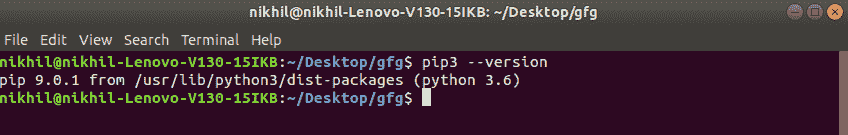

# 如何在 Linux 中安装 PIP？

> 原文:[https://www.geeksforgeeks.org/how-to-install-pip-in-linux/](https://www.geeksforgeeks.org/how-to-install-pip-in-linux/)

**先决条件:** [Python 语言介绍](https://www.geeksforgeeks.org/python-language-introduction/)

在开始介绍如何在 Linux 上为 Python 安装 pip 之前，我们先来看一下 Python 的基本介绍。 [Python](https://www.geeksforgeeks.org/python-programming-language/) 是一种广泛使用的通用高级编程语言。Python 是一种编程语言，可以让您快速工作并更高效地集成系统。

**PIP** 是一个包管理系统，用于安装和管理用 Python 编写的软件包/库。这些文件存储在一个被称为 Python 包索引(PyPI)的大型“在线存储库中”。

pip 使用 PyPI 作为包及其依赖项的默认来源。所以无论何时你输入:

```py
pip install package_name
```

pip 将在 PyPI 上查找该包，如果找到，它将在您本地系统上下载并安装该包。

### 下载并安装 pip:

通过以下命令，可以在 Linux 中使用终端下载和安装 pip:

```py
sudo apt-get install python3-pip python-dev
```

**开始安装:**

*   **入门:**
    
*   **提供磁盘空间:**
    
*   **下载库:**
    
*   **打开文件包:**
    
*   **完成安装:**
    

### 安装过程的验证:

通过对 pip 执行版本检查，可以轻松验证 pip 是否已正确安装。只需转到命令行并执行以下命令:

```py
pip3 --version
```

