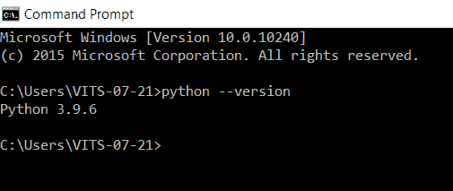
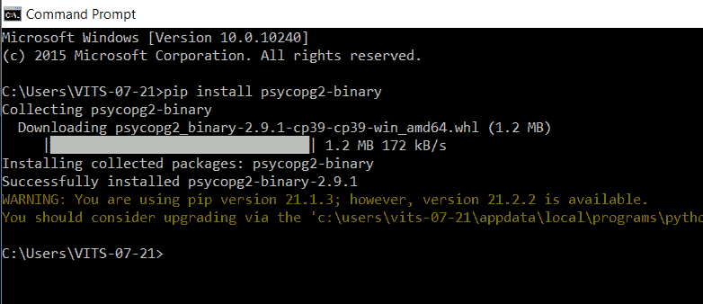
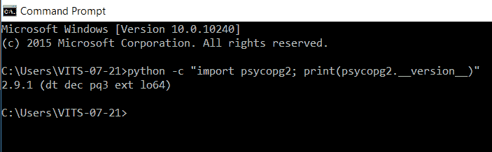

# 如何在 Python 中安装 psycopg2 二进制模块？

> 原文:[https://www . geesforgeks . org/how-install-psycopg2-二进制-python 中的模块/](https://www.geeksforgeeks.org/how-to-install-psycopg2-binary-module-in-python/)

psycopg2 是 Python 编程语言最流行的 PostgreSQL 数据库适配器。它是一个数据库应用编程接口 2.0 兼容的后回归 SQL 驱动程序，正在积极开发中。它是为创建和销毁大量游标并创建大量“INSERTs”或“UPDATEs”的多线程应用程序而设计的。

## 安装:

要安装此模块，请遵循以下步骤。

**第一步:**首先检查你的系统中是否安装了 Python。只需打印其版本即可。打开命令提示符，运行下面给出的命令:

```py
python --version
```



如果您的系统中没有安装 python，那么您可以通过在命令提示符下运行给定的命令来安装它。

```py
pip install python
```

**步骤 2:** 打开命令提示符，运行下面的命令安装 psycopg2-binary。如果它显示成功安装，那么你就可以走了。

```py
pip install psycopg2-binary
```



**第三步:**检查是否工作。只需导入 psycopg2 库并检查其版本即可。打开命令提示符，输入下面给出的命令。没有显示错误意味着我们的软件包安装成功。

```py
python -c "import psycopg2; print(psycopg2.__version__)"
```

