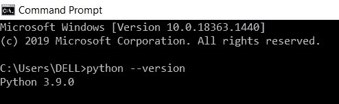
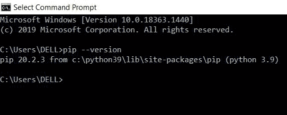
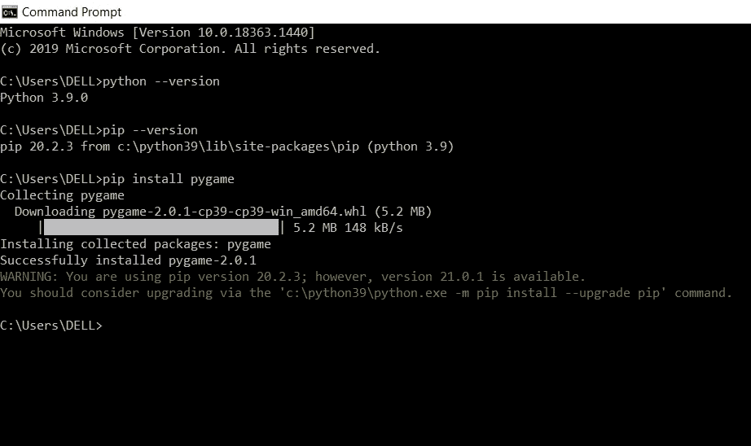

# 如何在 Windows 上安装 Pygame？

> 原文:[https://www . geeksforgeeks . org/如何在 windows 中安装 pygame/](https://www.geeksforgeeks.org/how-to-install-pygame-in-windows/)

在本文中，我们将学习如何在 Windows 上安装 Python 的 PyGame 模块。 **PyGame** 是一个 python 语言的库。它用于开发二维游戏，是一个可以设置 python 模块来开发游戏的平台。这是一个用户友好的平台，有助于快速轻松地构建游戏。

### **按照下面给出的步骤成功安装 Pygame**

#### **第一步:检查 Python 安装**

为了安装 Pygame，您的系统中必须已经安装了 Python。要检查系统中是否安装了 Python，请打开命令提示符并给出如下所示的命令。



如果这个命令成功运行，并且我们能够获得 Python 版本，那么我们就可以开始了。否则，我们必须在我们的系统中安装 Python，要做到这一点，请参考 [**如何在 Windows 上安装 Python？**T3】](https://www.geeksforgeeks.org/how-to-install-python-on-windows/)

#### **第二步:检查画中画安装**

PIP 是一个用来安装 python 包的工具。画中画是 Python 2.7 自动安装的。9+和 Python 3.4+。打开命令提示符，输入如下所示的命令，检查是否安装了 pip。



**注意:**参考 [**如何在 Windows 上安装 PIP？**](https://www.geeksforgeeks.org/how-to-install-pip-on-windows/) 获取详细信息。

#### **第三步:安装 Pygame**

要安装 Pygame，请打开命令提示符并给出如下所示的命令:

```py
pip install pygame
```



Pygame 安装成功，如上图所示。

#### **第四步:检查 PyGame 是否工作**

现在打开一个新的终端，导入 Pygame 库，看看它在我们的系统中是否工作正常。成功导入库意味着我们成功了。


这样，我们就可以在 Python 中安装 pygame 模块。