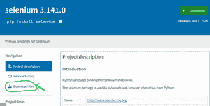
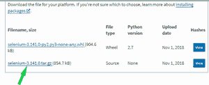
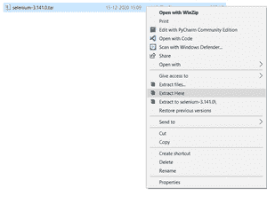
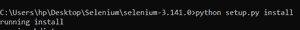
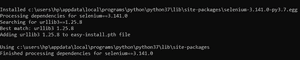

# 不使用 pip 命令如何安装 Python 库？

> 原文:[https://www . geesforgeks . org/如何不使用-pip-command/](https://www.geeksforgeeks.org/how-to-install-python-libraries-without-using-the-pip-command/) 安装 python 库

在系统中安装外部库最常见的做法是使用 Python *pip* 命令。但是，还有一种不使用 *pip* 命令手动安装 Python 库的替代方法。

在本文中，我们将讨论如何手动安装 python 包。

下面是在系统中手动安装*硒*库的分步方法。

**第一步:**下载文件

*   去[https://pypi.org/](https://pypi.org/)网站找到你要安装的包
*   从左侧菜单中，单击下载文件按钮。
*   这里我举了硒库的例子。
*   确保下载 *.tar.gz* 文件



下载文件



. tar.tz

**步骤 2:** 如果下载的文件是使用任何解压缩软件压缩的，请解压缩这些文件。



**步骤 3:** 使用 cd 命令将当前工作目录更改为包含 Setup.py 的文件。


cd 命令

**第 4 步:**仔细阅读安装说明，按照指示进行安装。

**步骤 5:** 将当前工作目录更改为包含 Setup.py 的文件后，键入以下命令:

```py
python setup.py install
```



setup.py



最后的

就是这样，现在您已经准备好使用已安装的库，并且可以在您的 python 程序中导入这个库。