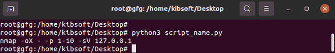
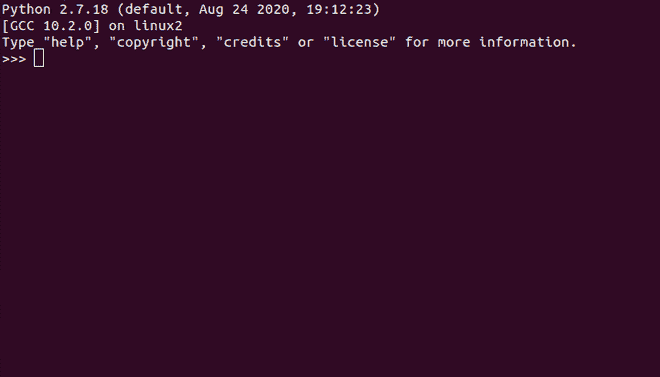
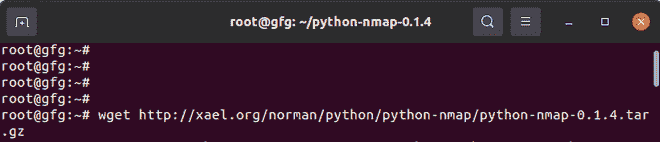
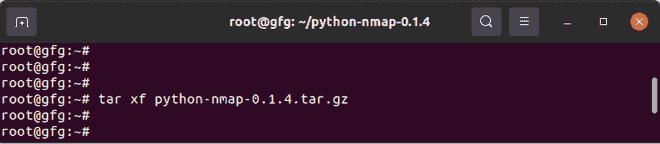
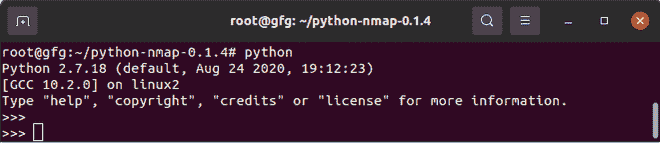

# 如何在 Linux 上安装 python-nmap 库？

> 原文:[https://www . geesforgeks . org/how-install-python-nmap-library-in-Linux/](https://www.geeksforgeeks.org/how-to-install-python-nmap-library-in-linux/)

Python-Nmap 是一个网络映射器，在处理安全审计和发现网络方面非常重要。它作为一个开源项目而存在；因此它是免费的。

所有核心操作系统都支持 Python-Nmap。但是，二进制包仅适用于 Windows、Linux 和 Mac OS X。通过以编程方式操作 Nmap 扫描结果，Nmap 在端口扫描任务中至关重要。这里我们将看到如何在 Linux 中安装 python-nmap 库。

#### Nmap 值得深入研究的关键特性包括:

*   **操作系统检测**–这包括识别主机操作系统以及网络设备的硬件特征
*   **端口扫描**–Nmap 可以计数并列出整个目标和开放端口
*   **与目标的可脚本化交互**–在 Nmap 中，我们可以使用结合 Lua 编程语言的 Nmap 脚本引擎编写脚本，在网络设备上执行操作。
*   **版本检测**–我们可以通过查询位于远程设备上的网络服务来建立应用版本号和应用名称。
*   **主机发现**–当我们想要找出特定网络中的主机时，这是一个概念。例如，当我们想知道特定端口是否打开时。或者当他们发出 ICMP 请求时。此外，Nmap 还可以列出响应 TCP 的主机。

**有两种不同的方法来测试 Nmap 方法:**

**方法 1:** 第一种方法是用 python 编写脚本，并使用以下命令在终端上运行。

```py
root@gfg:~# python script_name.py
```

```py
# script_name.py

import nmap
nmap =nmap.PortScanner()
host = '127.0.0.1'
nmap.scan(host, '1-10')
print(nmap.command_line())
```



使用脚本测试 Nmap 方法

**方法 2:** 第二种方法涉及通过命令行界面测试 Nmap 方法。要实现这一点，打开终端并运行命令“python”，这样您就可以获得如下所示的界面。



### 在 Ubuntu (Debian)中安装 Nmap:

运行以下命令

```py
root@gfg:~# sudo apt-get install nmap
```

#### 在 Ubuntu (Debian)中安装 Python-Nmap:

我们还需要名为 python-nmap 的 python 模块。它负责计算机网络中的主机和服务发现。它是通过在初始化向这些主机发送特定数据包后分析来自已识别主机的响应来实现的。

安装 python-nmap 有两种方法。第一个涉及在终端上安装，而第二个涉及下载 python-nmap 库并进行手动安装。

#### 方法一:通过终端安装 Python-Nmap

因此，我们将运行以下命令:

```py
root@gfg:~# pip install python-nmap
```

#### 方法二:手工安装 Python-Nmap

在第二种方法中，我们将列出下载 python-nmap 库直到它可以使用所需的所有步骤。

**步骤 1:** 使用 wget 下载 python-nmap 库，如下所示。

```py
root@gfg:~# wget http://xael.org/norman/python/python-nmap/python-nmap-0.1.4.tar.gz
```



使用 wget 下载 python-nmap 库

**第二步:**用焦油提取内含物

```py
root@gfg:~# tar xf python-nmap-0.1.4.tar.gz 
```



用焦油提取内含物

**步骤 3:** 将目录更改为提取的内容

```py
root@gfg:~#  cd python-nmap-0.1.4
```


将目录更改为提取的内容

**步骤 4:**Python-Nmap 的安装

```py
root@gfg:~#  python setup.py install
```


Python-Nmap 的安装

**第五步:**确认 Python-Nmap 安装成功，可以使用。

```py
root@gfg:~# python
```



确认 Python-Nmap 已成功安装并准备好使用

我们还需要一个虚拟环境来分离不同模块之间的关注点，并区分其他项目。如果您决定编写 python 脚本并运行它们而不是命令行界面，这一点很重要。

以下命令将有助于创建虚拟环境

```py
python -m venv my_virtual_environment_name
```

#### 在命令行界面上测试 Nmap

按键盘上的 Ctrl + Alt + T 打开终端。然后，键入单词 python，并按键盘上的 enter 键

```py
root@gfg:~# python
```

为了测试各种 Nmap 命令，我们将首先使用以下命令导入 Nmap 模块。

```py
>>> import nmap
```

接下来，我们需要实例化 Nmap 的端口扫描器，如下所示

```py
>>> nmap =nmap.PortScanner()
>>> host = '127.0.0.1'
```

接下来是将端口和主机范围都设置为扫描，如下所示:

```py
>>> nmap.scan(host, '1-10')
```

接下来，我们可以打印用于扫描的 command_line 命令，如图所示

```py
>>> print(nmap.command_line())
```

使用 Nmap 获取 127.0.0.1 的主机名

```py
>>> nmap['127.0.0.1'].hostname()
'localhost'
>>>
```

如果我们想在 Nmap 上获取扫描信息，请执行以下操作:

```py
>>> print nmap.scaninfo()
```

结果会是这样的:

```py
{'tcp': {'services': '1-10', 'method': 'connect'}}
```

要扫描每台主机，我们需要运行以下命令

```py
>>> for host in nmap.all_hosts():
...     print('Host : %s (%s)' % (host, nmap[host].hostname()))
...     print('State : %s' % nmap[host].state())
```

同样，我们也可以扫描所有协议。它返回被扫描的特定网络的协议。

```py
>>> nmap['127.0.0.1'].all_protocols()
```

我们案例的结果是:

```py
[tcp]
```

获取特定主机的状态，如下所示

```py
>>> nmap['127.0.0.1'].state()
```

它将指示主机是启动还是关闭。就我们而言，

```py
'up'
```

Keys()方法负责在提供范围的同时显示所有活动端口的信息。下面是如何使用 keys()方法。

```py
>>> nmap['127.0.0.1']['tcp'].keys()
[1, 2, 3, 4, 5, 6, 7, 8, 9, 10]
>>>
```

验证给定端口的端口信息。例如，给定主机上的 20 如下

```py
>>> nmap['127.0.0.1'].has_tcp(20)
False
>>>
```